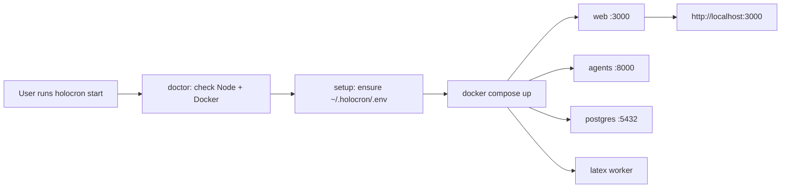
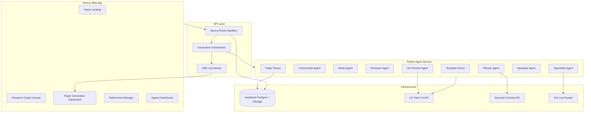
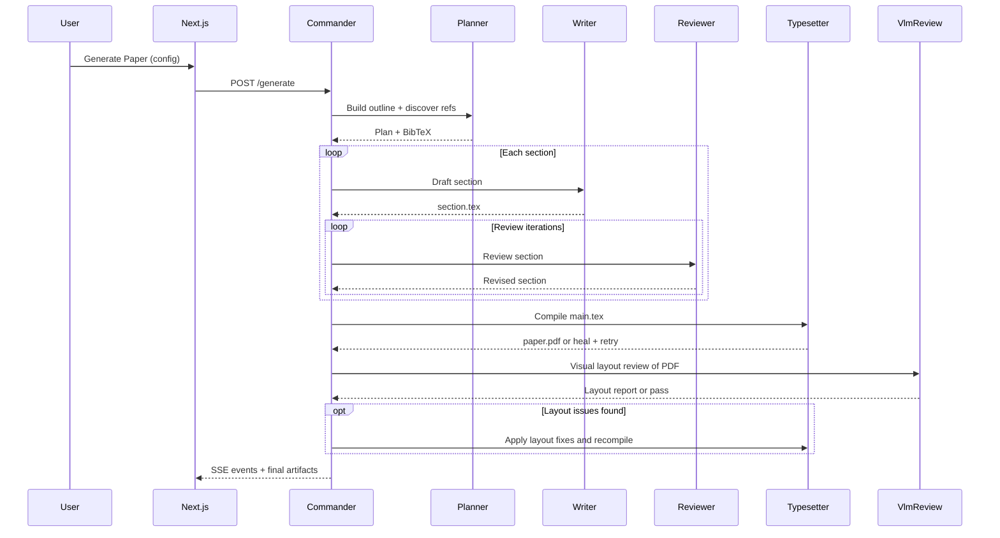

# AcademicHub Full Recreation Plan

## Context

- **Workspace:** [`d:\holocron`](d:\holocron) is a greenfield repo (git only, no source).
- **Reference:** Demo screenshots + transcript describe a Next.js-style web app with 5 main modules and **9 backend agents** (including Vlm Review).
- **Original stack (inferred):** React/Next.js UI, React Flow canvas, Python/FastAPI agent services, LaTeX toolchain, K2 Think V2, Semantic Scholar.
- **Your choices:** K2 Think as AI provider; full end-to-end feature build (not UI-only); publish to npm with a one-command local start (`npx holocron start`); **frequent git commits after every major milestone**.

---

## Git Commit Strategy

Commit **after every major milestone** — never batch an entire phase into one commit. Each commit should be a working, logical unit that could be reviewed independently.

### Rules during implementation

1. **Commit immediately** when a todo or sub-feature reaches a stable state (builds, no broken imports).
2. **One concern per commit** — e.g. schema separate from UI, each agent separate if large.
3. **Conventional commit prefixes:** `feat:`, `fix:`, `chore:`, `refactor:`, `docs:`.
4. **Never commit secrets** — `.env`, API keys, credentials stay gitignored.
5. **Do not push** unless explicitly asked; commits are local until user requests push.

### Planned commit checkpoints (~10 commits minimum)

| After completing | Commit message (example) |
|------------------|--------------------------|
| Monorepo + CLI stub | `feat: initial turborepo and holocron CLI skeleton` |
| DB schema + migrations | `feat: add Postgres schema and Drizzle migrations` |
| Auth + app shell | `feat: add auth, nav layout, and route shells` |
| Research graph dashboard | `feat: add works CRUD and project dashboard` |
| React Flow canvas | `feat: add research graph canvas with 16 node types` |
| Agent service scaffold | `feat: add FastAPI agent service and health registry` |
| Individual agents (batch if small) | `feat: add planner, writer, reviewer agents` |
| Paper generation pipeline | `feat: add paper generation orchestrator and SSE logs` |
| Paper generation UI | `feat: add paper generation dashboard and PDF explorer` |
| References module | `feat: add reference library and paper parser` |
| LaTeX + Typesetter + Vlm Review | `feat: add LaTeX templates, typesetter, and vlm review` |
| CLI + Docker release | `feat: add holocron start CLI and release compose` |
| Seed template + polish | `chore: add demo template, empty states, and README` |

Additional commits are expected for bug fixes, refactors, and incremental agent work — aim for **at least one commit per implementation phase**, often more.

---

## NPM Distribution Strategy

The app will ship as a **publishable npm CLI package** so anyone can run AcademicHub locally without cloning the repo or manual Docker setup.

### User experience (target)

```bash
# Zero-install (recommended)
npx holocron start

# Or global install
npm install -g holocron
holocron start
```

First run opens an interactive setup wizard, then starts all services and prints:

```
✓ Docker is running
✓ K2 Think API key configured
✓ Database ready
✓ Agents online (9/9)

AcademicHub is running at http://localhost:3000
Press Ctrl+C to stop
```

### CLI commands

| Command | Purpose |
|---------|---------|
| `holocron start` | Start full stack (web + agents + DB + LaTeX) |
| `holocron stop` | Stop all services |
| `holocron setup` | Interactive `.env` wizard (K2 Think key, optional Semantic Scholar key) |
| `holocron doctor` | Check prerequisites (Node 20+, Docker, ports 3000/8000 free) |
| `holocron status` | Show service health + agent online counts |
| `holocron update` | Pull latest Docker images for the installed version |

### Package structure

Add `packages/cli` as the **npm publish root**:

```
packages/cli/
├── package.json          # name: "holocron", bin: { "holocron": "./dist/index.js" }
├── src/
│   ├── index.ts          # Commander.js CLI entry
│   ├── commands/         # start, stop, setup, doctor, status
│   ├── docker.ts         # docker compose orchestration
│   ├── env.ts            # .env generation + validation
│   └── paths.ts          # ~/.holocron data dir resolution
├── assets/
│   ├── docker-compose.yml
│   ├── docker-compose.prod.yml
│   └── .env.example
└── scripts/
    └── prepack.js        # Copy built web standalone + agent context into package
```

**Root monorepo** uses npm workspaces; `npm publish -w holocron` (or from `packages/cli`) publishes only the CLI package with bundled runtime assets — not the entire turborepo source.

### How `holocron start` works



1. CLI resolves data directory: `~/.holocron/` (config, `.env`, volumes) — keeps npm global install clean.
2. Copies embedded `docker-compose.yml` if missing or version mismatch.
3. Runs `docker compose pull && docker compose up -d` using **version-pinned images** published to GitHub Container Registry (e.g. `ghcr.io/hatif03/holocron-web:0.1.0`).
4. Waits for health checks on web + agents endpoints.
5. Optionally opens browser via `open` / `start` / `xdg-open`.

### Local-first runtime (critical for npm users)

External Supabase is **optional**, not required for npm install. Default local mode:

| Component | Local npm mode | Cloud deploy mode |
|-----------|----------------|-------------------|
| Database | Postgres in Docker (`~/.holocron/data/postgres`) | Supabase hosted Postgres |
| File storage | Local volume (`~/.holocron/data/storage`) | Supabase Storage |
| Auth | Local email/password (simple, single-user default) | Supabase Auth |
| Migrations | Same SQL migrations run on container start | Supabase migrations |

This ensures `npx holocron start` works out of the box with only **Docker + a K2 Think API key**. Semantic Scholar key remains optional (lower rate limits without it).

Use a **storage abstraction layer** in `packages/shared` (`LocalStorageProvider` / `SupabaseStorageProvider`) and a **database adapter** (Drizzle ORM with Postgres connection string from env) so the same app code runs in both modes.

### Build and publish pipeline

1. **Build web** as Next.js `output: 'standalone'` → Docker image `holocron-web`.
2. **Build agents** → Docker image `holocron-agents`.
3. **Build latex** → Docker image `holocron-latex`.
4. **Build CLI** with `tsup` → publish to npm as `holocron`.
5. **GitHub Actions** on tag `v*`: build/push Docker images, then `npm publish`.

CLI package `files` field ships: compiled JS, `assets/docker-compose*.yml`, `.env.example`, README — **not** full source tree.

### npm package.json essentials

```json
{
  "name": "holocron",
  "version": "0.1.0",
  "description": "AI-native research platform — visual graph to publication-ready papers",
  "bin": { "holocron": "./dist/index.js" },
  "engines": { "node": ">=20" },
  "files": ["dist", "assets", "README.md"],
  "keywords": ["research", "academic", "ai-agents", "latex", "k2-think"]
}
```

### Prerequisites surfaced by `holocron doctor`

- Node.js 20+
- Docker Desktop (or Docker Engine + Compose v2)
- 4 GB+ free RAM
- Ports 3000 and 8000 available
- K2 Think API key (prompted on first `start` if missing)

---

## Target Architecture



### Monorepo layout

```
holocron/
├── apps/
│   ├── web/                 # Next.js 15 App Router + shadcn/ui
│   └── agents/              # Python FastAPI multi-agent service
├── packages/
│   ├── cli/                 # npm-publishable CLI (holocron start)
│   └── shared/              # Zod schemas, node types, API contracts, storage/db adapters
├── templates/               # LaTeX style guides (Nature, IEEE, ICML)
├── docker/
│   ├── docker-compose.yml       # dev stack (hot reload)
│   ├── docker-compose.release.yml  # pinned images for CLI/npm users
│   └── latex/               # TeX Live image for pdflatex
├── db/
│   └── migrations/          # Postgres schema (works local + Supabase)
├── .github/workflows/
│   ├── release.yml          # build Docker images + npm publish on tag
│   └── ci.yml
└── README.md
```

**Why this split:** LaTeX compilation, PDF parsing, and long-running agent jobs are poor fits for serverless-only Next.js. A Python sidecar matches the original agent architecture while keeping the UI fast in Next.js.

---

## Feature Map (from screenshots + transcript)

| Module | Must-have capabilities |
|--------|------------------------|
| **Home** | Hero ("From Research to Publication, Automated"), nav, light/dark mode, CTAs to Graph / Generate |
| **Research Graph** | Work list + search, create-work modal, template cards, React Flow canvas, 16 node types, sidebar grouping (Ideation/Knowledge/Execution/Evidence/Control), save, generate-paper modal (style guide, pages, planning/review toggles) |
| **Paper Generation** | Live agent log timeline, section-by-section progress, Explorer tree (`.tex`, PDF, `.bib`), reference discovery panel, view/download PDF |
| **References** | Search Semantic Scholar, add/import BibTeX, upload PDF, AI extraction (summary, RQs, methods, findings) |
| **Agents** | Service registry page showing **9 agents**, online status, endpoint counts, last active |

### Node types (canvas)

`start`, `end`, `idea`, `question`, `hypothesis`, `literature`, `concept`, `method`, `experiment`, `metric`, `data`, `result`, `finding`, `figure`, `table`, `paper_section`

Each node stores typed JSON fields (e.g. Literature: `bibtex`, `user_notes`, `file_path`; Start: `paper_title`, `target_venue`, `deadline`).

---

## Data Model (Postgres — local or Supabase)

Core tables (same schema in both modes via Drizzle + SQL migrations):

- `research_works` — title, description, user_id, is_template, graph snapshot metadata
- `graph_nodes` — work_id, type, label, position, data (jsonb)
- `graph_edges` — work_id, source_node_id, target_node_id
- `references` — user_id, title, authors, year, bibtex, s2_paper_id, pdf_storage_path, analysis (jsonb)
- `work_references` — join table
- `paper_generations` — work_id, status, config (style, pages, planning, review_iters), output_dir, word_count, pdf_path
- `generation_events` — generation_id, agent, event_type, message, metadata, created_at (powers live log)
- `agent_health` — agent_name, status, endpoint_count, last_seen_at
- `users` — local auth table (npm mode); skipped when Supabase Auth is configured

**Local npm mode:** Postgres in Docker, files on `~/.holocron/data/storage/`.
**Cloud mode:** Supabase Postgres + Storage + Auth; enable RLS scoped to `auth.uid()`.

---

## Agent System Design

All agents share a base class with K2 Think client (OpenAI-compatible endpoint) and structured JSON output via Zod/Pydantic.

| Agent | Responsibility | Key I/O |
|-------|----------------|---------|
| **Planner** | Query Semantic Scholar, build paragraph-level outline from graph | Graph JSON → plan + discovered refs |
| **Commander** | Orchestrate pipeline, assemble context per section | Plan + graph → job queue |
| **Writer** | Draft LaTeX per section with venue style | Section context → `.tex` |
| **Reviewer** | Logic/style/structure review loop | Section `.tex` → feedback + revised `.tex` |
| **Paper Parser** | PDF → structured analysis | PDF bytes → summary/RQs/methods/findings |
| **Template Parser** | Load venue template rules | Template dir → formatting rules |
| **Typesetter** | Inject content, compile, self-heal LaTeX errors | Project dir → PDF |
| **Metadata** | Simple-mode paper from 5 NL fields + BibTeX | Metadata form → full paper |
| **Vlm Review** | VLM-based visual PDF review for page overflow, underfill, and layout detection | Compiled PDF → layout report + fix suggestions |

**Vlm Review** runs after Typesetter compiles the PDF. It renders each page to images, sends them to a vision-capable model (K2 Think VLM path or compatible multimodal endpoint), and detects layout defects (text overflow, empty margins, figure/table misalignment, page count mismatch vs target). Issues feed back into the Reviewer/Typesetter loop when review is enabled.

### Generation pipeline (graph → PDF)



**Self-healing LaTeX:** Typesetter captures `pdflatex`/`bibtex` stderr, sends errors to K2 Think with surrounding source, patches file, retries (max 3).

**Live logs:** Each agent emits `generation_events`; Next.js SSE endpoint streams to Paper Generation UI.

---

## Frontend Implementation

### Stack

- **Next.js 15** (App Router), **TypeScript**, **Tailwind CSS**, **shadcn/ui**
- **@xyflow/react** for research canvas (matches screenshot UX: minimap, toolbar, custom nodes)
- **Vercel AI SDK** for any direct LLM calls from Next.js (optional; most LLM work stays in Python agents)
- **Auth:** local session auth (npm default) or Supabase Auth (cloud deploy); abstracted via `AuthProvider`
- **TanStack Query** for data fetching; **Zustand** for canvas local state with debounced save

### Key routes

| Route | Page |
|-------|------|
| `/` | Home landing |
| `/research-graph` | Works dashboard |
| `/research-graph/[workId]` | Canvas editor |
| `/paper-generation` | Generation list |
| `/paper-generation/[genId]` | Live dashboard + Explorer |
| `/references` | Reference library |
| `/agents` | Agent status dashboard |

### UI fidelity targets (from screenshots)

- Top nav: Home, Research Graph, Paper Generation, References, Agents
- Serif display font for headings; sans-serif for UI
- Blue gradient primary buttons; pill nav active state
- Research Graph: left sidebar tabs (Nodes / References / Work Info), bottom toolbar (+ Add Node, Generate Paper)
- Paper Generation: 3-column layout (Process Log | Explorer | Search Details)
- Agents: card grid with green "Online" badges

### Template seed data

Ship one pre-built template work matching the demo ("AI tools expand impact but contract focus" — 10 nodes, 13 edges) so users can explore immediately.

---

## Backend / Agent Service (Python FastAPI)

### Endpoints (mirrors Agents dashboard)

```
GET  /health                          # service + per-agent status
POST /agents/planner/plan
POST /agents/commander/generate
POST /agents/writer/draft
POST /agents/reviewer/review
POST /agents/paper-parser/analyze
POST /agents/template-parser/parse
POST /agents/typesetter/compile
POST /agents/metadata/generate
POST /agents/vlm-review/analyze-page    # single-page layout check
POST /agents/vlm-review/review-pdf      # full-document visual review
POST /agents/vlm-review/suggest-fixes   # LaTeX/layout fix recommendations
```

FastAPI runs as long-lived process; Commander `/generate` is async job with event emission to Supabase or Redis pub/sub.

### Integrations

- **K2 Think V2:** OpenAI-compatible client pointed at official API (request key via [build.k2think.ai](https://build.k2think.ai/)). Model: `MBZUAI-IFM/K2-Think-v2`. Abstract behind `LLMProvider` interface so dev can fall back to mock responses before key arrives.
- **Semantic Scholar:** `GET /graph/v1/paper/search` with `openAccessPdf` filter; store `paperId`, metadata, PDF URL ([Semantic Scholar API](https://www.semanticscholar.org/product/api)).
- **PDF parsing:** PyMuPDF for text extraction; K2 Think for structured analysis.
- **LaTeX:** Dockerized TeX Live; mount generation workspace volume.

---

## Dev Environment

### Developer mode (`docker compose -f docker/docker-compose.yml up`)

1. `web` — Next.js dev server (port 3000, hot reload)
2. `agents` — FastAPI (port 8000, reload)
3. `latex` — TeX Live compile worker
4. `postgres` — local database

### End-user mode (`holocron start` → `docker-compose.release.yml`)

Same services, but pinned pre-built images (no source mount). Data persisted under `~/.holocron/`.

Required env vars (generated by `holocron setup`):

```
K2THINK_API_KEY=              # required
K2THINK_BASE_URL=             # required
SEMANTIC_SCHOLAR_API_KEY=     # optional
DATABASE_URL=                 # auto-set for local Postgres
STORAGE_PATH=~/.holocron/data/storage
AUTH_MODE=local               # or "supabase"
AGENTS_SERVICE_URL=http://localhost:8000
```

---

## Implementation Phases (single pass, ordered)

Even with "full feature" scope, build in dependency order within one effort:

### Phase 1 — Foundation (Day 1-2)

- Scaffold turborepo + Next.js + shadcn/ui + theme toggle
- Postgres schema migrations (Drizzle) + local/Supabase adapters
- Auth (local default + optional Supabase) + protected layout matching screenshot nav
- Home page + empty route shells for all 5 modules
- Scaffold `packages/cli` with `holocron doctor` and stub `holocron start`
- **Git commit:** `feat: initial turborepo and holocron CLI skeleton`
- **Git commit:** `feat: database migrations and app layout`

### Phase 2 — Research Graph (Day 3-5)

- Works CRUD API + dashboard (search, cards, create modal)
- React Flow canvas with all 16 custom node components
- Sidebar node grouping, edge connections, save/load
- Generate Paper modal (config persisted to `paper_generations`)
- Seed template work
- **Git commit:** `feat: research graph dashboard and works CRUD`
- **Git commit:** `feat: research graph canvas with node types and save/load`

### Phase 3 — Agent Infrastructure (Day 5-7)

- FastAPI agent service scaffold + health registry
- K2 Think client wrapper + mock mode
- Commander orchestrator with job queue
- SSE/streaming log pipeline to frontend
- Agents dashboard (reads `/health`)
- **Git commit:** `feat: FastAPI multi-agent service with health registry`
- **Git commit:** `feat: agents dashboard and SSE log streaming`

### Phase 4 — Paper Generation (Day 7-10)

- Planner: graph → outline + Semantic Scholar discovery
- Writer + Reviewer loop with configurable iterations
- Template Parser + venue templates (Nature, IEEE)
- Typesetter Docker + self-healing compile
- **Vlm Review:** PDF page rendering (pdf2image) + VLM layout analysis; optional recompile loop
- Paper Generation UI: live log, Explorer file tree, PDF viewer
- **Git commit:** `feat: paper generation pipeline with 9 agents`
- **Git commit:** `feat: paper generation dashboard and PDF explorer`

### Phase 5 — References (Day 10-11)

- Reference library CRUD
- Semantic Scholar search UI
- PDF upload to Supabase Storage
- Paper Parser agent → structured analysis panel
- Link references to graph literature nodes
- **Git commit:** `feat: reference library with Semantic Scholar and PDF analysis`

### Phase 6 — CLI, npm publish, and verification (Day 12-14)

- Complete CLI: `start`, `stop`, `setup`, `status`, `update`
- Build release Docker images + `docker-compose.release.yml` with version pins
- GitHub Actions: tag → push images to GHCR → `npm publish`
- End-to-end test via **npm path**: `npx holocron start` → create work → generate → PDF
- Error states, loading skeletons, empty states (match screenshots)
- README: `npx holocron start` quickstart + optional cloud deploy guide
- **Git commit:** `feat: holocron start CLI and release Docker images`
- **Git commit:** `chore: seed template, polish, and npm quickstart docs`

---

## Risks and Mitigations

| Risk | Mitigation |
|------|------------|
| No K2 Think API key yet | Mock LLM provider for dev; request key at [build.k2think.ai](https://build.k2think.ai/) in parallel |
| LaTeX compile failures | Self-healing loop + store intermediate `.log` files in Explorer |
| PDF paywalls (no open access) | Allow manual PDF upload; Semantic Scholar metadata-only fallback |
| Long generation jobs timing out | Async jobs + polling/SSE; no synchronous serverless for full pipeline |
| Scope creep | Strict node-type schema + fixed 9 agents; defer collaboration/real-time multi-user |
| npm package too large | Ship runtime via Docker images, not bundled source; CLI package stays under ~2 MB |
| Users lack Docker | `holocron doctor` fails fast with clear install link; Docker is hard requirement |
| Image/version drift | CLI embeds compose file version; `holocron update` pulls matching image tags |

---

## Success Criteria

1. User can create a research work, add connected nodes on canvas, and save.
2. User can click Generate Paper with Nature/IEEE style and see live agent logs.
3. Completed run produces section `.tex` files, `references.bib`, and compiled PDF in Explorer.
4. User can search/add references, upload PDFs, and view AI-extracted analysis.
5. Agents page shows all **9 agents** online with endpoint counts (Vlm Review: 3 endpoints).
6. UI matches demo screenshots in layout, navigation, and core workflows.
7. **`npx holocron start` launches the full app locally** with no repo clone, no manual compose, and no Supabase account required.
8. Package publishes to npm with documented `holocron` CLI commands.
9. **Git history contains frequent, descriptive commits** — at least one commit per major milestone (~10+ commits total), each a reviewable unit of work.

---

## First Files to Create

1. [`package.json`](package.json) — npm workspaces root
2. [`packages/cli/package.json`](packages/cli/package.json) — publishable `holocron` CLI
3. [`packages/cli/src/commands/start.ts`](packages/cli/src/commands/start.ts) — `holocron start` orchestrator
4. [`apps/web/package.json`](apps/web/package.json) — Next.js + deps (standalone output)
5. [`apps/agents/pyproject.toml`](apps/agents/pyproject.toml) — FastAPI + agent deps
6. [`db/migrations/001_initial.sql`](db/migrations/001_initial.sql) — Postgres schema
7. [`docker/docker-compose.release.yml`](docker/docker-compose.release.yml) — pinned images for npm users
8. [`packages/shared/src/node-types.ts`](packages/shared/src/node-types.ts) — node schemas
9. [`apps/web/app/research-graph/[workId]/page.tsx`](apps/web/app/research-graph/[workId]/page.tsx) — canvas page
10. [`apps/agents/src/orchestrator/commander.py`](apps/agents/src/orchestrator/commander.py) — pipeline orchestrator
11. [`apps/agents/src/agents/vlm_review.py`](apps/agents/src/agents/vlm_review.py) — VLM PDF layout review agent
