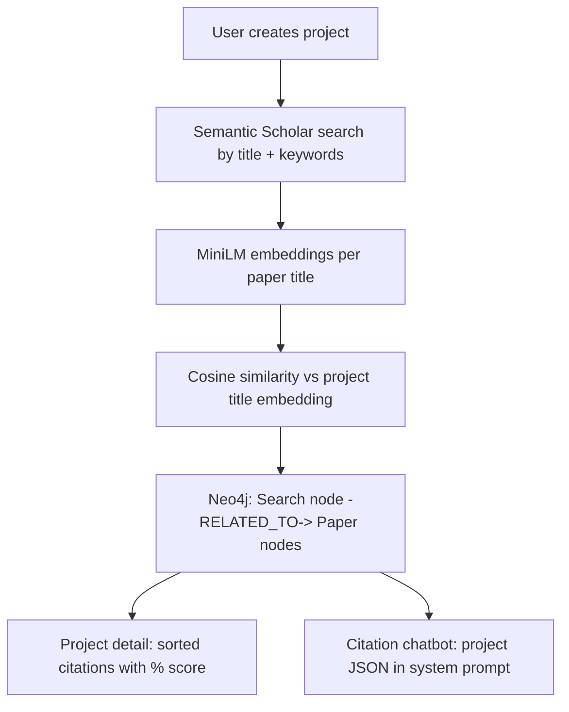
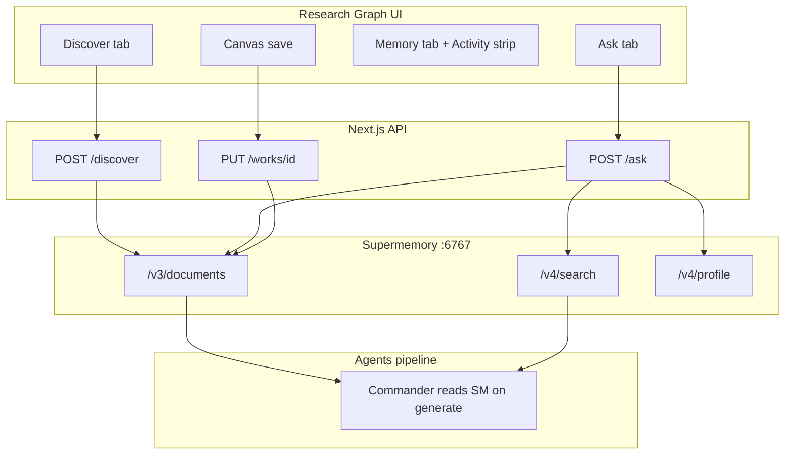
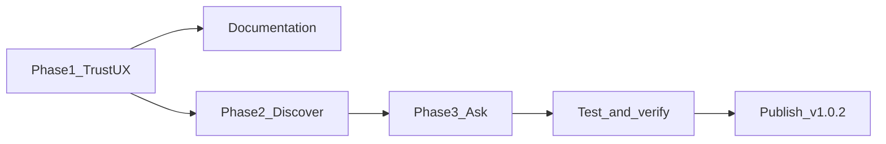

# Cite Smart Ideas + Traceable Supermemory + Full Documentation

## Executive summary

We are borrowing **ideas** from [Cite Smart AI](https://devpost.com/software/cite-smart-ai) (winner: Best Use of Neo4j, Hypermode Knowledge Graph challenge) and re-implementing them in Holocron using **Supermemory Local** instead of Neo4j + Modus. We are **not** copying their code or stack — we are adapting their product patterns to fit Holocron's existing architecture (React Flow research graph, Postgres CRUD, multi-agent LaTeX pipeline, local-first npm CLI).

Three new user-facing capabilities plus a trust redesign:

1. **Subtle, traceable Memory UX** — users can verify Supermemory is working without a loud "AI memory dashboard"
2. **Ranked paper discovery** — like Cite Smart "Create Project" → Semantic Scholar results with relevance scores
3. **Work-scoped citation Q&A** — like Cite Smart chatbot, grounded on project context via Supermemory profile/search

All changes will be **documented in repo** ([`docs/CITE_SMART_BORROW.md`](docs/CITE_SMART_BORROW.md) + updates to [`docs/SUPERMEMORY.md`](docs/SUPERMEMORY.md)).

---

## Security (before npm publish)

You shared an npm token in chat. **Revoke it immediately** at npmjs.com and create a new one. Store it only as GitHub secret `NPM_TOKEN` — never in code, commits, or chat. The release workflow at [`.github/workflows/release.yml`](.github/workflows/release.yml) already uses `${{ secrets.NPM_TOKEN }}`.

---

## Part A — Cite Smart AI: what it is and what we learn from it

### A.1 Source project summary

| Resource | URL | Role |
|----------|-----|------|
| Devpost | [cite-smart-ai](https://devpost.com/software/cite-smart-ai) | Product description, screenshots, hackathon context |
| Frontend | [cite-smart-fe](https://github.com/m-azzam-azis/cite-smart-fe) | Next.js + ShadCN + Supabase auth + GraphQL to Modus |
| Backend | [cite-smart-modus](https://github.com/m-azzam-azis/cite-smart-modus) | AssemblyScript on Hypermode/Modus: Semantic Scholar, embeddings, Neo4j, DeepSeek chat |

**Cite Smart core loop:**



### A.2 Feature-by-feature borrow matrix

| Cite Smart feature | Their implementation | Holocron decision | Rationale |
|-------------------|---------------------|-------------------|-----------|
| Research projects | Neo4j `Search` node per project | **Reuse** `research_works` + `start` node (`paper_title`, venue) | We already have works; no new entity type |
| Keyword tags | Stored on Neo4j node | **Add** optional `keywords` field on `start` node data (comma-separated) | Minimal schema change; powers discovery query |
| Semantic Scholar search | `fetchPapers()` in Modus | **Reuse** [`searchSemanticScholar`](apps/web/src/lib/agents-client.ts) | Already integrated in references + planner |
| Embedding similarity | MiniLM via Modus `EmbeddingsModel` | **Replace** with lightweight **title token overlap score** (0–1) | Avoids new embedding infra; good enough for ranked list; can upgrade later |
| Persistent citation graph | Neo4j `RELATED_TO { similarityScore }` | **Replace** with Supermemory `POST /v3/documents` per paper | `containerTag: work_{id}`, `metadata.type: discovered_paper`, `metadata.similarityScore` |
| Project list dashboard | `/dashboard` with cards | **Reuse** `/research-graph` work list | Holocron already lists works |
| Citation list UI | Sorted table, delete citation, color bands | **New** `DiscoverPanel` sidebar tab | Same UX pattern, scoped to current work |
| Citation chatbot | DeepSeek + Neo4j project JSON in system prompt | **New** `AskPanel` + `POST /api/works/[id]/ask` | Profile + search from Supermemory instead of Neo4j dump |
| Auth (Supabase) | User-scoped projects | **Skip** | Holocron local-first; `user_{LOCAL_USER_ID}` for prefs only |
| Graph visualization | Neo4j implicit graph | **Skip** | Holocron has IMRaD React Flow graph — different metaphor |
| Modus / Hypermode / GraphQL | Backend platform | **Skip** | Holocron uses FastAPI agents + Next.js API routes |

### A.3 What we explicitly choose NOT to do

- **No Neo4j dependency** — adds ops burden; conflicts with one-command `holocron start` simplicity
- **No MiniLM embedding service** — Cite Smart needs Modus runtime; Holocron would need new Docker service or API calls
- **No Supabase** — local Postgres + file storage is our model
- **No code copy** — MIT license allows study, but stacks are incompatible; we implement analogous flows

---

## Part B — Why Supermemory instead of Neo4j for Cite Smart patterns

### B.1 Architectural fit

Holocron already uses Supermemory for the same *semantic* job Cite Smart uses Neo4j for:

| Need | Cite Smart (Neo4j) | Holocron (Supermemory) |
|------|-------------------|------------------------|
| Store project context | `Search` node properties | `work_{workId}` documents (graph summary, plans, drafts) |
| Store related papers | `Paper` nodes + edges | `discovered_paper` documents with metadata |
| Retrieve for chat | Cypher query → JSON in prompt | `POST /v4/profile` + `POST /v4/search` (hybrid) |
| Rank by relevance | `similarityScore` on edge | `metadata.similarityScore` on write + search `score` on read |
| User preferences | `uid` on Search node | `user_{userId}` containerTag |

**Key insight:** Cite Smart's Neo4j graph is a **structured store for citations**. Supermemory is a **semantic store for agent context**. Holocron's paper pipeline already reads Supermemory before every LLM call — discovered papers and Q&A history naturally flow into generation without a second database.

### B.2 Supermemory API usage (canonical, per workspace rules)

Every read/write uses `containerTag` (singular string):

| Operation | Endpoint | When |
|-----------|----------|------|
| Store discovered paper | `POST /v3/documents` | After Semantic Scholar search |
| Store Q&A turn | `POST /v3/documents` | After each ask response |
| Recall for chat | `POST /v4/profile` + `POST /v4/search` | Before LLM in ask endpoint |
| Recall for generation | Same (existing) | Commander + planner (unchanged) |

Tags: `work_{workId}` for work-scoped; `user_{userId}` for cross-work prefs (existing).

### B.3 Data flow after this iteration



---

## Part C — Phase 1: Subtle, traceable Memory UX (detailed)

### C.1 Problem statement

Today, Supermemory works but is **hard to trust** because:

- Most writes are silent (save graph, upload CSV, analyze reference)
- UI says "Supermemory" prominently (feels like marketing, not proof)
- Process log memory events don't cover all agent reads/writes (review loop, VLM store)
- Memory tab requires manual search; empty state doesn't reflect recent writes

**Goal:** Anyone demoing Holocron for the hackathon can **point to specific evidence** that Supermemory ran: container tag, action type, timestamp, optional API path — without a noisy dashboard.

### C.2 UX design decisions

| Decision | Choice | Why |
|----------|--------|-----|
| User-facing name | **"Memory"** not "Supermemory" | Subtle; technical name in tooltip/link to docs |
| Primary indicator | Small dot in app shell + activity strip | Always visible, never modal |
| Detail on demand | Expandable **Activity** timeline | Traceability without clutter |
| Generation page | Memory trace **collapsed by default** | Paper log is primary; memory is supporting |
| Color | Neutral/muted, not violet hero | Violet reserved for memory *events* in process log only |
| Proof fields | `containerTag`, `action`, `source`, `at`, `customId?` | Matches Supermemory scoping rules |

### C.3 New components and files

| File | Purpose |
|------|---------|
| [`apps/web/src/lib/memory-trace.ts`](apps/web/src/lib/memory-trace.ts) | Types + client ring buffer (last 20 events per session) |
| [`apps/web/src/components/memory/MemoryActivityStrip.tsx`](apps/web/src/components/memory/MemoryActivityStrip.tsx) | Compact strip: "Memory · 3 writes · last 2m ago" |
| [`apps/web/src/app/api/works/[workId]/memory/activity/route.ts`](apps/web/src/app/api/works/[workId]/memory/activity/route.ts) | Server-side recent activity summary |

### C.4 API contract: `memoryTrace` on write responses

All mutating endpoints that touch Supermemory return:

```json
{
  "ok": true,
  "memoryTrace": {
    "enabled": true,
    "action": "write",
    "source": "graph_save",
    "containerTag": "work_c0d23fd0-...",
    "customId": null,
    "documentPreview": "Research graph (16 nodes...)",
    "at": "2026-07-16T04:00:00.000Z"
  }
}
```

**Endpoints to extend:**

- [`PUT /api/works/[workId]`](apps/web/src/app/api/works/[workId]/route.ts) — `source: graph_save`
- [`POST /api/works/[workId]/upload`](apps/web/src/app/api/works/[workId]/upload/route.ts) — `source: file_upload`, subtype from extension
- [`POST /api/references/analyze`](apps/web/src/app/api/references/analyze/route.ts) — `source: reference_analyze`
- New discover/ask endpoints (Phase 2–3)

Client shows toast: **"Saved to memory"** with expandable trace (not blocking).

### C.5 Agent pipeline completeness

Update [`commander.py`](apps/agents/src/orchestrator/commander.py):

| Gap today | Fix |
|-----------|-----|
| Review-phase `search_work` silent | `_emit_memory(..., "search", "Review recall for {section}")` |
| VLM `store_memory` silent | `_emit_memory(..., "store", "VLM review stored")` |
| `generation_complete` documented but missing | `store_memory` summary + emit event |

Process log [`DetailPanel.tsx`](apps/web/src/components/paper-generation/detail/DetailPanel.tsx) already shows memory events — no new panel needed.

### C.6 Rename map (user-visible copy)

| Before | After |
|--------|-------|
| "Supermemory" (Memory tab header) | "Memory" + tooltip "Powered by Supermemory Local" |
| "Supermemory Context" (generation) | "Memory trace" |
| Badge `ok` / `disabled` | "Connected" / "Offline" (technical status in tooltip) |

---

## Part D — Phase 2: Ranked paper discovery (detailed)

### D.1 User story

> As a researcher on a work, I enter a title and keywords, discover related papers from Semantic Scholar ranked by relevance, add them to my reference library or literature graph node, and know each discovery was stored in memory for later generation.

Maps to Cite Smart: [new-project page](https://github.com/m-azzam-azis/cite-smart-fe/blob/main/src/app/(dashboard)/dashboard/new-project/page.tsx) + [project detail](https://github.com/m-azzam-azis/cite-smart-fe/blob/main/src/app/(dashboard)/dashboard/project/%5Bid%5D/page.tsx).

### D.2 Scoring algorithm (why not embeddings)

Cite Smart uses MiniLM cosine similarity. We use **title token overlap**:

```
score = |tokens(projectTitle) ∩ tokens(paperTitle)| / |tokens(projectTitle)|
```

Optional: +0.1 if any keyword appears in paper title or abstract snippet.

**Why this choice:**

- Zero new dependencies or GPU
- Deterministic and explainable in UI ("42% title match")
- Semantic Scholar already pre-filters by query relevance
- Supermemory hybrid search adds semantic layer on storage/recall

**Future upgrade path:** document in `CITE_SMART_BORROW.md` — swap scorer for local embedding model without changing storage schema.

### D.3 API: `POST /api/works/[workId]/discover`

**Input:**

```json
{
  "keywords": ["climate", "life expectancy"],
  "limit": 15
}
```

**Steps:**

1. Load work + `start` node for default title/keywords
2. `searchSemanticScholar(title + keywords joined)`
3. Score and sort each result
4. For each top-N: `storeMemory({ content: bib-like summary, containerTag: work_{id}, metadata: { type: discovered_paper, paperId, similarityScore, title, authors, year } })`
5. Return `{ papers: [...], memoryTrace }`

**Why store each paper in Supermemory:**

- Planner/generation can `search_work` and find user-curated discoveries
- Ask chat can cite discovered papers from profile
- User can see discoveries in Memory tab with `discovered_paper` badge

### D.4 UI: `DiscoverPanel.tsx`

New tab in [`sidebar.tsx`](apps/web/src/components/research-graph/sidebar.tsx) — tabs become: Nodes | References | **Discover** | **Ask** | Memory | Work Info

| UI element | Behavior |
|------------|----------|
| Keywords input | Pre-filled from `start` node; editable |
| Discover button | Calls API; shows loading |
| Results list | Sorted by score%; color band like Cite Smart (red &lt;30%, yellow &lt;60%, green ≥60%) |
| Add to library | `POST /api/references` + optional literature node link |
| Memory chip | "Stored 12 papers to work_{id}" after success |

---

## Part E — Phase 3: Work-scoped citation Q&A (detailed)

### E.1 User story

> As a researcher, I ask questions about my work's citations and graph context in a chat panel. Each answer shows how many memories were recalled from Supermemory, and the conversation is stored for future sessions.

Maps to Cite Smart: [chatbot page](https://github.com/m-azzam-azis/cite-smart-fe/blob/main/src/app/(dashboard)/dashboard/chatbot/page.tsx) + Modus `citationChatbot()`.

### E.2 How context is built (Supermemory, not Neo4j JSON)

Cite Smart injects:

```
Project Details: { id, title, keywords, citations: [...] }
```

Holocron injects:

1. `profileForWorkRich(workId, prompt)` → static + dynamic profile strings
2. `searchMemoriesRich(workId, prompt, limit=8)` → top hybrid hits
3. Optional: recent `discovered_paper` hits from same search

**Why profile + search instead of dumping all documents:**

- Supermemory's filter prompt ([`SUPERMEMORY_FILTER_PROMPT`](packages/shared/src/constants.ts)) extracts relevant facts
- Scales as memory grows; Neo4j JSON dump does not
- Aligns with hackathon requirement to use profile before LLM calls

### E.3 API: `POST /api/works/[workId]/ask`

**Input:**

```json
{ "prompt": "What papers support the CO2-health hypothesis?" }
```

**Output:**

```json
{
  "answer": "...markdown...",
  "memoryTrace": {
    "action": "read",
    "recalledCount": 4,
    "containerTag": "work_...",
    "stored": true
  }
}
```

**After LLM:** store user prompt + answer as two documents (or one combined) with `metadata.type: ask`.

**LLM routing:** Proxy to agents service existing LLM config (same BYOK as paper generation) — keeps keys server-side.

### E.4 Guardrails (from Cite Smart system prompt)

- On-topic: citations, papers, graph context, methodology
- Off-topic: polite decline (same pattern as Cite Smart)
- Markdown responses (reuse `react-markdown` if not present, add dependency)

### E.5 UI: `AskPanel.tsx`

- Message list (user/bot)
- Project fixed to current work (no dropdown — simpler than Cite Smart global chat)
- Per bot message: chip **"Used 4 memories · work_{shortId}"** → expands to hit list
- Stores trace in `memory-trace.ts` client buffer

---

## Part F — Documentation deliverables (required)

User requested **everything documented in detail**. We will add/update:

### F.1 New: [`docs/CITE_SMART_BORROW.md`](docs/CITE_SMART_BORROW.md)

Sections:

1. **Inspiration** — links to Devpost + repos, what Cite Smart does well
2. **Borrow matrix** — table from Part A.2 (feature → their stack → our stack)
3. **Explicit non-goals** — Neo4j, Modus, embeddings (v1)
4. **Supermemory mapping** — how each Cite Smart concept maps to `containerTag` + metadata types
5. **Scoring rationale** — title overlap vs MiniLM, upgrade path
6. **API reference** — `/discover`, `/ask`, `/memory/activity`, `memoryTrace` schema
7. **UI map** — sidebar tabs, activity strip, trace chips
8. **Demo script** — step-by-step for hackathon judges (discover → ask → generate → show trace)
9. **Decision log** — dated ADR-style entries

### F.2 Update: [`docs/SUPERMEMORY.md`](docs/SUPERMEMORY.md)

Add rows to feature map:

| Integration | Route | Type metadata | Why |
|-------------|-------|---------------|-----|
| Paper discovery | `POST /api/works/[id]/discover` | `discovered_paper` | Ranked S2 results persist for planner/ask |
| Citation Q&A | `POST /api/works/[id]/ask` | `ask` | Conversational recall + storage |
| Memory activity | `GET /api/works/[id]/memory/activity` | — | Trust/trace API |
| Trace on writes | all write routes | — | Client proof |

Add **Trust UX** section: naming, `memoryTrace` contract, what users should see.

### F.3 Update: [`README.md`](README.md) + [`packages/cli/README.md`](packages/cli/README.md)

- Mention Discover + Ask features on research graph
- Link to `docs/CITE_SMART_BORROW.md`
- v1.0.2 changelog bullet list

### F.4 Inline code comments

- `memory-trace.ts` — schema docblock
- `discover/route.ts` — scoring function explained
- `ask/route.ts` — profile-before-LLM pattern reference to `docs/SUPERMEMORY.md`

---

## Part G — Schema and metadata conventions (new types)

Extend metadata `type` values (for `MemoryView` badges):

| type | Written by | Content shape |
|------|-----------|---------------|
| `discovered_paper` | discover API | Title, authors, S2 id, similarityScore, optional abstract snippet |
| `ask` | ask API | User question + assistant answer (markdown) |
| `data_file` | upload (existing) | CSV excerpt — add badge color in MemoryView |

Add optional `start` node field in [`node-field-schemas.ts`](packages/shared/src/node-field-schemas.ts):

- `keywords` — text field, comma-separated (for discover pre-fill)

---

## Part H — Testing and verification

| Test | Command / action | Pass criteria |
|------|------------------|---------------|
| Supermemory E2E | `node scripts/verify-supermemory-e2e.mjs` | PASS |
| Discover flow | UI: Discover tab on showcase work | ≥5 ranked papers; memoryTrace returned; Memory tab shows `discovered_paper` |
| Ask flow | UI: Ask "What is the hypothesis?" | Answer references graph; chip shows recalled count |
| Trace on save | Save graph | Toast/chip with `work_{id}` |
| Generation trace | Generate paper | Memory trace panel + violet log events |
| CLI build | `npm run build --workspace=holocron-research` | Success |
| npm smoke | `npx holocron-research@1.0.2 doctor` | Pass |

---

## Part I — Commits, release, publish

### I.1 Commit sequence

1. `feat(memory): subtle traceable Supermemory UX`
2. `docs: add CITE_SMART_BORROW and extend SUPERMEMORY trust model`
3. `feat(works): ranked paper discovery with Supermemory persistence`
4. `feat(works): memory-grounded citation Q&A chat`
5. `chore(release): bump holocron-research to 1.0.2`

(Documentation commit can merge with feature commits if preferred, but `CITE_SMART_BORROW.md` must land with or before features.)

### I.2 Release

- Bump [`packages/cli/package.json`](packages/cli/package.json) → `1.0.2`
- `git tag v1.0.2 && git push origin v1.0.2`
- GitHub Actions: GHCR images + `npm publish` (requires rotated `NPM_TOKEN` secret)
- Verify: `npm view holocron-research@1.0.2 version`

---

## Part J — Decision log (ADR summary)

| ID | Decision | Alternatives considered | Outcome |
|----|----------|------------------------|---------|
| ADR-001 | Supermemory over Neo4j for citation persistence | Neo4j sidecar, Postgres JSON only | Supermemory — already in stack, semantic recall for agents |
| ADR-002 | Title overlap scoring vs MiniLM | Add embedding Docker service, call OpenAI embeddings | Title overlap v1 — explainable, no new infra |
| ADR-003 | "Memory" UX naming vs "Supermemory" branding | Keep loud branding | Subtle naming + docs link for hackathon trust |
| ADR-004 | `memoryTrace` in API responses vs separate audit log | Postgres audit table, only client-side trace | API responses + client buffer — minimal, provable |
| ADR-005 | Ask LLM via agents service vs web-only | Direct OpenAI from Next.js | Agents service — reuses BYOK config |
| ADR-006 | Sidebar tabs vs new routes for Discover/Ask | `/research-graph/[id]/discover` pages | Sidebar tabs — keeps work context visible |
| ADR-007 | npm publish via CI secret only | Local `npm publish` with user token | CI only — never commit tokens |

---

## Implementation order



Documentation (`CITE_SMART_BORROW.md` + `SUPERMEMORY.md` updates) should be written **in parallel with Phase 1** so rationale is captured as we build, not after.
