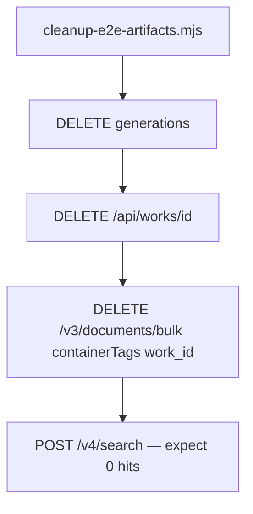

# E2E Cleanup, Real-World Verification, npm README Fix, and CI

## Current gaps

| Issue | Root cause |
|-------|------------|
| E2E works/papers persist | [`scripts/verify-supermemory-e2e.mjs`](scripts/verify-supermemory-e2e.mjs) creates work + generation but never deletes |
| Supermemory not cleared on delete | [`DELETE /api/works/[workId]`](apps/web/src/app/api/works/[workId]/route.ts) only removes Postgres rows — no Supermemory call |
| [npm page outdated](https://www.npmjs.com/package/holocron-research) | Version is **1.0.2** but published README still says **v1.0.1** and omits Discover/Ask/Memory — npm cannot overwrite an existing version; need **1.0.3** |
| Main README stale | [`README.md`](README.md) missing Discover/Ask tabs, memory trace UX, and `CITE_SMART_BORROW` link |
| GitHub Actions | Latest runs on [Actions](https://github.com/hatif03/holocron/actions) show Release #3 (v1.0.2) completed; CI/E2E on `172f4e1` need log audit to confirm green |



---

## Phase 1 — Supermemory delete on work removal

**API to use** (Supermemory Local, per [bulk delete docs](https://supermemory.ai/docs/document-operations)):

```bash
DELETE /v3/documents/bulk
{ "containerTags": ["work_{workId}"] }
```

**Changes:**

1. [`apps/web/src/lib/supermemory-client.ts`](apps/web/src/lib/supermemory-client.ts) — add `deleteWorkMemory(workId)`:
   - `DELETE ${BASE_URL}/v3/documents/bulk` with `containerTags: [workTag(workId)]`
   - no-op when `!isSupermemoryEnabled()`
   - return `{ deleted: boolean, containerTag }` for traceability

2. [`apps/web/src/app/api/works/[workId]/route.ts`](apps/web/src/app/api/works/[workId]/route.ts) — in `DELETE`, after Postgres cascade, call `deleteWorkMemory(workId)` and return `memoryTrace: buildWriteTrace(workId, "delete", { count: 1 })` (or a dedicated delete trace action)

3. [`docs/SUPERMEMORY.md`](docs/SUPERMEMORY.md) — document work-delete → bulk containerTag purge in redundancy matrix

4. Optional mirror in [`apps/agents/src/supermemory_client.py`](apps/agents/src/supermemory_client.py) for parity (not required for this task unless agents delete works)

---

## Phase 2 — Remove E2E test artifacts + verify memory gone

**New script:** [`scripts/cleanup-e2e-artifacts.mjs`](scripts/cleanup-e2e-artifacts.mjs)

- Query Postgres for test works:
  - `title ILIKE '%E2E%'` OR `title = 'Supermemory E2E Test'`
  - Optional `--work-id=<uuid>` for targeted cleanup
- For each work:
  1. Delete associated `paper_generations` + `generation_events` + `storage/generations/{id}` dirs (reuse patterns from [`scripts/cleanup-generations.mjs`](scripts/cleanup-generations.mjs))
  2. `DELETE /api/works/{workId}` (triggers Supermemory bulk delete once Phase 1 lands)
  3. **Verify Supermemory empty:** `POST /v4/search` with `containerTag: work_{id}`, `q: "graph planner discover"`, `limit: 5` → assert `results.length === 0`
- Print summary: works removed, generations removed, SM verification pass/fail

**Update:** [`scripts/verify-supermemory-e2e.mjs`](scripts/verify-supermemory-e2e.mjs)

- Add `finally` block (default `--cleanup`) that deletes the created work + generation and verifies SM search is empty
- `--no-cleanup` flag to keep artifacts for debugging

**Root `package.json` scripts:**

```json
"cleanup:e2e": "node scripts/cleanup-e2e-artifacts.mjs",
"verify:supermemory": "node scripts/verify-supermemory-e2e.mjs"
```

**One-time local run (after implementation):**

```powershell
npm run cleanup:e2e          # purge existing E2E artifacts + verify SM
npm run verify:supermemory   # re-run E2E; should self-clean
```

---

## Phase 3 — Real-world Discover/Ask verification

Use existing OWID showcase ([`scripts/seed-showcase-owid.mjs`](scripts/seed-showcase-owid.mjs)) — real CSV data downloaded from Our World in Data, real Semantic Scholar queries.

**New script:** [`scripts/verify-discover-ask-realworld.mjs`](scripts/verify-discover-ask-realworld.mjs)

1. `npm run seed:showcase` (or `--force` if exists) — work ID `c0d23fd0-508f-43b9-baf6-d713920970a2` or freshly created
2. Add `keywords` on start node if missing: `"CO2 emissions, life expectancy, climate health, OWID"`
3. `POST /api/works/{id}/discover` — assert `papers.length > 0`, each has `similarityScore`, `memoryTrace` present
4. `POST /api/works/{id}/ask` with: `"What is the relationship between CO2 emissions and life expectancy in our dataset?"` — assert `answer` non-empty, `recalled >= 0`, `memoryTrace.read` present
5. `GET /api/works/{id}/memory/activity` — assert `types.discovered_paper` or `types.ask` counted
6. Exit 0/1 with clear PASS/FAIL

**Root `package.json`:** `"verify:discover-ask": "node scripts/verify-discover-ask-realworld.mjs"`

**Manual UI check** (document in script header): Research graph → **Discover** tab → discover → **Ask** tab → question → recall chip visible.

---

## Phase 4 — Fix outdated npm page

The [npm package page](https://www.npmjs.com/package/holocron-research) renders [`packages/cli/README.md`](packages/cli/README.md) (listed in `files`). Published 1.0.2 still contains "CLI v1.0.1" and no v1.0.2 features.

**Update [`packages/cli/README.md`](packages/cli/README.md):**

- Header: `holocron-research CLI v1.0.3`
- New features section: Memory trace UX, Discover tab (Semantic Scholar ranking), Ask tab (memory-grounded Q&A), `holocron seed` / `status`
- Link to [`docs/CITE_SMART_BORROW.md`](docs/CITE_SMART_BORROW.md) and [`docs/SUPERMEMORY.md`](docs/SUPERMEMORY.md)
- Fix release tag examples (`v1.0.3`)

**Bump:** [`packages/cli/package.json`](packages/cli/package.json) → `1.0.3`

**Publish:** tag `v1.0.3` → triggers [`.github/workflows/release.yml`](.github/workflows/release.yml). Ensure GitHub secret `NPM_TOKEN` is set (rotated token — never commit).

---

## Phase 5 — Update main README

Update [`README.md`](README.md):

| Section | Add |
|---------|-----|
| **What you can do** | Research graph sidebar: **Discover** (ranked papers), **Ask** (citation Q&A), **Memory** (traceable recall) |
| **Architecture** | Add Supermemory `:6767` node to mermaid diagram |
| **Scripts** | `npm run cleanup:e2e`, `npm run verify:supermemory`, `npm run verify:discover-ask`, `npm run seed:showcase` |
| **Docs links** | [`docs/CITE_SMART_BORROW.md`](docs/CITE_SMART_BORROW.md) |
| **Quick start** | Reference `holocron-research@1.0.3` after publish |

Keep tone consistent with existing README; no plan-file edits.

---

## Phase 6 — GitHub Actions audit and fixes

On implementation, inspect latest runs for `main` and `v1.0.2` via `gh run list` / `gh run view --log`:

| Workflow | Likely issues to check |
|----------|------------------------|
| [**CI**](.github/workflows/ci.yml) | `lint`, `build web`, `pytest`, `test-cli-pack` |
| [**E2E**](.github/workflows/e2e.yml) | Playwright against dev server; supermemory started but `SUPERMEMORY_API_KEY: ""` — OK for page-render tests only |
| [**Release**](.github/workflows/release.yml) | npm publish step — confirm `holocron-research@1.0.2` exists; if publish skipped (missing `NPM_TOKEN`), 1.0.3 publish fixes README |

**If E2E fails:** read `playwright-report` artifact; common fixes are selector drift in [`apps/web/e2e/platform.spec.ts`](apps/web/e2e/platform.spec.ts) or web `/health` route.

**If CI lint/build fails:** fix TypeScript or ESLint regressions from recent Discover/Ask files.

No workflow changes unless a concrete failure is found.

---

## Phase 7 — Commit and publish

**Incremental commits:**

1. `feat(memory): delete Supermemory container on work removal`
2. `chore(scripts): E2E cleanup and real-world discover/ask verification`
3. `docs: update README and CLI README for v1.0.3 features`
4. `chore(release): bump holocron-research to 1.0.3`

**Publish:**

```bash
git push origin main
git tag v1.0.3 && git push origin v1.0.3
```

**Post-publish smoke:**

```bash
npx holocron-research@1.0.3 doctor
npm view holocron-research readme   # confirm v1.0.3 content on npm
```

---

## Success criteria

- Running `npm run cleanup:e2e` removes all E2E test works/generations and Supermemory search for those `work_{id}` tags returns zero hits
- `npm run verify:discover-ask` passes against OWID showcase + live Semantic Scholar
- [npm holocron-research](https://www.npmjs.com/package/holocron-research) shows updated README at **1.0.3**
- Main README documents Discover/Ask/Memory and new scripts
- All GitHub Actions workflows green on latest `main`
