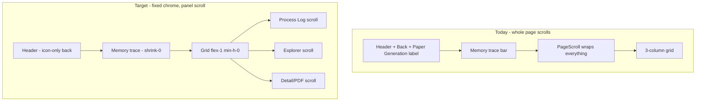

# Demo Polish, Narration, and v1.0.5 Publish

## Current issues (from screenshot + codebase)



- [`[genId]/page.tsx`](apps/web/src/app/(app)/paper-generation/[genId]/page.tsx) wraps Memory trace **and** the 3-column grid inside [`PageScroll`](apps/web/src/components/layout/page-scroll.tsx) — entire viewport scrolls.
- Panels already have inner `overflow-y-auto` ([`ProcessLogPanel`](apps/web/src/components/paper-generation/detail/ProcessLogPanel.tsx), [`ExplorerPanel`](apps/web/src/components/paper-generation/detail/ExplorerPanel.tsx), [`DetailPanel`](apps/web/src/components/paper-generation/detail/DetailPanel.tsx)) but the grid lacks a fixed height, so panels grow with content instead of scrolling independently.
- [`GenerationHeader`](apps/web/src/components/paper-generation/detail/GenerationHeader.tsx) passes `label="Paper Generation"` to [`BackLink`](apps/web/src/components/layout/back-link.tsx) — redundant with app-shell title and screenshot clutter.
- Fonts: [`layout.tsx`](apps/web/src/app/layout.tsx) loads **Inter** + JetBrains Mono, but [`globals.css`](apps/web/src/app/globals.css) still references **Geist** — inconsistent.
- No route-level `loading.tsx` files; list pages show blank or plain "Loading..." text.
- **Uncommitted** Supermemory search fix (dreaming instant, 401 key issue resolved) must ship before demo.

---

## Phase 1 — Paper detail: independent panel scroll

**File:** [`apps/web/src/app/(app)/paper-generation/[genId]/page.tsx`](apps/web/src/app/(app)/paper-generation/[genId]/page.tsx)

- Remove `PageScroll` wrapper around the grid.
- Layout structure:

```tsx
<div className="flex h-full min-h-0 flex-col">
  <div className="shrink-0 px-4 pt-4">…GenerationHeader…</div>
  <div className="shrink-0 px-4 sm:px-6">…SupermemoryContext…</div>
  <div className="grid flex-1 min-h-0 gap-4 px-4 pb-4 sm:px-6 lg:grid-cols-[1fr_1fr_1.2fr]">
    {/* each panel h-full min-h-0 */}
  </div>
</div>
```

- Add `h-full min-h-0` to each panel `Card` at `lg:` breakpoint (replace `lg:min-h-[420px]` growth behavior).
- Ensure [`DetailPanel`](apps/web/src/components/paper-generation/detail/DetailPanel.tsx) content area uses `flex-1 min-h-0 overflow-y-auto` (PDF iframe gets fixed height within panel).

**File:** [`GenerationHeader.tsx`](apps/web/src/components/paper-generation/detail/GenerationHeader.tsx)

- Change `<BackLink href="/paper-generation" label="Paper Generation" />` → icon-only: `<BackLink href="/paper-generation" />` (title tooltip remains via existing `title` attr in BackLink).

**Loading state:** Replace `"Loading..."` div with a 3-column skeleton matching the final layout.

---

## Phase 2 — Google Fonts

Chosen pair from [Google Fonts](https://fonts.google.com/) (research/SaaS appropriate, distinct logo vs body):

| Role | Font | Why |
|------|------|-----|
| Logo / display wordmark | **Instrument Serif** | Scholarly, distinctive; pairs with modern sans |
| UI body | **Plus Jakarta Sans** | Excellent screen readability, variable weights |
| Mono (logs, code, BibTeX) | **JetBrains Mono** | Already in use |

**Files:**

- [`apps/web/src/app/layout.tsx`](apps/web/src/app/layout.tsx) — load via `next/font/google`: `Instrument_Serif`, `Plus_Jakarta_Sans`, `JetBrains_Mono`; set CSS vars `--font-display`, `--font-sans`, `--font-mono`.
- [`apps/web/src/app/globals.css`](apps/web/src/app/globals.css) — wire `@theme inline` to new vars; remove stale Geist reference.
- [`apps/web/src/components/layout/app-shell.tsx`](apps/web/src/components/layout/app-shell.tsx) — apply `font-display` to sidebar "Holocron" wordmark.
- [`packages/brand/theme.css`](packages/brand/theme.css) — optional comment noting font stack (tokens only, no font files).
- [`apps/web/README.md`](apps/web/README.md) — document font choices.

---

## Phase 3 — Loading skeletons and animations

Reuse existing [`Skeleton`](apps/web/src/components/ui/skeleton.tsx).

**New shared components** in `apps/web/src/components/ui/`:

- `generation-detail-skeleton.tsx` — 3-column panel skeleton
- `generation-list-skeleton.tsx` — card rows
- `work-list-skeleton.tsx` — research graph work cards

**Apply to pages** (initial load + fetch pending):

| Page | Change |
|------|--------|
| [`paper-generation/[genId]/page.tsx`](apps/web/src/app/(app)/paper-generation/[genId]/page.tsx) | Detail skeleton while `!gen` |
| [`paper-generation/page.tsx`](apps/web/src/app/(app)/paper-generation/page.tsx) | List skeleton until first fetch |
| [`research-graph/page.tsx`](apps/web/src/app/(app)/research-graph/page.tsx) | Work list skeleton |
| [`references/page.tsx`](apps/web/src/app/(app)/references/page.tsx) | Table/card skeleton |
| [`settings/page.tsx`](apps/web/src/app/(app)/settings/page.tsx) | Settings panel skeleton |

Keep existing `Loader2` spinners for **in-flight actions** (generation running, image load, file fetch). Skeletons = **initial page/data load** only.

Optional: subtle `animate-pulse` on skeletons (default shadcn behavior).

---

## Phase 4 — Demo narration script

Replace/extend [`docs/DEMO.md`](docs/DEMO.md) with a **voiceover-ready narration** adapted from your Academic Hub script:

- Rename **Academic Hub** → **Holocron** throughout
- Insert **Supermemory act** after research graph, before/during generation:
  - Memory tab pre-seeded hits (renewables showcase)
  - Memory trace: profile → recall (3 hits) → store timeline
  - Second generation cross-run recall
- Update agent names: Planner (Semantic Scholar), Commander, Writer, Reviewer, Typesetter
- Mention WhatsApp green theme, Explorer (LaTeX + figures + PDF), reference deep analysis, Settings health, `holocron status`
- Keep [`docs/DEMO.md`](docs/DEMO.md) technical checklist; add **`docs/DEMO_NARRATION.md`** for the spoken script (paragraph form, ~2–3 min read)

Demo URLs to reference in script (current working generation):

- Renewables: `http://localhost:3000/paper-generation/4d9df851-1f58-4f46-820b-ab6da3d5e28b` (70 search recalls)

**Pre-record checklist** in DEMO.md:

```bash
npm run stop:all && npm run start:local
npm run seed:showcase && npm run seed:showcase:renewables && npm run seed:recall:demo
node scripts/diagnose-supermemory-search.mjs
```

Optional: regenerate OWID paper so `verify-showcase-papers` passes both works.

---

## Phase 5 — Documentation updates

| Doc | Updates |
|-----|---------|
| [`README.md`](README.md) | v1.0.5 quick start, fonts, panel scroll UX, Supermemory search fix summary |
| [`docs/SUPERMEMORY.md`](docs/SUPERMEMORY.md) | Already has dreaming instant section (uncommitted) — verify complete |
| [`docs/DEMO.md`](docs/DEMO.md) | Updated checklist + link to narration |
| [`docs/DEMO_NARRATION.md`](docs/DEMO_NARRATION.md) | New voiceover script |
| [`packages/cli/README.md`](packages/cli/README.md) | v1.0.5 |
| [`apps/web/README.md`](apps/web/README.md) | Fonts, skeletons, detail layout |

---

## Phase 6 — Git commits + publish **1.0.5**

Land in logical commits (exclude `.cursor/plans/`):

1. `fix(memory): Supermemory instant dreaming, search recall, and diagnose script` — pending uncommitted agent/web/seed changes
2. `fix(web): paper detail independent panel scroll and icon-only back link`
3. `feat(ui): Google Fonts and loading skeletons across app pages`
4. `docs: Holocron demo narration and v1.0.5 README updates`
5. `chore(release): bump holocron-research to 1.0.5`

Then:

- `npm run build --workspace=packages/cli`
- Tag `v1.0.5`, push `main` + tag to GitHub
- `npm publish --access public` in `packages/cli`
- Verify: `npx holocron-research@1.0.5 doctor`, `npm run diagnose:supermemory`, `node scripts/verify-showcase-papers.mjs`

---

## Success criteria for demo recording

- Paper detail: header + memory trace fixed; **only** Process Log / Explorer / Detail panels scroll
- Back button: arrow only, no "Paper Generation" label beside it
- Fonts load without FOUT; logo uses Instrument Serif
- List/detail pages show skeletons on first load
- Renewables generation Memory trace shows search recalls with hits
- npm `holocron-research@1.0.5` installable; docs match
