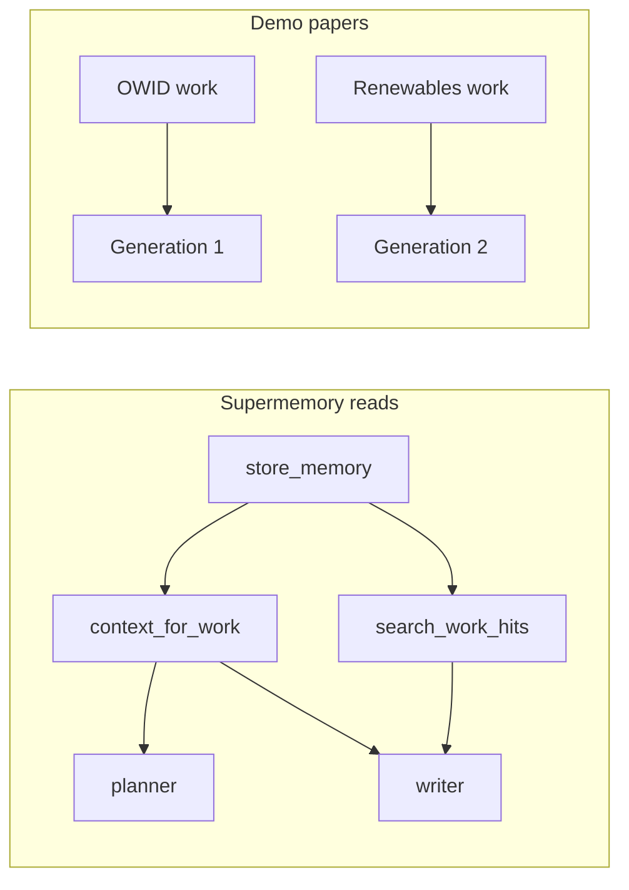

# Demo-Ready Publish: Supermemory Reads, Two Papers, WhatsApp Theme

## Current state

- **Unstaged work** from the detail UX plan is complete but not committed (~30 modified files + new routes/scripts).
- **Two showcase research graphs** exist: OWID climate ([`scripts/seed-showcase-owid.mjs`](scripts/seed-showcase-owid.mjs)) and renewables ([`scripts/seed-showcase-renewables.mjs`](scripts/seed-showcase-renewables.mjs)).
- **Supermemory writes work**; reads are wired but **under-utilized** — memory is buried in JSON dumps, planner/reviewer skip profile, reviewer feedback is never stored, and `memory_ctx` is frozen at pipeline start (see agent audit above).
- **Theme** is Graphite tweakcn in [`apps/web/src/app/globals.css`](apps/web/src/app/globals.css); target is [WhatsApp theme on tweakcn](https://tweakcn.com/themes/cmmbmmxsb000104l5fqg5b4x3).
- **Release** is at `holocron-research@1.0.3`; user wants **local + npm publish/tag 1.0.4**.



---

## Phase 1 — Delete stale CO2 climate paper

**Goal:** Remove the old generated paper artifact; keep the OWID research graph work.

1. Query Postgres for generations linked to the OWID title *"Global CO₂ Emissions and Life Expectancy…"* (or list via `GET /api/generations`).
2. Delete via `DELETE /api/generations/{genId}` (uses [`storage-cleanup.ts`](apps/web/src/lib/storage-cleanup.ts) + DB row).
3. Optionally add a small helper script `scripts/delete-generation.mjs --title "..."` for repeatability (or use existing [`scripts/cleanup-generations.mjs`](scripts/cleanup-generations.mjs) if it supports title filter — extend minimally if needed).

**Do not** delete the OWID research work itself — we will regenerate from it.

---

## Phase 2 — Make Supermemory reads visible and load-bearing

Root cause: reads exist but LLM prompts don't prioritize them; planner/reviewer miss profile; review feedback is never written back.

### Agent fixes (high impact)

| Change | File |
|--------|------|
| Pass `memory_ctx` to planner as dedicated prompt block | [`commander.py`](apps/agents/src/orchestrator/commander.py) → [`planner.py`](apps/agents/src/agents/planner.py) (`PlanRequest.memory_context`) |
| Promote memory to explicit prompt sections (not JSON-only) | [`writer.py`](apps/agents/src/agents/writer.py): `Work/user memory:` + `Recalled for this section:` blocks |
| Include `memory_ctx` in all reviewer paths | [`reviewer.py`](apps/agents/src/agents/reviewer.py) + [`commander.py`](apps/agents/src/orchestrator/commander.py) |
| **Store** reviewer feedback after each non-approved round | [`commander.py`](apps/agents/src/orchestrator/commander.py) via `store_memory(..., metadata={type:"review"})` |
| Refresh profile/search before each section (or at least redraft passes) | [`commander.py`](apps/agents/src/orchestrator/commander.py): re-call `context_for_work(work_id, query=f"{title} {section}")` |
| Lower search threshold / make configurable | [`supermemory_client.py`](apps/agents/src/supermemory_client.py): `threshold=0.4` default |
| Second-run recall: search prior section drafts before drafting | [`commander.py`](apps/agents/src/orchestrator/commander.py): `search_work_hits(work_id, f"prior draft {prev_sections}", limit=3)` |

### Verification that reads happened

- Extend [`scripts/verify-supermemory-e2e.mjs`](scripts/verify-supermemory-e2e.mjs) or add `scripts/verify-memory-recalls.mjs` to assert:
  - `GET /api/generations/{genId}/memory/recalls` has **≥1 `search` events with `recalledCount > 0`**
  - On **second generation** on same work, Introduction search hits include prior draft content
- Update [`docs/SUPERMEMORY.md`](docs/SUPERMEMORY.md) to document read points (profile → planner/writer, section search, review recall, cross-run draft recall).

---

## Phase 3 — Generate two end-to-end showcase papers

**Works:** OWID climate + renewables (seed if missing).

```bash
npm run seed:showcase
npm run seed:showcase:renewables   # pre-seeds Supermemory recall docs
```

**Generation flow (each work):**

1. Open research graph → Generate from `end` node (or `POST /api/generations` with work graph).
2. **Run 1:** baseline paper; confirm Memory trace shows profile + search + store timeline.
3. **Run 2 (renewables only, for demo):** second generation on same work — Introduction/Methods should **recall Run 1 drafts** in trace and prompts.

**PDF formatting checks** (already partially fixed in agents; verify after regen):

| Check | How |
|-------|-----|
| Figures render | `figures/*.png` in output dir; no SVG in PDF log |
| Methods readable | no overlapping `verbatim`; `lstlisting` with breaklines |
| Citations resolve | `npm run gen:verify {genId}` — no `??` in `.tex` cite keys vs `references.bib` |
| Compile warnings | LaTeX log section from [`compile_server.py`](docker/latex/compile_server.py) |

Add `scripts/verify-showcase-papers.mjs` to automate: find gens by work title, run `gen:verify`, check recalls API, print demo URLs.

**Commit after green verification:** `feat(demo): generate OWID and renewables showcase papers with Supermemory recall`.

---

## Phase 4 — WhatsApp theme + side panel UX

### Theme swap

1. Open [WhatsApp theme on tweakcn](https://tweakcn.com/themes/cmmbmmxsb000104l5fqg5b4x3) → **Code** export.
2. Replace `:root` / `.dark` blocks in [`apps/web/src/app/globals.css`](apps/web/src/app/globals.css) (keep imports, `@theme inline`, Holocron extras `--success/--warning/--info`, React Flow utilities).
3. Mirror tokens in [`packages/brand/theme.css`](packages/brand/theme.css) if marketing/CLI references it.
4. Spot-check: Research graph, Paper detail, Settings, References in light + dark.

### Slightly larger components

| Target | Change |
|--------|--------|
| Global radius | `--radius` → ~`0.5rem` (WhatsApp export may set this) |
| Buttons/inputs | [`button.tsx`](apps/web/src/components/ui/button.tsx), [`input.tsx`](apps/web/src/components/ui/input.tsx): `h-8` → `h-9` |
| App sidebar | [`sidebar.tsx`](apps/web/src/components/ui/sidebar.tsx): width `16rem` → `18rem`; menu `h-9 text-sm` |
| App shell header | [`app-shell.tsx`](apps/web/src/components/layout/app-shell.tsx): `h-10` → `h-11` |

### Side panel UX (the “awkward” panel)

Focus on **research graph sidebar** ([`research-graph/sidebar.tsx`](apps/web/src/components/research-graph/sidebar.tsx)) — fixed 264px, tiny tabs:

- Widen to **280–300px**, bump tab text `text-[10px]` → `text-xs`, increase row padding
- Use consistent `bg-sidebar` (not mixed `bg-card`) to match app nav
- Optional: collapsible width toggle (chevron) without full redesign

**Paper detail panels** ([`paper-generation/[genId]/page.tsx`](apps/web/src/app/(app)/paper-generation/[genId]/page.tsx)):

- Desktop: flex row with `min-h-0` + per-panel `overflow-y-auto` so Explorer/Log/Detail scroll independently inside the grid
- Give DetailPanel slightly more width (`lg:grid-cols-[1fr_1fr_1.2fr]`)

**Commit:** `feat(ui): WhatsApp tweakcn theme, larger density, sidebar polish`.

---

## Phase 5 — Local + published build verification

### Local

```bash
npm run stop:all && npm run start:local
npm run build --workspace=web
npm run verify:supermemory
node scripts/verify-showcase-papers.mjs
npm run gen:verify <owidGenId>
npm run gen:verify <renewablesGenId>
```

Manual demo checklist (for video):
- Paper list idle → no polling
- Paper detail → scroll, image preview, memory timeline with search hits
- Research graph → Memory tab shows pre-seeded renewables hits
- Settings → Supermemory health green

### Published (npm 1.0.4)

1. Bump versions: [`packages/cli/package.json`](packages/cli/package.json), root [`package.json`](package.json) quick-start refs, [`packages/cli/assets/docker-compose.release.yml`](packages/cli/assets/docker-compose.release.yml) if image tags change.
2. `npm run build` (turbo) + CLI pack smoke test: `npx holocron-research@1.0.4 doctor` from packed tarball.
3. Commit: `chore(release): bump holocron-research to 1.0.4`
4. Tag `v1.0.4`, push, `npm publish` (workspace `packages/cli`), verify CI green.

---

## Phase 6 — Documentation + demo script

Update:

| Doc | Changes |
|-----|---------|
| [`README.md`](README.md) | WhatsApp theme note, two showcase works, `seed:showcase:renewables`, Supermemory **read** demo flow, v1.0.4 quick start |
| [`docs/SUPERMEMORY.md`](docs/SUPERMEMORY.md) | Read/write matrix, second-run recall demo |
| [`apps/web/README.md`](apps/web/README.md) | Theming section → WhatsApp tweakcn |
| [`packages/cli/README.md`](packages/cli/README.md) | v1.0.4, both seed commands |
| New `docs/DEMO.md` | Step-by-step demo video script: seed renewables → Memory tab → gen 1 → gen 2 → show recall timeline → open PDF |

**Commit:** `docs: demo guide, Supermemory reads, v1.0.4 README updates`.

---

## Phase 7 — Git commits (include all unstaged changes)

Land work in **logical commits** (exclude `.cursor/plans/` — local IDE artifacts):

1. `fix(web): paper detail scroll, asset preview route, and loading states`
2. `perf(web): reduce polling and optimize generation APIs`
3. `fix(agents): LaTeX formatting, bib keys, figure labels, SVG handling`
4. `feat(memory): recall timeline API and SupermemoryContext redesign`
5. `feat(demo): renewables showcase seed and recall memory bootstrap`
6. `fix(agents): load-bearing Supermemory reads in planner, writer, reviewer`
7. `feat(ui): WhatsApp tweakcn theme and sidebar density polish`
8. `docs: demo guide and v1.0.4 documentation`
9. `chore(release): bump holocron-research to 1.0.4`

First commit pass: stage all **code/script** changes from existing unstaged work (items 1–5). Then implement Phases 2–6 and commit 6–9.

Push to GitHub after each commit group or at end (user requested regular commits).

---

## Risk notes

- **LLM mock mode** will produce empty/minimal papers — ensure real API key in `.env` for demo-quality PDFs.
- **matplotlib** required for PNG seed charts (`python` on PATH during `seed:showcase*`).
- **WhatsApp green primary** may clash with graph node accent colors — audit [`research-graph/nodes.tsx`](apps/web/src/components/research-graph/nodes.tsx) contrast after theme swap.
