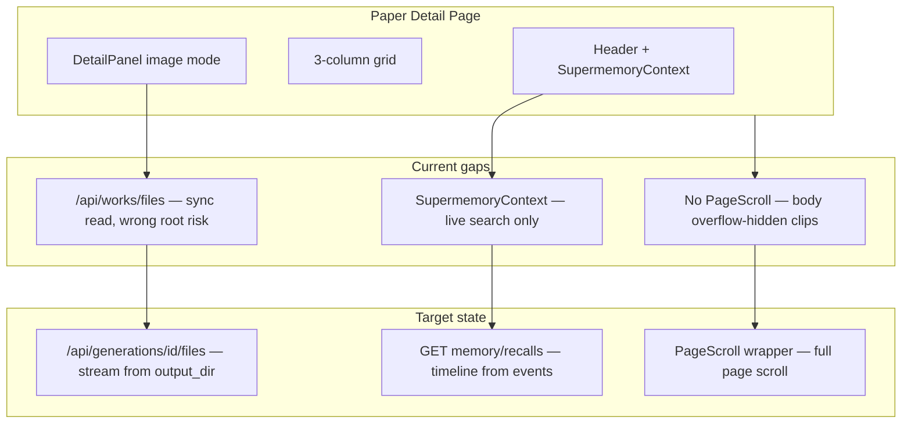

# Paper Detail UX, Performance, Formatting, Memory Trace, and Second Showcase

Your screenshots confirm four separate problems: **(1)** image preview shows filename/path but no reliable render + page still clips; **(2)** Memory trace shows a live search snapshot, not pipeline recalls; **(3)** PDF has overlapping Methods text, missing figure renders, and `??` refs; **(4)** polling and uncached API work make the app feel slow.



---

## Phase 1 — Paper detail: scroll + asset preview

### Scroll (still broken in your screenshot)

Root cause: [`app/layout.tsx`](apps/web/src/app/layout.tsx) + [`app-shell.tsx`](apps/web/src/components/layout/app-shell.tsx) lock the viewport, but [`paper-generation/[genId]/page.tsx`](apps/web/src/app/(app)/paper-generation/[genId]/page.tsx) has **no outer scroll region**. Header + expanded Memory trace + three `min-h-[280px]` panels exceed the shell height on many viewports.

**Changes:**
- Wrap detail content in [`PageScroll`](apps/web/src/components/layout/page-scroll.tsx) (same pattern as Settings).
- On mobile (`< lg`): stack panels with natural height inside the scroll area; drop fixed `min-h-[280px]`.
- On desktop: sticky header row + scroll body, or keep 3-column grid with `min-h-0 flex-1` inside a flex parent.
- Default Memory trace **collapsed**; expanded trace scrolls inside its own `max-h-48 overflow-y-auto` so it does not steal the whole viewport.

### Image / asset preview (filename only, slow load)

Root causes:
- Images use [`generationFileUrl`](apps/web/src/lib/storage-utils.ts) → `/api/works/files` with **sync** `readFileSync` ([`works/files/route.ts`](apps/web/src/app/api/works/files/route.ts)).
- [`DetailPanel`](apps/web/src/components/paper-generation/detail/DetailPanel.tsx) has no loading spinner or `onError` fallback — broken loads look like “filename only”.
- Code/CSV assets are not opened in preview mode when clicked.

**Changes:**

| Item | File | Fix |
|------|------|-----|
| Generation file route | **New** [`api/generations/[genId]/files/route.ts`](apps/web/src/app/api/generations/[genId]/files/route.ts) | Stream binary/text from `gen.output_dir`; reuse MIME map from works/files |
| URL helper | [`storage-utils.ts`](apps/web/src/lib/storage-utils.ts) | `generationFileUrl()` → `/api/generations/{genId}/files?path=...` |
| Preview UX | [`DetailPanel.tsx`](apps/web/src/components/paper-generation/detail/DetailPanel.tsx) | Loading skeleton, `onError` message, `decoding="async"`; code/CSV/json modes with syntax-friendly `<pre>` |
| File routing | [`[genId]/page.tsx`](apps/web/src/app/(app)/paper-generation/[genId]/page.tsx) | Route `.py`, `.csv`, `.json`, `.bib`, `.svg`, `.webp` to appropriate preview modes |

---

## Phase 2 — Sitewide loading performance

Quick wins ordered by impact:

| Change | File(s) |
|--------|---------|
| Stop polling when all generations terminal | [`paper-generation/page.tsx`](apps/web/src/app/(app)/paper-generation/page.tsx) |
| Stop detail poll after `completed` / `failed` / `cancelled` | [`paper-generation/[genId]/page.tsx`](apps/web/src/app/(app)/paper-generation/[genId]/page.tsx) |
| Run `syncGenerationsFromStorage` at most once per 60s (not every list GET) | [`api/generations/route.ts`](apps/web/src/app/api/generations/route.ts) |
| Skip `getGenerationStatus()` when DB status is terminal and events exist | [`api/generations/[genId]/route.ts`](apps/web/src/app/api/generations/[genId]/route.ts) |
| Cache file tree by output-dir mtime | same route |
| Batch agent event inserts (remove N× dedup SELECT) | same route |
| Parallelize `.tex` fetches in `loadCitations` | [`[genId]/page.tsx`](apps/web/src/app/(app)/paper-generation/[genId]/page.tsx) |
| Single combined memory fetch for trace | new recalls API (Phase 4) replaces dual poll in [`SupermemoryContext.tsx`](apps/web/src/components/paper-generation/detail/SupermemoryContext.tsx) |
| Replace per-row subqueries on works list | [`api/works/route.ts`](apps/web/src/app/api/works/route.ts) |

Optional follow-up: SWR/`staleTime` on list pages — defer unless still slow after server fixes.

---

## Phase 3 — PDF formatting improvements

Your PDF screenshot shows **overlapping Methods text**, **missing figure images**, and **`??` citations**.

### Root causes (from pipeline audit)

1. **Methods overlap** — `pseudo_code` appears in both graph snippets and `\begin{verbatim}` blocks; `verbatim` breaks in `twocolumn` Nature layout ([`graph_context.py`](apps/agents/src/orchestrator/graph_context.py), [`commander.py`](apps/agents/src/orchestrator/commander.py)).
2. **Missing figures** — LaTeX figure blocks are passed to the Writer but **not deterministically appended** to section `.tex`; LLM can omit them ([`commander.py`](apps/agents/src/orchestrator/commander.py) `_write_section`).
3. **SVG figures** — OWID seed uses `.svg`; `pdflatex` cannot include SVG without conversion ([`seed-showcase-owid.mjs`](scripts/seed-showcase-owid.mjs), [`copy_figure_assets`](apps/agents/src/orchestrator/graph_context.py)).
4. **`??` refs** — Writer cites `lit0` but `references.bib` keeps original BibTeX keys; figure envs lack `\label{fig:...}`.

### Fixes

| Fix | Location |
|-----|----------|
| **Append** `section_latex` blocks after writer/reviewer if not already present | `commander.py` `_write_section()` |
| Rewrite literature BibTeX keys to `lit{N}` to match `GraphContract` | `graph_context.py` `build_bibtex_entries()` |
| Add `\label{fig:node_key}` + `[tbp]` float placement | `graph_context.py` `latex_figures_and_tables()` |
| Convert SVG → PNG at copy time (or seed PNG charts only) | `copy_figure_assets()` + [`seed-showcase-owid.mjs`](scripts/seed-showcase-owid.mjs) |
| Replace `verbatim` with `lstlisting` + `breaklines`; exclude code from text snippets | `graph_context.py` |
| Add `\lstset{breaklines=true}`, `\graphicspath{{figures/}}` | `commander.py` `_build_main_tex()` |
| Parse compile log for undefined refs / missing graphics | [`docker/latex/compile_server.py`](docker/latex/compile_server.py) |

**Verify:** Re-run generation on OWID showcase; PDF should show bar/histogram figures, non-overlapping Methods, and resolved `\cite{}` / `\ref{}`.

---

## Phase 4 — Memory trace: show all recalled memories

### Current behavior (matches your screenshot)

[`SupermemoryContext.tsx`](apps/web/src/components/paper-generation/detail/SupermemoryContext.tsx) runs one **live** search for the current phase query. It does **not** aggregate Supermemory events already logged in the Process Log (`agent=Supermemory`, `event_type=memory`).

Pipeline already emits recalls in [`commander.py`](apps/agents/src/orchestrator/commander.py) `_emit_memory()`:
- `profile` at start
- `search` before each section draft and review
- `store` after planner, contract, sections, VLM, completion

### Target UX

Replace/extend Memory trace with a **timeline** similar to Process Log:

```
Planning     profile  Loaded work profile…
Introduction search   Recalled 3 memories (query: "Introduction …")
Introduction store    Stored Introduction draft
Methods      search   Recalled 2 memories
…
```

Each row expandable → show `metadata.preview`, query, section, and rich hits.

### Implementation

1. **New API** [`api/generations/[genId]/memory/recalls/route.ts`](apps/web/src/app/api/generations/[genId]/memory/recalls/route.ts)
   - Load `generation_events` where `agent='Supermemory'`
   - Return ordered `{ action, section, query, message, preview, createdAt }[]`
   - Optionally re-search with `metadata.query` for full hit cards (limit 3 per event)

2. **Enrich pipeline metadata** (optional but recommended)
   - Extend `_emit_memory()` to store `metadata.recalledCount` and `metadata.hits[]` (first 3 strings) from `search_work()`

3. **Redesign SupermemoryContext**
   - Fetch recalls API on load + when `isRunning` (poll only while running)
   - Render timeline using existing [`MemoryView`](apps/web/src/components/memory/MemoryView.tsx) / [`MemoryActivityStrip`](apps/web/src/components/research-graph/MemoryPanel.tsx) patterns
   - Fix Process Log drill-down: use `metadata.query` not section title ([`[genId]/page.tsx`](apps/web/src/app/(app)/paper-generation/[genId]/page.tsx))

4. **Completed generations:** show full recall history from events even when live search returns empty.

---

## Phase 5 — Second showcase graph (Supermemory demo)

**Goal:** A second pre-built research graph (different domain from CO₂/life expectancy) that makes **Supermemory recall visible** during paper generation.

### Proposed work

**Title:** *Renewable Electricity Share and Fossil Fuel Dependence: A Global Energy Transition Analysis (2000–2023)*

**Why:** Different scientific story (energy policy), reuses proven OWID CSV/chart pipeline, and is ideal for pre-seeded cross-run memories.

### New files

| File | Purpose |
|------|---------|
| [`scripts/seed-showcase-renewables.mjs`](scripts/seed-showcase-renewables.mjs) | Mirror OWID showcase structure with renewables + fossil-share datasets |
| [`scripts/seed-utils.mjs`](scripts/seed-utils.mjs) | Add `seedRecallMemories(workId, memories[])` — bulk POST to Supermemory `/v3/documents` |
| [`api/setup/seed-showcase-renewables/route.ts`](apps/web/src/app/api/setup/seed-showcase-renewables/route.ts) | Web trigger (optional) |
| `package.json` | `"seed:showcase:renewables"` script |

### Pre-seeded Supermemory documents (before first generation)

Stored under `work_{id}` with realistic `custom_id`s:

1. Prior Introduction draft (`type: writer`) — recalled on second run
2. VLM layout note (`type: vlm_review`) — "Use single-column for bar charts"
3. User preference in `user_{userId}` — "Concise Methods, Nature-style captions"
4. 3× discovered paper stubs (`type: discovered_paper`)
5. Rich graph summary (hypothesis + metrics)

### Demo flow (document in script header)

1. `npm run seed:showcase:renewables`
2. Open work → Memory tab shows pre-seeded hits
3. **Generate paper** → Process Log + Memory trace show profile/search/store timeline
4. **Generate again** on same work → Introduction/Methods recall prior section drafts (visible in Memory trace)

Also update OWID showcase seeds to emit **PNG** figures (not SVG) so formatting fixes apply to both works.

---

## Phase 6 — Verification checklist

| Check | How |
|-------|-----|
| Scroll | Paper detail with expanded Memory trace + 3 panels — reach bottom on laptop and mobile width |
| Image preview | Click `generated_bar_0.png` — image renders with spinner, no filename-only state |
| Code preview | Click `.tex` / `.csv` — content visible |
| Performance | Paper list idle — no 5s polling; completed detail stops polling |
| PDF | Regenerate OWID paper — figures visible, Methods readable, no `??` |
| Memory trace | Completed gen shows 10+ recall/store events in timeline |
| Second showcase | Renewables work seeds; second generation recalls prior draft in trace |

---

## Suggested commit grouping

1. `fix(web): paper detail scroll, asset preview route, and loading states`
2. `perf(web): reduce polling and heavy generation API work`
3. `fix(agents): deterministic LaTeX blocks, figure labels, bib keys, SVG→PNG`
4. `feat(memory): generation recall timeline API and SupermemoryContext redesign`
5. `feat(demo): renewable energy showcase with pre-seeded Supermemory recalls`
