# Fix Holocron Local Startup Issues

## Problems observed

| Path | Failure | Root cause |
|------|---------|------------|
| [`npm run start:local`](scripts/start-local.mjs) | Web container exit 127 `next: not found` | [`docker/docker-compose.yml`](docker/docker-compose.yml) overrides web `command` to `npm run dev` but builds the **production `runner` stage** from [`apps/web/Dockerfile`](apps/web/Dockerfile) which has no `node_modules` / `next` binary |
| [`holocron start`](packages/cli/src/commands/start.ts) | `postgres is unhealthy` → compose aborts | Fresh Postgres init on Windows exceeds default healthcheck window (~25s); agents never start |
| `holocron start` (first run) | Exits at interactive setup prompt | [`setupCommand`](packages/cli/src/commands/setup.ts) requires stdin; non-TTY runs get EOF |
| `holocron stop` | Leaves `docker_*` stack running | [`stop.ts`](packages/cli/src/commands/stop.ts) only tears down release compose (`assets_*`), not repo [`docker/docker-compose.yml`](docker/docker-compose.yml) |
| Both paths | Supermemory container runs but **not used** | `SUPERMEMORY_API_KEY` empty in `.env` until manually captured; agents report `supermemory: disabled`; dev compose never runs key bootstrap |
| `holocron status` | Supermemory shows `error 404` | Status probes `GET /health` with `res.ok`; Supermemory Local may return non-200 on `/health` even when API is live |
| Dev supermemory | Restart loop / slow start | Stale K2 URL (`www.k2think.ai`) in [`docker/docker-compose.yml`](docker/docker-compose.yml) supermemory env |

```mermaid
flowchart TD
  subgraph sm_flow [Supermemory bootstrap required]
    smStart[supermemory container starts]
    smKey[sm_* key in docker logs]
    envPatch[Write SUPERMEMORY_API_KEY to .env]
    restartAgents[Restart agents to load key]
    settingsPatch[PATCH /v3/settings filterPrompt]
    smOk[agents /health supermemory: ok]
    smStart --> smKey --> envPatch --> restartAgents --> settingsPatch --> smOk
  end

  subgraph broken_local [start:local broken path]
    buildProd[Build web Dockerfile runner stage]
    runDev[Override CMD: npm run dev]
    fail[next binary missing]
    buildProd --> runDev --> fail
  end
```



---

## Phase 1 — Stop everything cleanly

Add a single stop entry point and run it before any restart.

**New script** [`scripts/stop-all.mjs`](scripts/stop-all.mjs) (and `npm run stop:all` in root [`package.json`](package.json)):

1. `holocron stop` (release stack: `assets_*` containers)
2. `docker compose -f docker/docker-compose.yml down` (dev stack: `docker_*` containers)
3. Print port status for 3000 / 8000 / 5432 / 6767

No data volumes deleted unless user passes `--volumes` later (out of scope).

---

## Phase 2 — Fix `npm run start:local` (repo dev stack)

### 2a. Add a `dev` Docker target for web

Extend [`apps/web/Dockerfile`](apps/web/Dockerfile) with a `dev` stage after `deps`:

```dockerfile
FROM base AS dev
COPY --from=deps /app/node_modules ./node_modules
COPY package.json package-lock.json turbo.json ./
COPY packages/shared ./packages/shared
COPY apps/web ./apps/web
ENV NEXT_TELEMETRY_DISABLED=1
EXPOSE 3000
CMD ["npm", "run", "dev", "--workspace=web"]
```

### 2b. Point dev compose at the `dev` target

In [`docker/docker-compose.yml`](docker/docker-compose.yml):

- `web.build.target: dev`
- Keep volume mounts and `command: npm run dev --workspace=web` (now valid)
- Add `depends_on.postgres.condition: service_healthy` for web and agents
- Add `depends_on.supermemory.condition: service_started` for agents and web
- Bump Postgres healthcheck (`start_period: 60s`, `retries: 12`)

### 2c. Harden [`scripts/start-local.mjs`](scripts/start-local.mjs)

- Call `docker compose down` before `up` (idempotent restart)
- After `up`, poll web + agents health (180s timeout)
- On failure, print `docker logs docker-web-1 --tail 30` hint

---

## Phase 3 — Fix `holocron start` (release / GHCR stack)

### 3a. Postgres healthcheck (same fix)

Apply identical `start_period` / `retries` to [`packages/cli/assets/docker-compose.release.yml`](packages/cli/assets/docker-compose.release.yml).

### 3b. Non-interactive setup bootstrap

In [`packages/cli/src/commands/setup.ts`](packages/cli/src/commands/setup.ts):

- Extract `writeDefaultEnv(...)` from interactive flow
- Add `setupNonInteractive()` — defaults: K2 Think + mock key (or copy from repo `.env` when present)
- In [`start.ts`](packages/cli/src/commands/start.ts): if no config and `!process.stdin.isTTY`, call `setupNonInteractive()`

### 3c. Compose up retry on first-run Postgres

One retry after 30s wait if first `docker compose up` fails due to postgres health.

### 3d. Unified stop in CLI

Update [`packages/cli/src/commands/stop.ts`](packages/cli/src/commands/stop.ts) to also `down` repo [`docker/docker-compose.yml`](docker/docker-compose.yml).

---

## Phase 4 — Supermemory: healthy and used end-to-end

Supermemory is load-bearing for agent memory (see [`docs/SUPERMEMORY.md`](docs/SUPERMEMORY.md)). Both startup paths must guarantee: container running → API key in env → agents/web can call API → settings configured.

### 4a. Compose hardening (both stacks)

In [`docker/docker-compose.yml`](docker/docker-compose.yml) and [`packages/cli/assets/docker-compose.release.yml`](packages/cli/assets/docker-compose.release.yml):

```yaml
supermemory:
  healthcheck:
    test: ["CMD-SHELL", "curl -fsS http://localhost:6767/v4/openapi >/dev/null || exit 1"]
    interval: 10s
    timeout: 5s
    retries: 12
    start_period: 90s
  environment:
    OPENAI_BASE_URL: ${K2THINK_BASE_URL:-https://api.k2think.ai/v1/chat/completions}
```

- Fix stale K2 URL in dev compose supermemory service
- Ensure `agents` and `web` `depends_on.supermemory: condition: service_healthy` (release already has `service_started` for agents — upgrade to `service_healthy`)
- Keep `SUPERMEMORY_API_URL=http://host.docker.internal:6767` for agents/web containers (port published to host; matches existing pattern in [`apps/agents/src/supermemory_client.py`](apps/agents/src/supermemory_client.py))

### 4b. Shared bootstrap script

Create [`scripts/supermemory-bootstrap.mjs`](scripts/supermemory-bootstrap.mjs) — port logic from [`packages/cli/src/supermemory.ts`](packages/cli/src/supermemory.ts) and [`docker/supermemory/bootstrap.ps1`](docker/supermemory/bootstrap.ps1):

1. Wait for supermemory container (filter `name=supermemory`, port 6767)
2. Poll docker logs for `sm_*` API key (120s timeout)
3. Write `SUPERMEMORY_API_URL` + `SUPERMEMORY_API_KEY` to target env file (repo `.env` or `~/.holocron/.env`)
4. `docker compose restart agents` (and `web` in dev stack) so containers pick up new env
5. Smoke: `GET /v4/openapi` with Bearer token → 200
6. Smoke: `PATCH /v3/settings` with Holocron `filterPrompt` from [`packages/shared/src/constants.ts`](packages/shared/src/constants.ts) (same as agents `configure_settings_once`)

Wire into:

- [`scripts/start-local.mjs`](scripts/start-local.mjs) — call bootstrap after compose up, before health wait
- [`packages/cli/src/commands/start.ts`](packages/cli/src/commands/start.ts) — replace/enhance existing `waitForSupermemoryKey` block: wait for healthy container first, then capture key, restart agents, verify `supermemory: ok` on agents `/health`

### 4c. Unified health probe

Add shared helper (CLI + web):

| Probe | Accept as online |
|-------|------------------|
| `GET /health` | status 200 |
| `GET /v4/openapi` | status 200 (fallback) |

Update:

- [`packages/cli/src/commands/status.ts`](packages/cli/src/commands/status.ts) — use fallback; show `configured` vs `online` separately
- [`apps/web/src/app/api/setup/status/route.ts`](apps/web/src/app/api/setup/status/route.ts) — same fallback so Settings/onboarding shows Supermemory green

Agents already treat `/health` status `< 500` as ok ([`supermemory_client.py`](apps/agents/src/supermemory_client.py) line 62); CLI/web should align.

### 4d. Propagate key to web container env

Dev compose loads `env_file: ../.env`. After bootstrap patches repo `.env`, restart `web` so [`apps/web/src/lib/supermemory-client.ts`](apps/web/src/lib/supermemory-client.ts) gets `SUPERMEMORY_API_KEY` for reference upload, memory UI, and settings routes.

Release path: holocron already writes `~/.holocron/.env` used by release compose `env_file`.

---

## Phase 5 — Stop, rebuild, and verify both paths

```powershell
npm run stop:all
npm run build --workspace=holocron-research

# Dev path
npm run start:local
curl http://localhost:8000/health          # supermemory: ok
curl http://localhost:3000/api/setup/status # supermemory: true
holocron status                             # Supermemory online

npm run stop:all

# Release path
holocron start
# same Supermemory checks
```

**Supermemory-specific success criteria:**

- Container `supermemory` healthy (not restart-looping)
- `.env` contains `SUPERMEMORY_API_KEY=sm_...`
- `GET http://localhost:8000/health` → `"supermemory": "ok"` (not `disabled` or `unreachable`)
- `GET http://localhost:3000/api/setup/status` → `"supermemory": true`
- Optional smoke: `POST /v3/documents` with `containerTag: work_test` returns 200

**General success criteria:**

- http://localhost:3000/health → 200
- http://localhost:8000/health → 200 with 9 agents
- http://localhost:3000/research-graph loads desktop UI
- Both start commands complete without manual recovery

---

## Files to change

| File | Change |
|------|--------|
| [`apps/web/Dockerfile`](apps/web/Dockerfile) | Add `dev` stage |
| [`docker/docker-compose.yml`](docker/docker-compose.yml) | `target: dev`, Postgres + Supermemory healthchecks, depends_on, K2 URL |
| [`packages/cli/assets/docker-compose.release.yml`](packages/cli/assets/docker-compose.release.yml) | Postgres + Supermemory healthchecks, depends_on upgrade |
| [`scripts/start-local.mjs`](scripts/start-local.mjs) | `compose down` first, call supermemory bootstrap |
| [`scripts/stop-all.mjs`](scripts/stop-all.mjs) | New unified stop |
| [`scripts/supermemory-bootstrap.mjs`](scripts/supermemory-bootstrap.mjs) | New shared key capture + settings PATCH |
| [`package.json`](package.json) | Add `stop:all` script |
| [`packages/cli/src/commands/setup.ts`](packages/cli/src/commands/setup.ts) | Non-interactive bootstrap |
| [`packages/cli/src/commands/start.ts`](packages/cli/src/commands/start.ts) | TTY guard, compose retry, enhanced Supermemory bootstrap |
| [`packages/cli/src/commands/stop.ts`](packages/cli/src/commands/stop.ts) | Stop both compose projects |
| [`packages/cli/src/commands/status.ts`](packages/cli/src/commands/status.ts) | Supermemory health fallback |
| [`apps/web/src/app/api/setup/status/route.ts`](apps/web/src/app/api/setup/status/route.ts) | Supermemory health fallback |

No npm republish required for local verification (rebuild global CLI or use workspace).
