# Research Graph Enrichment + Settings + Live Generation

## Current diagnosis

Your screenshots match **stale database state**, not missing UI features:

| Symptom | Root cause |
|---------|------------|
| Empty description/bibtex/file fields on canvas | DB rows were seeded **before** references existed, or seeds were never re-run with `--force`. Seed JSON in [`scripts/seed-works.mjs`](scripts/seed-works.mjs) already has hypothesis body, method pseudo_code, experiment env, etc. |
| **0 refs** on work cards | `ref_count` counts linked `reference_id` on literature nodes ([`apps/web/src/app/api/works/route.ts`](apps/web/src/app/api/works/route.ts)). Seeds set `reference_id` only when `refs[refIndex]` exists at insert time. [`seed:all`](package.json) runs **template before references** — wrong order. |
| Settings shows **Mock mode** | Agents process reports `mock_llm: true` because runtime config in `storage/llm_config.json` (or env) has no active key — Settings save never persisted your K2 key. |
| Paper Generation list looks complete but isn't real | [`scripts/seed-generations.mjs`](scripts/seed-generations.mjs) inserts fake 8-event logs + stub PDFs, not agent output. |

```mermaid
flowchart TD
  subgraph broken [Current broken path]
    SeedTemplate["seed-template first"] --> NoRefs["references_lib empty"]
    NoRefs --> NullRefId["literature reference_id null"]
    NullRefId --> ZeroRefs["WorkCard: 0 refs"]
  end
  subgraph fixed [Fixed path]
    SeedRefs["seed-references --force"] --> SeedWorks["seed-works + seed-template --force"]
    SeedWorks --> LinkRefs["reference_id + bibtex + syncWorkReferences"]
    LinkRefs --> DownloadPDF["download arXiv PDFs to literature file_path"]
    DownloadPDF --> CopyAssets["figure/data assets copied"]
  end
```



---

## Phase 1 — Fix refs and re-seed order

### 1a. Fix seed pipeline order

In [`package.json`](package.json), change `seed:all` to:

```
seed-references → seed-template → seed-works → seed-generations
```

Add a one-shot backfill script [`scripts/backfill-work-references.mjs`](scripts/backfill-work-references.mjs):
- For each work: read literature nodes, resolve `reference_id` from `references_lib` by matching `refIndex` mapping (or existing bibtex title)
- UPDATE `graph_nodes.data`, call `syncWorkReferences()`, optionally trigger graph save API pattern

### 1b. Harden reference linking in seeds

In [`scripts/seed-works.mjs`](scripts/seed-template.mjs):
- Change template `refIndex: 9` → `refIndex: 0` (or 1) so it never depends on ≥10 refs
- Log warning if `refs[refIndex]` is missing instead of silently inserting null
- After insert, assert `ref_count > 0` per work or exit non-zero

### 1c. Re-seed command (run after code changes)

```bash
npm run seed:refs -- --force
npm run seed -- --force          # template
npm run seed:works -- --force
```

**Expected result:** Work cards show **2 refs** (RAG + Multi-Agent works), **1 ref** (template).

---

## Phase 2 — Enrich research graphs with real content

Goal: Every demo work uses **all node types meaningfully** — filled text fields, bibtex, uploaded PDFs, chart images, CSV/JSON data files.

### 2a. New seed utilities in [`scripts/seed-utils.mjs`](scripts/seed-utils.mjs)

Add:

- **`downloadArxivPdf(arxivId, destPath)`** — fetch `https://arxiv.org/pdf/{id}.pdf`, save under `storage/works/{workId}/`
- **`linkLiteraturePdf(sql, workId, nodeKey, refRow)`** — set `data.file_path`, `data.file_path_url`, and `references_lib.pdf_storage_path`
- **`writeReviewCurveSvg(path)`** — generate a simple SVG line chart (quality vs review iterations) for Multi-Agent `figure_1` instead of reusing generic `tpl_fig2.svg`
- **`writeRagMetricsSvg(path)`** — accuracy/recall chart for RAG work `figure_1`

ArXiv PDFs are open-access and safe to auto-download. For **paywalled papers** (your choice: mixed), literature nodes will show the file dropzone with bibtex pre-filled; you can drag-drop PDFs manually via the existing [`FileDropzone`](apps/web/src/components/research-graph/fields/FileDropzone.tsx) — no code change needed for upload, just document which nodes may need manual PDFs.

### 2b. Expand seed content per work

**Multi-Agent work** ([`scripts/seed-works.mjs`](scripts/seed-works.mjs) — matches your screenshot):
- Literature nodes: full bibtex from `references_lib`, arXiv PDF attached, expanded `user_notes` with abstract snippet
- Method/experiment/metric/result/finding: already have text — verify `status: "complete"` on all nodes
- `figure_1`: generated review-curve SVG/PNG with caption
- `paper_section_1`: keep outline + draft_notes (already seeded)
- Add `table_1` node with columns/rows sample data (currently missing in this work — add one linked to experiment)

**RAG work:**
- 2 literature PDFs, `corpus.json` + `openalex_sample.csv` on data nodes, 2 figure charts

**Template work** ([`scripts/seed-template.mjs`](scripts/seed-template.mjs)):
- All 4 figure SVGs assigned, OpenAlex CSV on data node, 2 literature nodes (add second with refIndex 1), longer method/experiment text

### 2c. New assets in [`scripts/seed-assets/`](scripts/seed-assets/)

- `review_quality_curve.svg` — Multi-Agent figure
- `rag_retrieval_curve.svg` — RAG figure  
- Keep existing `corpus.json`, `openalex_sample.csv`

Optional: small [`scripts/generate-seed-charts.mjs`](scripts/generate-seed-charts.mjs) to regenerate charts from hardcoded data arrays (no external deps beyond Node).

### 2d. Post-seed verification script

Add [`scripts/verify-graph-enrichment.mjs`](scripts/verify-graph-enrichment.mjs):
- Assert each work: ref_count ≥ 1, literature nodes have bibtex + file_path, figure nodes have figure_path, no empty required text fields on key nodes
- Print pass/fail summary

---

## Phase 3 — Settings: all API keys + model dropdowns

### 3a. Add Groq as first-class provider

In [`apps/agents/src/config.py`](apps/agents/src/config.py):
- Add `groq` to `PROVIDER_DEFAULTS` (`https://api.groq.com/openai/v1`, default model `llama-3.3-70b-versatile`)
- Add `groq_api_key` env alias in `resolved_credentials()`

### 3b. Multi-key storage schema

Extend `storage/llm_config.json` from flat single-key to:

```json
{
  "active_provider": "k2think",
  "keys": { "k2think": "...", "groq": "..." },
  "models": { "k2think": "MBZUAI-IFM/K2-Think-v2", "groq": "llama-3.3-70b-versatile" },
  "base_urls": { ... }
}
```

Update [`config.py`](apps/agents/src/config.py) `apply_llm_override`, `persist_llm_override`, `public_llm_info()` to:
- Merge keys per provider (blank save = keep existing)
- Return `keys_set: Record<provider, boolean>` + masked suffixs for UI badges

**Security:** Keys entered in Settings are persisted locally only (`storage/llm_config.json`). Never commit keys. Your K2/Groq keys from chat should be saved via Settings once — consider rotating the Groq key since it appeared in chat.

### 3c. Model catalog per provider

**Default for your workflows:** K2 Think (`MBZUAI-IFM/K2-Think-v2`) remains the **recommended and pre-selected** provider. Other users can pick Groq, OpenAI, Anthropic, etc. from the dropdown without affecting your default.

Add static curated model lists (shared between agents + web):

| Provider | Default model | Other options (dropdown) |
|----------|---------------|--------------------------|
| **k2think (recommended)** | MBZUAI-IFM/K2-Think-v2 | — |
| groq | llama-3.3-70b-versatile | llama-3.1-8b-instant, mixtral-8x7b-32768 |
| openai | gpt-4o | gpt-4o-mini, o3-mini |
| anthropic | claude-sonnet-4-20250514 | claude-haiku-3-5 |
| google | gemini-2.0-flash | gemini-2.0-pro |

Expose via `GET /config/llm` as `model_options: Record<string, string[]>` and `recommended_provider: "k2think"`.

Settings UI copy: *"K2 Think is recommended for Holocron paper generation. Choose any provider below — keys are stored locally on your machine."*

### 3d. Settings UI overhaul

Refactor [`apps/web/src/app/(app)/settings/page.tsx`](apps/web/src/app/(app)/settings/page.tsx) into sections:

1. **LLM Provider** — provider dropdown, **model `<select>`** (not free-text), base URL (advanced/collapsed)
2. **API Keys** — per-provider password fields with “configured” badges (K2 Think, Groq, OpenAI, Anthropic, Semantic Scholar, Supermemory)
3. **Reference sources** — editable default source toggle (already read-only in info card; wire to env or local config file)

Update [`apps/web/src/app/api/settings/llm/route.ts`](apps/web/src/app/api/settings/llm/route.ts) to pass `keys` map to agents.

Add [`apps/web/src/app/api/settings/keys/route.ts`](apps/web/src/app/api/settings/keys/route.ts) for non-LLM keys (Semantic Scholar, Supermemory) stored in `storage/app_config.json` (web reads; agents already use env — optionally write to `.env.local` or pass through agents config endpoint).

### 3e. Bootstrap on first load

On agents startup ([`apps/agents/src/config.py`](apps/agents/src/config.py)), if `llm_config.json` has no keys but `.env` has `K2THINK_API_KEY` / `GROQ_API_KEY`, import them automatically. **Always default `active_provider` to `k2think`** when unset.

---

## Phase 4 — First-run guided walkthrough (in-app onboarding)

Goal: A new user running Holocron locally gets a **step-by-step setup tour** without reading docs or using the CLI wizard alone.

### 4a. Onboarding flow (modal stepper or spotlight tour)

New component [`apps/web/src/components/onboarding/SetupWalkthrough.tsx`](apps/web/src/components/onboarding/SetupWalkthrough.tsx), triggered when:
- `localStorage.holocron_onboarding_v1` is not `"complete"`, AND
- user lands on app shell (after first visit)

**Steps:**

| Step | Title | Action |
|------|-------|--------|
| 1 | Welcome | Explain local-first: everything runs on your machine |
| 2 | Services check | Poll `/api/agents/health`, Supermemory health, LaTeX — show green/red badges |
| 3 | LLM setup | Link to Settings inline: K2 Think recommended, paste key OR skip for mock mode |
| 4 | Optional keys | Semantic Scholar, Supermemory (optional — works without) |
| 5 | Demo data | Button: "Load demo research graphs" → runs `seed:all --force` via new API route |
| 6 | Feature tour | Spotlight highlights: Research Graph → References → Paper Generation → Agents |
| 7 | Done | Mark complete, offer "Generate your first paper" CTA on Multi-Agent work |

Persist completion in:
- `localStorage` (immediate, per-browser)
- `storage/app_state.json` (optional, survives browser clear): `{ onboardingComplete: true, completedAt }`

**Restart tour:** link in Settings → "Restart setup walkthrough".

Implementation: lightweight custom stepper (no heavy deps) with overlay highlights on [`app-shell.tsx`](apps/web/src/components/layout/app-shell.tsx) nav items. Mock mode is explicitly OK for step 6 tour.

### 4b. Setup status API

Add [`apps/web/src/app/api/setup/status/route.ts`](apps/web/src/app/api/setup/status/route.ts):
- Returns `{ agents, supermemory, latex, database, mockLlm, hasDemoWorks, storagePath, onboardingComplete }`
- Used by walkthrough and Settings dashboard

Add [`apps/web/src/app/api/setup/seed/route.ts`](apps/web/src/app/api/setup/seed/route.ts):
- POST triggers `npm run seed:all -- --force` (spawn child process) for one-click demo load from UI

---

## Phase 5 — Local-first: one command + storage management

Holocron must work **entirely on someone's machine** with minimal setup. All user data stays under `./storage/` (gitignored) and Postgres Docker volume.

### 5a. Single-command local start

Add root script in [`package.json`](package.json):

```json
"start:local": "node scripts/start-local.mjs"
```

[`scripts/start-local.mjs`](scripts/start-local.mjs) orchestrates:
1. Check Docker running (`holocron doctor` logic or inline)
2. Copy `.env.example` → `.env` if missing
3. `node scripts/storage-init.mjs` — create storage dirs
4. `docker compose -f docker/docker-compose.yml up -d --build`
5. Wait for health (web, agents, latex, supermemory)
6. If DB empty → `npm run seed:all -- --force`
7. Open browser at `http://localhost:3000?onboarding=1`

Keep existing `npx holocron start` (CLI) as equivalent; document both in README.

For dev contributors, `npm run dev` remains separate (hot reload without full Docker rebuild).

### 5b. Canonical local storage layout

All services already mount [`storage/`](storage/) via Docker ([`docker-compose.yml`](docker/docker-compose.yml)). Standardize and document:

```
storage/                          # gitignored root
├── llm_config.json               # LLM keys + active provider (never commit)
├── app_config.json               # Semantic Scholar key, onboarding flags
├── works/{workId}/               # graph assets, literature PDFs
├── generations/{genId}/        # LaTeX sections, PDF, bib
├── uploads/                      # reference PDF uploads
└── .meta/storage_manifest.json   # last init timestamp, version
```

Add [`scripts/storage-init.mjs`](scripts/storage-init.mjs):
- Creates all dirs if missing
- Writes `.meta/storage_manifest.json`
- Refuses paths outside repo root (safety)

Ensure [`apps/web/src/lib/storage-path.ts`](apps/web/src/lib/storage-path.ts) and agents `STORAGE_PATH` always resolve to the **same** folder (already `./storage` at repo root in dev; `/data/storage` in Docker with bind mount).

### 5c. Settings → Storage panel

New section in Settings ([`settings/page.tsx`](apps/web/src/app/(app)/settings/page.tsx)):

- **Storage path** (read-only display)
- **Disk usage** breakdown: works / generations / uploads (via `GET /api/setup/storage`)
- **Clear generation cache** — delete `storage/generations/*` with confirm dialog (keeps works + config)
- Note: "All data stays on this machine. Nothing is sent to Holocron cloud."

Add [`apps/web/src/app/api/setup/storage/route.ts`](apps/web/src/app/api/setup/storage/route.ts) — returns folder sizes.

---

## Phase 6 — Live paper generation (real workflow)

After Phases 1–5, run a **real** generation — not `seed-generations.mjs`.

### 6a. Configure LLM

1. Open Settings → select **K2 Think** → paste K2 key → model `MBZUAI-IFM/K2-Think-v2` → Save
2. Verify agents: `GET http://localhost:8000/config/llm` shows `mock_llm: false`
3. Optionally save Groq key for fallback/testing

K2 API endpoint per your curl: base URL `https://api.k2think.ai/v1`, model `MBZUAI-IFM/K2-Think-v2` (agents already strip `/chat/completions` suffix).

### 6b. Clear fake seeded generations

Delete seeded demo generations (3 rows from `seed-generations.mjs`) so the Paper Generation dashboard only shows real runs:

```bash
# via SQL or add --force to seed-generations to skip inserting fakes
```

Prefer: add `SEED_DEMO_GENERATIONS=false` flag or remove fake generation insert from default `seed:all` — keep `seed-generations.mjs` opt-in only.

### 6c. Trigger live generation

From **Multi-Agent work** (your screenshot) → **Generate Paper** with config:

- `enablePlanning: true`, `enableReviewLoop: true`, `maxReviewIterations: 2`
- `targetPages: 8`, `compilePdf: true`, `styleGuide: "Nature"`

Or run [`scripts/verify-generations.mjs`](scripts/verify-generations.mjs) (already uses 2 different works) after removing seed fakes.

### 6d. Success criteria

| Check | Real generation | Seeded fake |
|-------|----------------|-------------|
| Process log events | 30–50+ | 8 |
| Section `.tex` word count | 200–800+ each | N/A |
| `references.bib` | From planner + graph literature | Static placeholder |
| PDF size | 30–100+ KB (LaTeX) | ~660 bytes stub |
| `mock_llm` | false | true → thin stubs |

Monitor at `/paper-generation/{genId}` — log should show Supermemory profile, Planner search with `discovered_refs`, per-section Writer word counts, Typesetter compile, VLM review.

### 6e. If resources are missing

If any literature PDF cannot be downloaded (non-arXiv, paywalled):
- Bibtex + metadata will still be seeded
- You upload PDF manually to that literature node's file dropzone
- Tell us which paper and we can add a manual asset path to the seed script

---

## Implementation order

1. Fix seed order + backfill refs (quick win for **0 refs**)
2. Enrich seeds: PDF download, charts, expanded assets, re-seed `--force`
3. Local storage init + `start:local` one-command script
4. Settings: Groq provider, multi-key, model dropdowns, K2 default, storage panel
5. First-run guided walkthrough (services → keys → demo seed → feature tour)
6. Remove opt-in fake generations from default seed
7. Configure K2 in Settings → run live generation on Multi-Agent work → verify output

---

## Files touched (primary)

| Area | Files |
|------|-------|
| Seeds | [`scripts/seed-utils.mjs`](scripts/seed-utils.mjs), [`scripts/seed-works.mjs`](scripts/seed-works.mjs), [`scripts/seed-template.mjs`](scripts/seed-template.mjs), [`scripts/seed-references.mjs`](scripts/seed-references.mjs), [`package.json`](package.json) |
| New scripts | `scripts/backfill-work-references.mjs`, `scripts/verify-graph-enrichment.mjs`, `scripts/generate-seed-charts.mjs`, `scripts/start-local.mjs`, `scripts/storage-init.mjs` |
| Onboarding | `apps/web/src/components/onboarding/SetupWalkthrough.tsx`, [`apps/web/src/components/layout/app-shell.tsx`](apps/web/src/components/layout/app-shell.tsx), `apps/web/src/app/api/setup/*/route.ts` |
| Settings backend | [`apps/agents/src/config.py`](apps/agents/src/config.py), [`apps/agents/src/main.py`](apps/agents/src/main.py) |
| Settings UI | [`apps/web/src/app/(app)/settings/page.tsx`](apps/web/src/app/(app)/settings/page.tsx), [`apps/web/src/app/api/settings/llm/route.ts`](apps/web/src/app/api/settings/llm/route.ts) |
| Generation | [`scripts/seed-generations.mjs`](scripts/seed-generations.mjs) (make opt-in), [`scripts/verify-generations.mjs`](scripts/verify-generations.mjs) |
