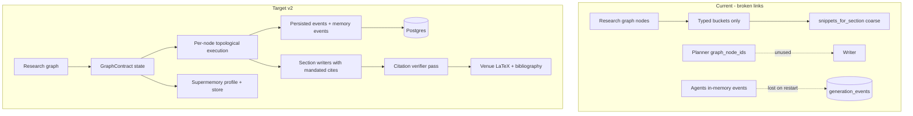

# Holocron pipeline v2: graph-faithful generation, Supermemory, and process log

## Problems confirmed from your screenshot

| Issue | Root cause |
|-------|------------|
| Process Log stuck on "Waiting for agent activity…" | `generation_events` table is **empty** for `45d575ac`; events live only in agents RAM until polled, and the refactored [`commander.py`](apps/agents/src/orchestrator/commander.py) no longer emits `_emit` events (Supermemory/Planner/Reviewer logs removed) |
| `Related_Work.tex` / `Results.tex` are **0 B** | Literature `bibtex` not extracted into snippets; `graph_node_ids` from planner never used; reviewer auto-approves when snippets empty |
| Supermemory card shows raw text wall | UI is search-only (`string[]`), no profile, no metadata, no phase-aware updates |
| Graph not fully followed | Coarse bucket mapping — no per-node execution in topological order |



---

## 1. Fix Process Log (P0)

### 1a. Restore event emission in agents

Re-add `_emit` calls throughout [`commander.py`](apps/agents/src/orchestrator/commander.py) for: Commander start/complete, Planner search/plan, Writer draft/complete, Reviewer rounds, Supermemory profile/search/store, Typesetter, expansion passes.

### 1b. Persist events durably

**Option (recommended):** Agents write each event to Postgres in `on_event` ([`main.py`](apps/agents/src/main.py)) using existing `DATABASE_URL` — eliminates dependence on web polling and survives restarts.

Fallback: Web API [`GET /api/generations/[genId]`](apps/web/src/app/api/generations/[genId]/route.ts) does a **terminal sync** when `status` is completed; return `agentsReachable` / `agentsStatus` in JSON.

### 1c. Backfill existing generation

Add [`scripts/backfill-generation-events.mjs`](scripts/backfill-generation-events.mjs): for completed gens with empty events, insert a structured event timeline from disk artifacts (section mtimes, log messages) so `45d575ac` is immediately viewable.

### 1d. Fix UI empty states

[`ProcessLogPanel.tsx`](apps/web/src/components/paper-generation/detail/ProcessLogPanel.tsx):
- `running` + no events → spinner + "Waiting…"
- `completed`/`failed` + no events → "No log recorded" + backfill hint
- `agentsReachable: false` → actionable error (check `/agents` health)

---

## 2. Supermemory UI upgrade

### 2a. Shared `MemoryView` component

New [`apps/web/src/components/memory/MemoryView.tsx`](apps/web/src/components/memory/MemoryView.tsx) used by:
- [`SupermemoryContext.tsx`](apps/web/src/components/paper-generation/detail/SupermemoryContext.tsx)
- [`MemoryPanel.tsx`](apps/web/src/components/research-graph/MemoryPanel.tsx)

Features:
- **Profile block** (static + dynamic) via new `GET /api/works/[workId]/memory/profile`
- **Search hits** as expandable cards with type badge (`planner`, `writer`, `graph`, `reference`), score, `customId`
- Health/disabled state from `isSupermemoryEnabled()`
- Phase-aware query: derive from latest log event `metadata.section` / `metadata.phase`

### 2b. Enrich memory API

Update [`supermemory-client.ts`](apps/web/src/lib/supermemory-client.ts) `searchMemories` to return `{ text, score?, metadata?, customId? }[]` instead of plain strings.

Wire existing `profileForWork()` into new profile route.

### 2c. Emit memory events (activates DetailPanel drill-down)

In commander, after `context_for_work`, `search_work`, `store_memory`:
```python
await _emit(on_event, "Supermemory", "memory", msg, {
  "action": "profile|search|store", "section": name,
  "containerTag": f"work_{work_id}", "preview": text[:500], "query": q
})
```

---

## 3. Graph-faithful node execution (core pipeline)

### 3a. Introduce `GraphContract` (Story2Proposal-inspired shared state)

New [`apps/agents/src/orchestrator/graph_contract.py`](apps/agents/src/orchestrator/graph_contract.py):
- Built from `extract_graph_context` + edges
- Maps each `node_id` → section obligations, required citations, figures/tables
- Tracks which nodes are **satisfied** (cited / included in LaTeX)
- Validates at end: every non-`start`/`end` node must be satisfied or flagged

### 3b. Fix snippet extraction

[`graph_context.py`](apps/agents/src/orchestrator/graph_context.py):
- Add to `_text_fields`: `bibtex`, `user_notes`, `source_note`, `related_terms`, `unit`, `target_value`, `script_source`, `notes`
- New `snippets_for_node_ids(ids, ordered=True)` respecting `ordered_node_ids`
- New `section_flow(section_name, node_ids)` — topological sub-path for that section
- Extract `end` node notes into generation config hints

### 3c. Consume `graph_node_ids` in commander

[`commander.py`](apps/agents/src/orchestrator/commander.py) `_write_section`:
- Pass `section.get("graph_node_ids")` to targeted snippets (not just coarse `snippets_for_section`)
- Pass section-scoped flow string, not global `flow_summary()` for all sections
- Remove stale empty-file fallback; fail section if still `< min_words` after writer fallback
- Always run `_ensure_academic_sections` even when `enablePlanning: false`

### 3d. Per-node execution checklist

Before compile, run `GraphContract.validate()`:
- Literature nodes → must appear as `\cite{litN}` in Related Work or Introduction
- Method/experiment/data nodes → referenced in Methods
- Result/metric/finding/figure/table nodes → referenced in Results
- Unsatisfied nodes → trigger **targeted re-draft** of that section (max 1 pass)

### 3e. Reviewer hardening

[`reviewer.py`](apps/agents/src/agents/reviewer.py):
- Never auto-approve Methods/Results/Related Work when snippets empty **and** contract has nodes for that section
- Add `citation_coverage` check: count `\cite{}` keys vs required `bib_keys`

---

## 4. Paper quality, format, and full citations

### 4a. Venue-native LaTeX

Upgrade [`_build_main_tex`](apps/agents/src/orchestrator/commander.py) to copy structure from [`templates/icml/main.tex`](templates/icml/main.tex), [`templates/nature/main.tex`](templates/nature/main.tex), [`templates/ieee/main.tex`](templates/ieee/main.tex):
- ICML target venue → `icml2024` package + `\bibliographystyle{icml2024}`
- Nature → `natbib` + `naturemag`
- IEEE → `IEEEtran`

Add `references.bst` / style files to output dir when needed.

### 4b. Citation Verifier agent (AMAR/PaperOrchestra pattern)

New [`apps/agents/src/agents/citation_verifier.py`](apps/agents/src/agents/citation_verifier.py):
- Parse all `\cite{keys}` across sections
- Compare against `references.bib` + graph literature keys
- Emit report; if uncovered refs exist, inject "References to cite: …" into thinnest section and re-draft once
- **Goal: every bib entry used at least once; every literature node cited**

### 4c. Writer citation mandates

[`writer.py`](apps/agents/src/agents/writer.py):
- Related Work: require `\cite{lit0}`, `\cite{lit1}`, … for each literature node
- Introduction: cite at least 3 discovered refs
- Results: include all figure/table LaTeX blocks from contract
- Post-process: if `word_count < 50`, build fallback from `bibtex` + node snippets (not empty `\section{}` only)

### 4d. Regenerate empty sections for current gen

One-shot script [`scripts/repair-generation-sections.mjs`](scripts/repair-generation-sections.mjs) or agents endpoint to re-draft only `Related_Work` + `Results` for `45d575ac` using fixed pipeline.

---

## 5. Industry patterns to adopt

| Pattern | Source | Holocron application |
|---------|--------|---------------------|
| Specialized agent pipeline | PaperOrchestra, AISSISTANT | Keep Planner → Literature → Writer → Reviewer → CitationVerifier → Typesetter → VLM |
| API-grounded citations | PaperOrchestra, AMAR | Semantic Scholar + arXiv discovery + graph `bibtex`; verifier checks existence |
| Shared contract state | Story2Proposal | `GraphContract` tracks nodes, figures, cites across agents |
| Verifier agent | AMAR | Citation + node-satisfaction pass before compile |
| Human-in-the-loop | AISSISTANT | Keep `pauseForFeedback`; add optional "review section" gate in UI |
| Persistent session memory | AMAR | Supermemory `work_{id}` + `user_{id}` profile at every phase |
| Literature agent pass | PaperOrchestra | Dedicated pre-write step: synthesize Related Work outline from literature nodes before section drafting |

---

## 6. Supermemory depth (agents + web)

Per [docs/SUPERMEMORY.md](docs/SUPERMEMORY.md) and workspace rules:

| When | Action | `containerTag` |
|------|--------|----------------|
| Graph save | `add` graph snapshot | `work_{workId}` |
| Generation start | `profile` + `search` | `work_{workId}`, `user_{userId}` |
| Per section write | `search` with section query | `work_{workId}` |
| After each section | `add` draft | `work_{workId}` |
| After plan | `add` plan JSON | `work_{workId}` |
| Citation verify fail | `search` prior related work | `work_{workId}` |
| Settings save | `add` preferences | `user_{userId}` |

Store `GraphContract` summary as a single Supermemory document at generation start so later sections can `search` it.

---

## 7. Full re-run sequence

After implementation, execute in order:

```bash
# 1. Reseed demo data
npm run seed:all -- --force

# 2. Re-space graph nodes
npm run graph:respread

# 3. Ensure Supermemory + agents up
docker compose -f docker/docker-compose.yml up -d supermemory agents latex

# 4. Clean old generations
npm run gen:cleanup

# 5. Live generation on Multi-Agent work
npm run gen:live

# 6. Sync DB + backfill events
node scripts/sync-generation-row.mjs <newGenId>
node scripts/backfill-generation-events.mjs <newGenId>

# 7. Verify
npm run seed:verify
npm run gen:verify
```

**Success criteria:**
- Process Log shows 30+ events with Supermemory/Planner/Writer/Reviewer entries
- Supermemory UI shows profile + searchable memory cards
- All 7 section `.tex` files non-empty; Related Work cites all literature nodes
- `references.bib` entries all appear in compiled PDF citations
- Word count ≥ 3,500; PDF > 100 KB
- Graph contract validation: 0 unsatisfied nodes

---

## Files to change (priority order)

| Priority | Files |
|----------|-------|
| P0 | `commander.py`, `main.py`, `ProcessLogPanel.tsx`, `generations/[genId]/route.ts`, `backfill-generation-events.mjs` |
| P1 | `graph_context.py`, `graph_contract.py`, `writer.py`, `reviewer.py`, `citation_verifier.py` |
| P1 | `SupermemoryContext.tsx`, `MemoryPanel.tsx`, `MemoryView.tsx`, memory API routes, `supermemory-client.ts` |
| P2 | LaTeX templates integration in `commander.py`, `repair-generation-sections.mjs` |
| P2 | `seed-all.mjs` verification, re-run scripts |
