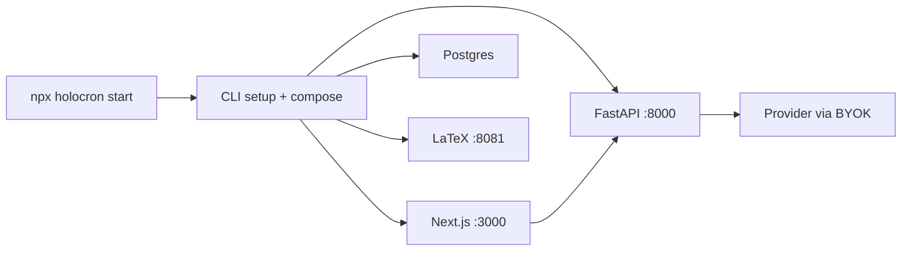

# Holocron Star Wars Remaster

## Locked decisions

- **Runtime:** Docker remains the only prerequisite. First `npx holocron start` auto-runs setup if needed, pulls images, waits for health, opens the browser.
- **Theme:** Blend — dark space backgrounds; **crimson red** for primary actions/glow (logo); **crawl yellow** for display titles; **cyan** for info/status.
- **IP safety:** Original / open-licensed assets only. No Disney trademarks, official Star Wars fonts, or scraped movie screenshots. Homage aesthetic (space, holocron geometry, terminal readouts), not a clone of licensed UI.

## Current baseline

- UI is generic light/blue “AcademicHub” ([`apps/web/src/app/globals.css`](apps/web/src/app/globals.css), [`navbar.tsx`](apps/web/src/components/navbar.tsx), [`page.tsx`](apps/web/src/app/page.tsx)).
- LLM is hard-coded K2 Think in [`apps/agents/src/llm.py`](apps/agents/src/llm.py) / [`config.py`](apps/agents/src/config.py).
- CLI already does `npx holocron start` → Docker Compose + `~/.holocron/.env` ([`packages/cli`](packages/cli)), but branding still says AcademicHub and setup only asks for K2.

---

## 1. Design system (blend palette)

Update [`apps/web/src/app/globals.css`](apps/web/src/app/globals.css) tokens; default theme **dark**:

| Role | Token | Approx value |
|------|--------|----------------|
| Background | `--color-background` | near-black `#050505` / deep space |
| Surface | `--color-card` | charcoal panels |
| Primary (actions) | `--color-primary` | holocron crimson `#C41E3A` |
| Display / titles | `--color-accent-yellow` | crawl gold `#FFE81F` |
| Info / status | `--color-accent-cyan` | `#4FC3F7` |
| Borders | subtle warm/cool metallic edges |

Also:

- Load expressive fonts via `next/font` (e.g. **Orbitron** or **Exo 2** for display, clean sans for body) — not system Inter.
- Soft geometric motif (subtle triangular/holocron lattice in CSS, not busy LCARS chrome).
- Extend [`apps/web/src/components/ui.tsx`](apps/web/src/components/ui.tsx): sharper corners (small radius), red primary buttons, cyan outline/ghost for secondary, yellow used sparingly for page titles.
- Graph node colors in [`nodes.tsx`](apps/web/src/components/research-graph/nodes.tsx) / shared badge styles: retune to SW-adjacent hues that stay distinguishable (keep category contrast for usability).

## 2. Branding & layout surfaces

- Replace **AcademicHub** → **Holocron** in UI, CLI, metadata, LaTeX author string, README.
- Place [`holocron.png`](holocron.png) at `apps/web/public/holocron.png` (and favicon/app icon derivatives).
- Navbar: logo + “Holocron”; remove owl avatar; Settings link for BYOK.
- Landing ([`page.tsx`](apps/web/src/app/page.tsx)): one composition — logo as hero brand, one headline, one short line, CTA group; dark space atmosphere (CSS stars / subtle parallax), not a dashboard of cards.
- Light Star Wars flavor in copy only where it helps (“Archives” subtitle for References optional); keep nav labels functional: Research Graph, Paper Generation, References, Agents, Settings.

## 3. Motion & assets (restrained)

Ship 2–3 intentional motions:

1. Holocron logo idle pulse / soft red glow on home and loading states.
2. Page enter fade/slide for main content (CSS or Framer Motion if already easy to add).
3. Generation “thinking” indicator: pulsing crimson panel (agent pipeline), not a full crawl on every page.

Optional one-shot: first-visit “crawl” teaser dismissible on home — skippable, never blocks workflows.

Assets to add under `apps/web/public/`:

- Logo from repo.
- Lightweight SVG starfield / geometric corner ornaments (hand-authored or open-license).
- Prefer CSS/SVG over heavy downloaded image packs.

## 4. Multi-provider BYOK

### Agents layer

Refactor [`apps/agents/src/llm.py`](apps/agents/src/llm.py) into a small provider router (still OpenAI-compatible client where possible):

| Provider | Env keys (examples) | Notes |
|----------|---------------------|--------|
| **k2think** (default) | `LLM_PROVIDER`, `K2THINK_*` | Current behavior; demo default |
| **openai** | `OPENAI_API_KEY`, model | Official API |
| **anthropic** | `ANTHROPIC_API_KEY`, model | Messages API or compatible gateway |
| **google** | `GOOGLE_API_KEY`, model | Gemini |
| **openrouter** | `OPENROUTER_API_KEY`, model | Broad model access |
| **custom** | `LLM_BASE_URL`, `LLM_API_KEY`, `LLM_MODEL` | Any OpenAI-compatible endpoint |

Config in [`config.py`](apps/agents/src/config.py): `llm_provider`, unified `llm_api_key` / `llm_base_url` / `llm_model`, keep K2 aliases for back-compat. Mock mode when key is missing/`mock-key-for-dev`.

Expose `GET /config/llm` (no secrets) and `POST /config/llm` or rely on web writing `~/.holocron/.env` via API that restarts or hot-reloads settings — prefer **write env + document restart**, or agents reload settings on each request from env for simplicity in local Docker (compose env file already mounted).

### Web Settings UI

New page `/settings` (and API route if needed):

- Provider select (K2 Think highlighted as recommended for demos).
- API key field (masked), base URL override, model name.
- Optional Semantic Scholar key.
- Save → persists to `~/.holocron/.env` through a local-only API (or instruct CLI `holocron setup`); for Docker release, web can write a config file mounted from `~/.holocron` and agents read it.

### CLI setup

Expand [`packages/cli/src/commands/setup.ts`](packages/cli/src/commands/setup.ts):

1. Choose provider (default K2 Think).
2. Prompt for that provider’s key / model.
3. Optional S2 key.
4. Write full env for compose.

`start` already calls setup if no env — keep that; after healthy, `open http://localhost:3000`.

## 5. Zero-friction local start (1A)

Polish [`packages/cli/src/commands/start.ts`](packages/cli/src/commands/start.ts) + doctor:

- Clear message: only Docker Desktop required.
- Auto setup when `~/.holocron/.env` missing (allow empty key → mock for tour).
- Wait for web/agents health endpoints before printing success.
- Open browser when ready.
- Rebrand all CLI strings to Holocron.
- README: single path `npx holocron start` → setup → localhost:3000; document providers table.

No Docker elimination; no cloud auth (stay local `LOCAL_USER`).

## 6. Implementation order

1. Tokens + fonts + `ui.tsx` + dark default.
2. Brand/logo/navbar/landing + shared copy sweep.
3. Secondary pages (graph, paper gen, references, agents) — themed chrome without breaking density.
4. Motion + public assets.
5. Agents LLM router + env schema.
6. Settings page + CLI setup multi-provider.
7. CLI start health-wait + browser open + README.

## Out of scope

- Removing Docker / embedding Postgres-LaTeX in pure Node.
- Real multi-user auth / Supabase.
- Pixel-perfect recreation of the community Figma library (file is mostly a crawl cover; use as palette/mood reference only).
