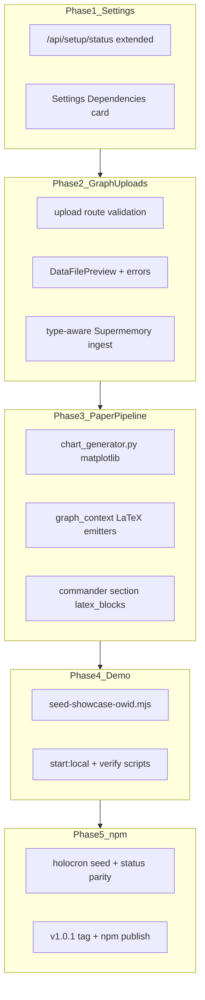

# Holocron: Settings Health, Rich Media, Paper Charts, Demo, npm Publish

## Scope summary

Five workstreams, executed in order with **incremental git commits** after each:

1. Settings dependency health panel
2. Research graph file upload UX + ingestion
3. Agent paper pipeline: charts, tables, equations, code
4. Local run + OWID showcase verification
5. npm package fixes + publish prep



---

## Phase 1 — Settings: dependency health

**Problem:** Health probes exist but only appear in the dismissible onboarding modal ([`SetupWalkthrough.tsx`](apps/web/src/components/onboarding/SetupWalkthrough.tsx)); Settings ([`settings/page.tsx`](apps/web/src/app/(app)/settings/page.tsx)) has no services panel.

**Changes:**

| File | Change |
|------|--------|
| [`apps/web/src/components/setup/ServiceBadge.tsx`](apps/web/src/components/setup/ServiceBadge.tsx) | **New** — extract `ServiceBadge` from onboarding |
| [`apps/web/src/components/setup/DependenciesPanel.tsx`](apps/web/src/components/setup/DependenciesPanel.tsx) | **New** — card with Postgres, Agents, Supermemory, LaTeX; Refresh + 30s poll; remediation hints (`npm run start:local`, `holocron doctor`) |
| [`apps/web/src/app/(app)/settings/page.tsx`](apps/web/src/app/(app)/settings/page.tsx) | Add `DependenciesPanel` above LLM config |
| [`apps/web/src/app/api/setup/status/route.ts`](apps/web/src/app/api/setup/status/route.ts) | Extend response: `web: true`, `supermemoryKeyConfigured`, `supermemoryIntegration` (from agents `/health`), `details: { url, port, error? }` per service |
| [`apps/web/src/app/api/setup/storage/route.ts`](apps/web/src/app/api/setup/storage/route.ts) | **New** — wire existing `getStorageBreakdown()` from [`app-config.ts`](apps/web/src/lib/app-config.ts) (Settings already references this API but route is missing) |

**Reuse:** Same probe logic as onboarding; optionally call [`/api/agents/health`](apps/web/src/app/api/agents/health/route.ts) for Supermemory integration state (`ok` / `disabled` / `unreachable`).

**Commit:** `feat(web): add dependency health panel to settings`

---

## Phase 2 — Research graph: CSV/XLS/charts upload

**Current state:** Client `accept` filters exist in [`node-field-schemas.ts`](packages/shared/src/node-field-schemas.ts); server accepts any file ([`upload/route.ts`](apps/web/src/app/api/works/[workId]/upload/route.ts)); all uploads call PDF-only `ingestReferencePdf()`; no tabular preview; upload errors swallowed in [`FileDropzone.tsx`](apps/web/src/components/research-graph/fields/FileDropzone.tsx).

**Changes:**

| File | Change |
|------|--------|
| [`apps/web/src/app/api/works/[workId]/upload/route.ts`](apps/web/src/app/api/works/[workId]/upload/route.ts) | Accept `fieldKey` + `nodeType` in form; validate extension against schema; return typed error messages |
| [`apps/web/src/lib/supermemory-client.ts`](apps/web/src/lib/supermemory-client.ts) | Add `ingestWorkFile(path, workId, mime)` — PDF → `/v3/documents/file`; CSV/TXT/JSON → text excerpt via `storeMemory()`; images → skip ingest (path stored only) |
| [`apps/web/src/app/api/works/files/route.ts`](apps/web/src/app/api/works/files/route.ts) | Add MIME for `.xlsx`, `.xls`, `.tsv`, `.parquet` |
| [`apps/web/src/components/research-graph/fields/DataFilePreview.tsx`](apps/web/src/components/research-graph/fields/DataFilePreview.tsx) | **New** — fetch CSV/TSV, render first 8 rows in HTML table; XLS/XLSX show metadata + download link |
| [`apps/web/src/components/research-graph/fields/NodeFieldRenderer.tsx`](apps/web/src/components/research-graph/fields/NodeFieldRenderer.tsx) | Route `data`/`table` file fields to `DataFilePreview`; `figure` keeps `FigurePreview` |
| [`FileDropzone.tsx`](apps/web/src/components/research-graph/fields/FileDropzone.tsx) | Pass `fieldKey`/`nodeType`; surface toast on failure |
| [`apps/agents/src/orchestrator/graph_context.py`](apps/agents/src/orchestrator/graph_context.py) | Include `file_path`/`data_path`/`figure_path` in agent snippets; add `parse_tabular_file()` stub used in Phase 3 |

**Commit:** `feat(graph): validate uploads, tabular preview, and type-aware memory ingest`

---

## Phase 3 — Paper generation: charts, tables, equations, code

**Current state:** [`graph_context.py`](apps/agents/src/orchestrator/graph_context.py) copies figure images and builds tables from manual `columns`/`rows` text only; `latex_blocks` injected into **Results** only ([`commander.py`](apps/agents/src/orchestrator/commander.py) line ~209); equations/code exist as plain text in `metric.formula` / `method.pseudo_code` but are not rendered as LaTeX.

**New agent dependencies** in [`apps/agents/requirements.txt`](apps/agents/requirements.txt):
- `pandas`, `matplotlib`, `openpyxl` (XLS/XLSX parsing)

**New module:** [`apps/agents/src/orchestrator/chart_generator.py`](apps/agents/src/orchestrator/chart_generator.py)

| Capability | Implementation |
|------------|----------------|
| **Bar chart** | From `data`/`table` nodes with `data_path` CSV — group-by column + numeric column |
| **Frequency distribution** | Histogram of numeric column from uploaded CSV |
| **Tables** | `parse_tabular_file()` fills `columns`/`rows` when `data_path` set but rows empty |
| **Equations** | `latex_equations_from_graph()` — wrap `metric.formula` in `\begin{equation}...\end{equation}` when non-empty |
| **Code** | `latex_code_from_graph()` — `method.pseudo_code` → `\begin{lstlisting}...\end{lstlisting}` |

**Pipeline wiring** ([`commander.py`](apps/agents/src/orchestrator/commander.py)):

1. After `extract_graph_context`, call `generate_charts_from_graph()` → PNGs in `figures/`
2. Merge agent-generated figures with uploaded `figure_path` assets
3. Build section-specific `latex_blocks`:
   - **Methods** → code blocks
   - **Results** → figures (uploaded + generated), tables, equations
4. Use node `caption` in `\caption{}` instead of generic "Figure from research graph"

**LaTeX preamble** in `_build_main_tex()`:
- Add `\usepackage{listings}` for code
- `amsmath` already present for equations

**Writer prompt** ([`writer.py`](apps/agents/src/agents/writer.py)): instruct to preserve pre-built LaTeX blocks verbatim; do not paraphrase equations or code.

**Commit:** `feat(agents): generate charts, tables, equations, and code in papers`

---

## Phase 4 — Local verification + OWID showcase

### Demo topic (user confirmed)

**Title:** *Global CO₂ Emissions and Life Expectancy: A Cross-Country Analysis (1990–2023)*

**Data source:** [Our World in Data](https://ourworldindata.org/) — public CSV exports (auto-downloaded).

### New script: [`scripts/seed-showcase-owid.mjs`](scripts/seed-showcase-owid.mjs)

Auto-downloads to `scripts/seed-assets/owid/`:
- `co2-emissions-per-capita.csv`
- `life-expectancy.csv`

Builds a full IMRaD graph exercising every capability:

| Node type | Showcase content |
|-----------|------------------|
| `start` | Paper title + Nature venue |
| `idea` / `question` / `hypothesis` | Climate–health linkage hypothesis |
| `literature` | PDF upload slot (optional OWID methodology PDF) |
| `data` | Uploaded OWID CSV (`file_path`) |
| `table` | `data_path` → same CSV; auto-populated rows in pipeline |
| `figure` | **Uploaded** bar chart PNG (pre-generated in script) |
| `metric` | Pearson correlation formula in `formula` field |
| `method` | Python analysis `pseudo_code` block |
| `experiment` / `result` / `finding` | Narrative nodes |
| `end` | Generation entry |

Script also generates `owid_emissions_bar.png` and `owid_life_exp_histogram.png` via existing [`seed-utils.mjs`](scripts/seed-utils.mjs) pattern (extend with OWID-specific SVG/PNG writers).

Wire into [`package.json`](package.json): `"seed:showcase": "node scripts/seed-showcase-owid.mjs"`

### Verification sequence

```powershell
npm run stop:all
npm run start:local          # stack + bootstrap
npm run seed:showcase        # OWID demo work
# UI checks:
#   Settings → all 4 services green
#   /research-graph/{id} → CSV preview, figure preview, save, Memory panel
#   Generate Paper → Supermemory live, PDF with bar chart + table + equation + code
node scripts/verify-supermemory-e2e.mjs
node scripts/verify-live-generation.mjs {genId}   # requires real K2THINK_API_KEY in .env
```

**Pass criteria:**
- Settings Dependencies panel: database, agents, supermemory, latex all healthy
- Graph: CSV/XLS upload + inline preview; figure/chart image preview
- Generated PDF: contains ≥1 figure, ≥1 table, ≥1 equation, ≥1 code listing
- Supermemory: profile hits after save + during generation

**Commit:** `feat(demo): OWID climate-health showcase seed and verification`

---

## Phase 5 — npm package: clearly usable published version

**Current gaps** (from exploration + uncommitted WIP in [`packages/cli/`](packages/cli/)):

| Issue | Fix |
|-------|-----|
| README says `npm install -g holocron` (wrong package) | Fix [`README.md`](README.md) line 46 → `holocron-research` |
| `holocron start` opens empty DB | Add `holocron seed` command or `--seed` flag in [`start.ts`](packages/cli/src/commands/start.ts) pulling showcase template |
| CLI `status` missing Postgres/LaTeX | Align with web setup/status in [`status.ts`](packages/cli/src/commands/status.ts) |
| Weak CI tarball test | Expand [`ci.yml`](.github/workflows/ci.yml) `test-cli-pack`: `doctor` + compose config validate |
| Uncommitted bootstrap/start fixes | Include existing WIP: [`supermemory-bootstrap.mjs`](scripts/supermemory-bootstrap.mjs), [`start.ts`](packages/cli/src/commands/start.ts), [`docker-compose.release.yml`](packages/cli/assets/docker-compose.release.yml) |
| Version | Bump [`packages/cli/package.json`](packages/cli/package.json) to **1.0.1** |

**Publish flow** (after all commits pushed):

```bash
git tag v1.0.1 && git push origin v1.0.1
# release.yml builds GHCR images + npm publish
```

**Commit:** `fix(cli): publishable holocron-research 1.0.1 with seed and docs`

---

## Incremental commit plan

| # | Commit message | Scope |
|---|----------------|-------|
| 1 | `feat(web): add dependency health panel to settings` | Phase 1 |
| 2 | `feat(graph): validate uploads, tabular preview, and type-aware memory ingest` | Phase 2 |
| 3 | `feat(agents): generate charts, tables, equations, and code in papers` | Phase 3 |
| 4 | `chore(scripts): include pending startup and supermemory bootstrap fixes` | Existing uncommitted infra from git status |
| 5 | `feat(demo): OWID climate-health showcase seed and verification` | Phase 4 |
| 6 | `fix(cli): publishable holocron-research 1.0.1` | Phase 5 |

Commits 4 may merge with 1–3 if files overlap; goal is logical, reviewable increments per your request.

---

## Prerequisites for execution

- **Real `K2THINK_API_KEY`** in `.env` for live paper generation verification (mock mode will not produce rich PDF output)
- **Docker running** for local stack
- No manual file drops needed — OWID CSVs and chart PNGs auto-downloaded per your preference

---

## Risk notes

| Risk | Mitigation |
|------|------------|
| matplotlib in Docker agents image | Rebuild agents container in dev compose; ensure GHCR image rebuilt on tag |
| LaTeX compile fails on `lstlisting` special chars | Escape in `latex_code_from_graph()`; Typesetter self-heal loop |
| XLS parsing without Excel | Use `openpyxl` only; show download-only preview in web for XLS if parse fails |
| Large OWID CSVs | Seed script samples top-N countries + year range 1990–2023 for manageable charts |
