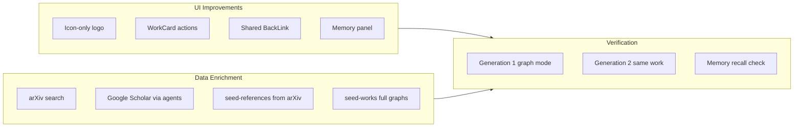

# Holocron UX, Data Enrichment, and Supermemory Visibility

## Current gaps (from codebase review)

| Area | Exists today | Missing |
|------|--------------|---------|
| Logo | [`holocron.png`](apps/web/public/holocron.png) includes icon + "H." | Icon-only asset |
| Research graph actions | `DELETE`/`PUT` in [`/api/works/[workId]`](apps/web/src/app/api/works/[workId]/route.ts) | No delete/edit UI on list or canvas |
| Back navigation | Only on [`GenerationHeader`](apps/web/src/components/paper-generation/detail/GenerationHeader.tsx) | Canvas detail has no back link |
| References search | Semantic Scholar + arXiv in [`FindPaperStep`](apps/web/src/components/references/FindPaperStep.tsx) | Google Scholar; S2 unusable without API key |
| Seed data | 1 template graph, 3 sample refs | Only demo/template content |
| Supermemory | Backend-only (`work_{workId}` tags) | No UI panel; memory search API unused |
| Paper gen verification | `seed-generations.mjs` fakes completed runs | No documented live E2E runs |



---

## Phase 1 — Logo and core navigation UX

### 1a. Icon-only logo
- Add [`apps/web/public/holocron-icon.png`](apps/web/public/holocron-icon.png) — crop/icon-only version from your provided image (no "H." text).
- Update branding in:
  - [`app-shell.tsx`](apps/web/src/components/layout/app-shell.tsx) — use icon asset; keep "Holocron" wordmark only when sidebar is expanded (hidden in `collapsible="icon"` collapsed state via existing shadcn sidebar behavior).
  - [`marketing-header.tsx`](apps/web/src/components/layout/marketing-header.tsx) and [`layout.tsx`](apps/web/src/app/layout.tsx) favicon — use icon-only for favicon; marketing can keep wordmark text separately.
- Sidebar logo link should go to `/research-graph` (app home) instead of `/` marketing page.

### 1b. Shared back navigation
- Add [`apps/web/src/components/layout/back-link.tsx`](apps/web/src/components/layout/back-link.tsx) — reusable `ArrowLeft` + optional breadcrumb label (pattern from `GenerationHeader`).
- Wire into:
  - [`canvas.tsx`](apps/web/src/components/research-graph/canvas.tsx) header — back to `/research-graph` with label "Research Graph".
  - Refactor [`GenerationHeader`](apps/web/src/components/paper-generation/detail/GenerationHeader.tsx) to use `BackLink` (no behavior change).

### 1c. Research graph work actions
- Extract inline cards from [`research-graph/page.tsx`](apps/web/src/app/(app)/research-graph/page.tsx) into new [`WorkCard.tsx`](apps/web/src/components/research-graph/WorkCard.tsx) mirroring [`GenerationCard`](apps/web/src/components/paper-generation/GenerationCard.tsx):
  - **Open** — primary click navigates to canvas
  - **Edit** — `SimpleDialog` to PATCH title/description via existing `PUT /api/works/[workId]`
  - **Delete** — confirm dialog → `DELETE /api/works/[workId]`; disable delete while running generations on that work (check via generations list or 409 from API)
  - **Duplicate** (optional, low-cost) — clone work + nodes/edges for quicker demos
- Add overflow menu (`DropdownMenu` from shadcn) on each card so actions don't fight the open-link click.
- On canvas header: add same overflow menu (Edit metadata, Delete work) beside Save.

### 1d. General UI polish (scoped, high-impact)
- Empty states on list pages: CTA button when no works/refs/generations.
- Research graph list: show search on type (debounced) instead of Enter-only.
- Canvas: editable title inline in header (currently read-only from `initialWork`).
- Settings page: no back needed (top-level nav), but add brief section explaining data sources.

---

## Phase 2 — Reference search: arXiv + Google Scholar (no S2 key)

You cannot get Semantic Scholar API keys — plan treats S2 as **optional/degraded**, not primary.

### 2a. Add `google_scholar` source
- Extend [`paperSearchSourceSchema`](packages/shared/src/reference-types.ts) with `"google_scholar"`.
- Implement search in agents service (new route `GET /agents/search/google-scholar`):
  - Add `scholarly` to [`apps/agents/requirements.txt`](apps/agents/requirements.txt).
  - New module [`apps/agents/src/search/google_scholar.py`](apps/agents/src/search/google_scholar.py) — query → normalized `{ id, title, authors, year, url, abstract }`.
  - Rate-limit / cache lightly to avoid Scholar blocks; return graceful empty + user-visible message on failure.
- Wire web:
  - [`agents-client.ts`](apps/web/src/lib/agents-client.ts) — `searchGoogleScholar()`
  - [`/api/references/search`](apps/web/src/app/api/references/search/route.ts) — route `source=google_scholar` to agents
  - [`FindPaperStep.tsx`](apps/web/src/components/references/FindPaperStep.tsx) — radio options: **arXiv (default)** and **Google Scholar**; hide or de-emphasize Semantic Scholar when `SEMANTIC_SCHOLAR_API_KEY` unset (detect via small `/api/settings/search-sources` or env-exposed flag).

### 2b. Planner fallback (agents)
- In [`planner.py`](apps/agents/src/agents/planner.py): when S2 key missing, fall back to arXiv search (reuse export.arxiv.org query logic) so paper generation still discovers references.

### 2c. Seed real references
- Rewrite [`scripts/seed-references.mjs`](scripts/seed-references.mjs) to fetch **8–12 real papers** from arXiv API (topics: AI in science, bibliometrics, LLM agents) with full metadata + generated BibTeX + analysis summaries.
- Add `npm run seed:refs` script; document `node scripts/seed-references.mjs --force`.
- Optional companion script [`scripts/seed-from-search.mjs`](scripts/seed-from-search.mjs) that accepts `--query` and `--source=arxiv|google_scholar` for ad-hoc seeding via agents.

---

## Phase 3 — Richer research graphs (not demo-only)

### 3a. New seed works script
- Add [`scripts/seed-works.mjs`](scripts/seed-works.mjs) creating **2 additional full works** (`is_template: false`) with complete node data across the 16 node types:
  1. **"Retrieval-Augmented Generation for Scientific Literature"** — idea → literature (linked to seeded refs) → method → experiment → results → figures → end
  2. **"Evaluating Multi-Agent Paper Writing Pipelines"** — hypothesis-driven graph with metrics, tables, paper_section nodes
- Each work: 12–18 nodes, all typed fields filled (`status: "complete"`, real bibtex, descriptions, pseudo_code, etc.) following patterns in [`seed-template.mjs`](scripts/seed-template.mjs).
- Link literature nodes to `references_lib` via `data.reference_id` so `ref_count` and ReferenceCard "Linked to N nodes" work.
- Add `npm run seed:works` and umbrella `npm run seed:all` (template + refs + works + optional generations).

### 3b. UI affordances for fuller graphs
- Graph sidebar References tab: show linked library refs, not just inline literature nodes.
- Inspector literature fields: "Pick from library" dropdown pulling `/api/references`.

---

## Phase 4 — Surface Supermemory usage

Supermemory is integrated backend-only today ([`supermemory-client.ts`](apps/web/src/lib/supermemory-client.ts), [`commander.py`](apps/agents/src/orchestrator/commander.py)). Make it visible without changing the memory protocol.

### 4a. Memory panel on research graph
- New tab **"Memory"** in [`sidebar.tsx`](apps/web/src/components/research-graph/sidebar.tsx) (alongside Nodes / References / Work Info).
- Component [`MemoryPanel.tsx`](apps/web/src/components/research-graph/MemoryPanel.tsx):
  - Search box → `GET /api/works/{workId}/memory/search?q=...`
  - List recalled snippets with `containerTag: work_{workId}` badge
  - Footer note: "Memories stored when you save the graph, upload PDFs, or run paper generation"
  - Status chip: connected / disabled (from agents `/health` supermemory field)

### 4b. Paper generation detail — memory events
- Extend process log in [`ProcessLogPanel`](apps/web/src/components/paper-generation/detail/ProcessLogPanel.tsx) to render `event_type: "memory"` events (add these in [`commander.py`](apps/agents/src/orchestrator/commander.py) when `profile`, `search_work`, `store_memory` run).
- Add collapsible **"Supermemory Context"** section on generation detail showing memories retrieved at generation start (new lightweight `GET /api/generations/[genId]/memory` or reuse work memory search with gen title).

### 4c. Agents page indicator
- On [`agents/page.tsx`](apps/web/src/app/(app)/agents/page.tsx), show Supermemory health badge (ok / disabled / unreachable) from `/health`.

### 4d. Subtle branding
- Small "Powered by Supermemory" tooltip on Memory tab and generation memory section linking to [`docs/SUPERMEMORY.md`](docs/SUPERMEMORY.md).

---

## Phase 5 — Live verification: 2 paper generations

This is an **execution/verification step** after code changes, not just seed fakes.

### Prerequisites
```powershell
docker compose -f docker/docker-compose.yml up -d postgres agents latex supermemory
.\docker\supermemory\bootstrap.ps1   # ensure SUPERMEMORY_API_KEY in .env + apps/web/.env
npm run dev --workspace=web
```
- `K2THINK_API_KEY` or configured LLM provider (mock key works for plumbing; real key better for content quality).
- `SEMANTIC_SCHOLAR_API_KEY` **not required** after planner arXiv fallback.

### Run 1 — Graph mode (seeded work)
1. `npm run seed:all`
2. Open seeded work **"Retrieval-Augmented Generation..."** in Research Graph.
3. Verify Memory tab shows graph snapshot after save.
4. Generate paper from `end` node → land on `/paper-generation/{genId}`.
5. Wait for `completed`; confirm PDF in explorer.

### Run 2 — Same work (Supermemory recall)
1. From same work, trigger second generation.
2. Confirm Memory panel / process log shows recall of gen 1 plan/sections.
3. `curl "http://localhost:3000/api/works/{workId}/memory/search?q=plan"` returns prior artifacts.

### Success criteria checklist
- Both generations reach `completed` (or `completed_with_warnings` with PDF).
- Process log shows planner, writer, typesetter events.
- Supermemory panel shows stored memories after gen 1.
- Gen 2 memory search returns content from gen 1.

---

## Files most touched

| File | Change |
|------|--------|
| [`app-shell.tsx`](apps/web/src/components/layout/app-shell.tsx) | Icon logo, app home link |
| [`research-graph/page.tsx`](apps/web/src/app/(app)/research-graph/page.tsx) | WorkCard with actions |
| [`canvas.tsx`](apps/web/src/components/research-graph/canvas.tsx) | BackLink, edit/delete |
| [`FindPaperStep.tsx`](apps/web/src/components/references/FindPaperStep.tsx) | arXiv + Google Scholar |
| [`reference-types.ts`](packages/shared/src/reference-types.ts) | `google_scholar` source |
| [`agents/.../google_scholar.py`](apps/agents/src/search/google_scholar.py) | Scholar search |
| [`scripts/seed-references.mjs`](scripts/seed-references.mjs) | Real arXiv papers |
| [`scripts/seed-works.mjs`](scripts/seed-works.mjs) | 2 full research graphs |
| [`sidebar.tsx`](apps/web/src/components/research-graph/sidebar.tsx) | Memory tab |
| [`commander.py`](apps/agents/src/orchestrator/commander.py) | Memory events in log |

---

## Risks and mitigations

- **Google Scholar scraping is fragile** — implement in agents with timeouts, user-visible errors, and arXiv as reliable fallback; never block reference add flow on Scholar alone.
- **Scholar rate limits** — cache recent queries in agents memory for session; document that heavy use may need delays.
- **Long paper gen runs** — use modest `targetPages` (5–8) and mock LLM for fast plumbing verification; real LLM for demo quality.
- **`.cursor/mcp.json` API key** — do not commit secrets; keep auth in `.env` only (existing diff should be reverted or gitignored).
