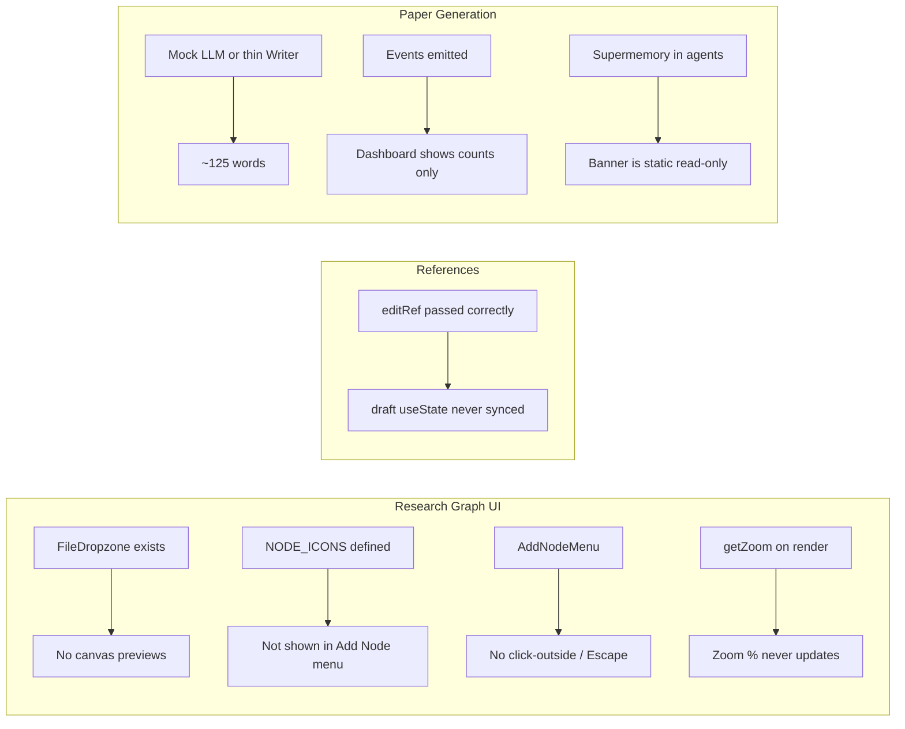
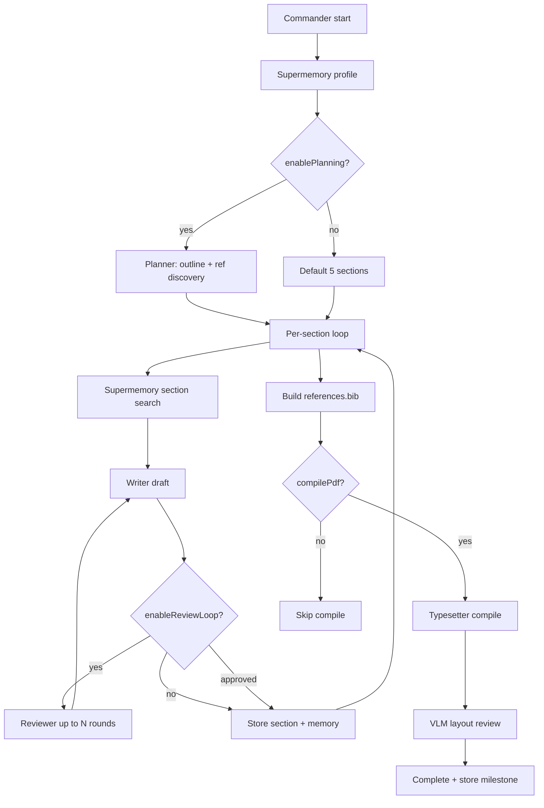
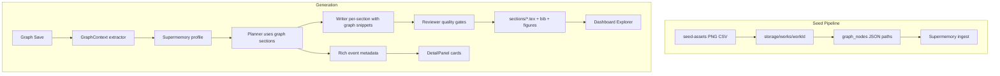

# Holocron AcademicHub-Quality Upgrade Plan

## Current state (root causes)

| Issue | Root cause | Primary files |
|-------|-----------|---------------|
| Missing upload/preview on canvas | `NodeFieldRenderer` on canvas uses `compact` with `showFigurePreview={false}`; empty seed paths | [`nodes.tsx`](apps/web/src/components/research-graph/nodes.tsx), [`NodeFieldRenderer.tsx`](apps/web/src/components/research-graph/fields/NodeFieldRenderer.tsx) |
| No emojis in node picker | `AddNodeMenu` only renders text labels | [`sidebar.tsx`](apps/web/src/components/research-graph/sidebar.tsx) |
| Menu stuck on screen | `AddNodeMenu` has no backdrop, Escape, or pane-click dismiss | [`canvas.tsx`](apps/web/src/components/research-graph/canvas.tsx), [`sidebar.tsx`](apps/web/src/components/research-graph/sidebar.tsx) |
| Zoom % unresponsive | `getZoom()` read once per parent render; no `onMove` subscription | [`canvas.tsx`](apps/web/src/components/research-graph/canvas.tsx), [`toolbar.tsx`](apps/web/src/components/research-graph/toolbar.tsx) |
| Edit reference form empty | `useState(editRef)` in modal only runs on first mount | [`AddReferenceModal.tsx`](apps/web/src/components/references/AddReferenceModal.tsx) |
| Demo nodes look empty | Seeds have text but **no binary assets**; DB may need `--force` re-seed | [`seed-template.mjs`](scripts/seed-template.mjs), [`seed-works.mjs`](scripts/seed-works.mjs) |
| **0 refs on work cards** | Dashboard counts `work_references` table, but seed only sets `reference_id` on literature nodes — junction table never populated; graph save doesn't sync it either | [`works/route.ts`](apps/web/src/app/api/works/route.ts), [`works/[workId]/route.ts`](apps/web/src/app/api/works/[workId]/route.ts), [`seed-works.mjs`](scripts/seed-works.mjs) |
| **Duplicate paper generations** | [`verify-generations.mjs`](scripts/verify-generations.mjs) runs 2 generations on the **same work** for E2E testing | [`verify-generations.mjs`](scripts/verify-generations.mjs) |
| 125-word papers | Writer has no length targets; mock stubs are ~25 words × 5 sections; refs not wired to `.bib` | [`writer.py`](apps/agents/src/agents/writer.py), [`commander.py`](apps/agents/src/orchestrator/commander.py), [`llm.py`](apps/agents/src/agents/llm.py) |
| Workflow not graph-driven | Graph dumped as raw JSON; edges/topology ignored; `paper_section` nodes unused; `compilePdf`/`pauseForFeedback` config ignored | [`commander.py`](apps/agents/src/orchestrator/commander.py), [`planner.py`](apps/agents/src/agents/planner.py) |
| Sparse dashboard | Search events emit count only; Explorer empty if generation dir wrong; Supermemory banner is one-shot | [`DetailPanel.tsx`](apps/web/src/components/paper-generation/detail/DetailPanel.tsx), [`SupermemoryContext.tsx`](apps/web/src/components/paper-generation/detail/SupermemoryContext.tsx) |

You have a real K2 Think API key — ensure it is set in **both** root `.env` and `apps/web/.env` as `K2THINK_API_KEY` (not `mock-key-for-dev`) so `mock_llm` is disabled in [`config.py`](apps/agents/src/config.py).

---

## Phase 1 — Research Graph UX (AcademicHub parity)

### 1a. Fix stuck Add Node menu + zoom + pan

**[`canvas.tsx`](apps/web/src/components/research-graph/canvas.tsx)**
- Track `zoom` in state; subscribe via React Flow `onMove` / `useOnViewportChange` to update it live.
- Close `addMenuOpen` on pane click, Escape key, and when opening Generate modal.
- Render a full-screen transparent backdrop behind `AddNodeMenu` that calls `onClose`.

**[`toolbar.tsx`](apps/web/src/components/research-graph/toolbar.tsx)**
- Lift `tool` state to canvas (or pass callbacks) and wire:
  - `pan`: `panOnDrag={true}`, `selectionOnDrag={false}`
  - `select`: default drag-to-select behavior
- Toggle `panOnScroll` appropriately so zoom still works with mouse wheel.

### 1b. Emojis + grouped node picker (like AcademicHub sidebar)

**[`sidebar.tsx`](apps/web/src/components/research-graph/sidebar.tsx) — `AddNodeMenu`**
- Group options by `NODE_CATEGORIES` from [`node-types.ts`](packages/shared/src/node-types.ts).
- Show `NODE_ICONS[type]` + human label per row (icons already defined in [`node-field-schemas.ts`](packages/shared/src/node-field-schemas.ts)).

Also add icons to the sidebar node list (left panel) next to each node badge.

### 1c. Canvas file/image upload experience

**[`nodes.tsx`](apps/web/src/components/research-graph/nodes.tsx)**
- Pass `showFigurePreview={true}` for `figure`, `table`, and `data` nodes on canvas.
- After a file is uploaded, show inline `FigurePreview` + "Open file" link (AcademicHub style).

**[`NodeFieldRenderer.tsx`](apps/web/src/components/research-graph/fields/NodeFieldRenderer.tsx) + [`FileDropzone.tsx`](apps/web/src/components/research-graph/fields/FileDropzone.tsx)**
- When `value` is set, show filename chip **and** "Open file" link (not just Remove).
- Show accept hints on dropzone: e.g. `.csv, .json, .xlsx…` for data nodes.

**[`TypedFieldLabel.tsx`](apps/web/src/components/research-graph/fields/TypedFieldLabel.tsx)**
- Replace dev-style `string body*` labels with human-readable labels (e.g. "Description", "Rationale") while keeping type hints subtle or hidden in compact mode.

### 1d. Inspector node-type changer

Wire the dead `MoreVertical` button in [`nodes.tsx`](apps/web/src/components/research-graph/nodes.tsx) OR add a type `<select>` in [`inspector.tsx`](apps/web/src/components/research-graph/inspector.tsx) to change `nodeType` and merge default fields for the new type (preserve overlapping keys).

---

## Phase 2 — References edit form fix

**[`AddReferenceModal.tsx`](apps/web/src/components/references/AddReferenceModal.tsx)**
- Add `useEffect` to sync `draft` + `step` when `open` / `editRef` changes (or remount with `key={editRef?.id ?? "new"}`).
- Preserve all DB fields on edit: `source`, `s2_paper_id`, `pdf_storage_path`, `analysis`.

**[`ReviewAnalyzeStep.tsx`](apps/web/src/components/references/ReviewAnalyzeStep.tsx)**
- Sync local `analysis` state when `draft.analysis` changes.

**[`page.tsx`](apps/web/src/app/(app)/references/page.tsx)**
- Pass full `editRef` object (stop hardcoding `source: "manual"`).

---

## Phase 3 — Rich demo graph data + assets

Goal: template + demo works look like AcademicHub screenshots — filled descriptions, visible chart previews, sample datasets.

### 3a. Create seed assets

Add [`scripts/seed-assets/`](scripts/seed-assets/) with:
- 4–6 chart PNG/SVG files (e.g. `tpl_fig1.png` … adoption/impact/diversity plots)
- Sample data files: `openalex_sample.csv`, `corpus.json`
- Optional literature PDF placeholder

Generate simple charts via a small Node script (canvas/chart.js) or ship static SVGs converted to PNG.

### 3b. Link references to works (fix "0 refs")

**Root cause:** Work cards show `ref_count` from the `work_references` junction table ([`works/route.ts`](apps/web/src/app/api/works/route.ts) line 14), but nothing writes to that table. Seed scripts set `reference_id` on literature nodes in `graph_nodes.data` only.

**Fix in [`works/[workId]/route.ts`](apps/web/src/app/api/works/[workId]/route.ts) PUT handler:**
- After saving graph nodes, extract all `reference_id` values from literature nodes.
- `DELETE FROM work_references WHERE work_id = ?` then `INSERT` one row per unique linked ref.
- Keeps dashboard count in sync whenever user saves the graph.

**Fix in seed scripts:**
- [`seed-works.mjs`](scripts/seed-works.mjs): after inserting nodes with `reference_id`, INSERT into `work_references`.
- [`seed-template.mjs`](scripts/seed-template.mjs): add 2 literature nodes with `refIndex` links (AI/bibliometric papers from [`seed-references.mjs`](scripts/seed-references.mjs) queries 3–4) and populate `work_references`.

**Optional belt-and-suspenders:** Change `ref_count` query to also count distinct literature nodes with non-null `reference_id` so the number is correct even before first save sync.

### 3c. Extend seed scripts (assets + content)

Update [`seed-template.mjs`](scripts/seed-template.mjs) and [`seed-works.mjs`](scripts/seed-works.mjs) to:
1. Copy assets into `{STORAGE_PATH}/works/{workId}/` after work creation.
2. Set `figure_path`, `figure_path_url`, `file_path`, `file_path_url`, `data_path` in node JSON.
3. Expand text content (longer captions, method descriptions, experiment environments) to match AcademicHub depth.
4. Populate `bibtex` on literature nodes from seeded references.
5. After seeding, call Supermemory `POST /v3/documents` with graph summary per work (reuse pattern from [`works/[workId]/route.ts`](apps/web/src/app/api/works/[workId]/route.ts) `summarizeGraph`).

**Run:** `npm run seed:all -- --force` to refresh existing DB rows.

### 3d. Demo paper generations — one per topic (fix duplicates)

**Root cause:** [`verify-generations.mjs`](scripts/verify-generations.mjs) intentionally runs **2 generations on the same work** (`Generation 1` + `Generation 2 (same work)`), which is why the Paper Generation list shows two identical "Retrieval-Augmented Generation for Scientific Literature" entries at 125 words.

**Fix:**
1. Update `verify-generations.mjs` to generate on **two different works** (e.g. RAG work + Multi-Agent work), not twice on one work.
2. Add [`scripts/seed-generations.mjs`](scripts/seed-generations.mjs) (or extend `seed:all`) to create **one completed demo generation per seeded work**, each on a distinct topic:

| Work | Generation title | Notes |
|------|-----------------|-------|
| Retrieval-Augmented Generation… | Same as work title | Full pipeline output after Phase 4/5 fixes |
| Evaluating Multi-Agent Paper Writing… | Same as work title | Different topic, different content |
| AI tools expand impact… (template) | Same as template title | Optional — shows template → paper flow |

3. On `--force`, delete existing generations for seeded works before re-seeding to avoid stale duplicates.
4. User can delete the two existing duplicate RAG generations manually, or re-seed will replace them.

### 3e. Align schema with seed fields

Add missing schema fields used in seeds so they render in UI:
- `metric.target_value`, `table.columns` / `table.rows`, `concept.related_terms`, `paper_section.draft_notes`

In [`node-field-schemas.ts`](packages/shared/src/node-field-schemas.ts).

---

## Phase 4 — Generation workflow enforcement (graph → agents → paper)

The intended pipeline (from [`ARCHITECTURE.md`](docs/ARCHITECTURE.md)) is:

**Today the stages exist but agents do not faithfully consume the research graph.** The graph is passed as opaque JSON; node types, edges, figures, and `paper_section` outlines are not mapped into plan/write steps. Config toggles `compilePdf` and `pauseForFeedback` are shown in UI but never read by [`commander.py`](apps/agents/src/orchestrator/commander.py).

### 4a. Graph context extractor (new module)

Add [`apps/agents/src/orchestrator/graph_context.py`](apps/agents/src/orchestrator/graph_context.py):

- **Topological walk** from `start` → `end` following edges (fallback: group by node type if disconnected).
- **Structured extraction** by node type into a `GraphContext` dataclass:

| Node type | Extracted fields | Maps to section |
|-----------|-----------------|-----------------|
| `start` | `paper_title`, `target_venue`, `deadline` | Title, style guide hint |
| `idea`, `question`, `hypothesis` | `body`, `rationale`, `context` | Introduction |
| `literature` | `bibtex`, `user_notes`, `reference_id` | Introduction + `.bib` |
| `concept` | `description`, `definition` | Introduction / Discussion |
| `method` | `description`, `pseudo_code` | Methods |
| `data` | `description`, `file_path` | Methods |
| `experiment` | `description`, `environment` | Methods / Results |
| `metric` | `name`, `formula`, `unit`, `target_value` | Results |
| `result`, `finding` | `description`, `value`, `significance` | Results / Discussion |
| `figure` | `caption`, `figure_path`, `script_source` | Results (with `\includegraphics`) |
| `table` | `caption`, `data_path`, `columns`, `rows` | Results |
| `paper_section` | `section_name`, `outline`, `draft_notes` | Custom section in plan |

- Fix [`planner.py`](apps/agents/src/agents/planner.py) `_derive_query`: use `data.body` (not `data.content`) for idea/hypothesis nodes.
- Pass `GraphContext` summary to Planner and Writer instead of raw graph dump.

### 4b. Planner follows graph + paper_section nodes

**[`planner.py`](apps/agents/src/agents/planner.py)**
- Accept pre-extracted `GraphContext` from commander.
- If graph contains `paper_section` nodes, **merge their outlines** into the plan (these become first-class sections with bullet outlines from `outline` field).
- Prompt instructs: "Derive section list and paragraph counts from graph evidence nodes; Introduction must cite literature nodes; Methods must reflect method/experiment/data nodes; Results must include findings/metrics/figures."
- Return per-section: `{ name, paragraphs, outline: string[], target_words, graph_node_ids[] }`.

### 4c. Commander enforces workflow stages + config flags

**[`commander.py`](apps/agents/src/orchestrator/commander.py)**

| Config flag | Current behavior | Fix |
|-------------|-----------------|-----|
| `enablePlanning` | Works | Keep; pass `GraphContext` to planner |
| `enableReviewLoop` | Works | Keep; add min-word gate before approve |
| `maxReviewIterations` | Works | Keep |
| `targetPages` | Only VLM | Also compute `target_words = targetPages * 250` shared across sections |
| `compilePdf` | **Ignored** | Skip Typesetter when `false`; emit event explaining skip |
| `pauseForFeedback` | **Ignored** | After review loop, if `true`, emit `waiting` event and stop (resume endpoint optional v2) |
| `styleGuide` | Passed to Writer | Also read `start.target_venue` as override hint |

**Phase gates (quality checks before advancing):**
1. After planning: fail fast if 0 sections or plan JSON invalid.
2. After each section write: if word count < 50% of section budget, force reviewer rejection with "expand" instruction.
3. After all sections: if total words < `targetPages * 200`, emit warning and trigger one expansion pass on thinnest section.
4. Before compile: validate all section `.tex` files exist and `references.bib` has entries.

**Figure wiring:** When writing Results (or any section linked to figure nodes), Writer prompt includes figure paths; generated LaTeX uses `\includegraphics` pointing to copied figures in generation output dir (commander copies `works/{workId}/*.png` into `generations/{genId}/figures/`).

**Bibliography wiring:** Build `references.bib` from:
- Planner `discovered_refs` (converted to BibTeX entries)
- Graph `literature` node `bibtex` fields
- Linked references from Postgres if `reference_id` present (optional fetch via work_id)

Replace placeholder `@article{placeholder2024...}` at line 322 of commander.

**Workflow events:** Each phase transition emits event with `{ phase, step, workflow_stage }` metadata so dashboard Process Log mirrors AcademicHub's step-by-step agent timeline and `current_step` in DB stays accurate.

### 4d. Writer + Reviewer follow plan and graph context

**[`writer.py`](apps/agents/src/agents/writer.py)**
- Accept per-section: `outline`, `target_words`, `paragraphs`, `graph_snippets` (relevant node texts), `figures`, `citations`.
- System prompt: "You are writing the {section_name} section for a {style_guide} paper. Use ONLY facts from the provided graph context and references. Target {target_words} words."

**[`reviewer.py`](apps/agents/src/agents/reviewer.py)**
- Reject if: word count below budget, missing citations where literature nodes exist, style violations for target venue.
- Return `revised_content` with expansion when rejected for length.

### 4e. Supermemory tied to workflow stages

At each workflow stage, memory operations must be meaningful:
- **Profile** (pre-plan): query = paper title from `start` node
- **Plan store**: full plan JSON + graph summary
- **Section search** (pre-write): query = `{section_name} {outline_first_bullet}`
- **Section store**: full draft after review approval
- **Complete store**: word counts, section list, figure count

Commander already does this structurally; ensure `GraphContext` enriches what gets stored so re-runs recall useful content.

---

## Phase 5 — Paper generation quality (target: 5,000–8,000 words)

With your K2 Think key configured (`K2THINK_API_KEY` in root `.env` and agents env), focus on pipeline richness (mock improvements as fallback for CI).

### 5a. Writer agent — length + structure

**[`writer.py`](apps/agents/src/agents/writer.py)**
- Accept `target_words`, `paragraphs`, `outline`, `discovered_refs`, `section_memory`.
- Prompt: "Write {target_words} words, {paragraphs} paragraphs; cite using \\cite{key}; use graph node content."

**[`commander.py`](apps/agents/src/orchestrator/commander.py)**
- Compute per-section word budget from `targetPages` (e.g. 250 words/page ÷ sections).
- Pass full section dict from planner (not just `name`).
- Build real `references.bib` from `discovered_refs` + graph literature nodes' `bibtex`.
- Pass graph node texts (hypothesis, methods, findings, figure captions) into Writer context.
- Re-count words after reviewer revision.

### 5b. Mock LLM fallback

**[`llm.py`](apps/agents/src/llm.py)** — section-specific mock stubs (~400 words each) for dev without API key; mock plan returns graph-aware section outlines when graph context is present in the user prompt.

### 5c. Supermemory in generation (functional, not decorative)

Already partially wired in commander; strengthen:
- Include recalled memory text in Writer prompt (already passed; verify non-empty after graph save).
- On generation start, emit memory event with **full preview** (500 chars) not 150.
- After completion, store final paper summary + section list.

Ensure graph **Save** is called before Generate (auto-save already runs on Generate click in [`canvas.tsx`](apps/web/src/components/research-graph/canvas.tsx)).

---

## Phase 6 — Paper Generation dashboard (AcademicHub-style)

### 6a. Richer process log

**[`LogEntry.tsx`](apps/web/src/components/paper-generation/detail/LogEntry.tsx) + [`ProcessLogPanel.tsx`](apps/web/src/components/paper-generation/detail/ProcessLogPanel.tsx)**
- Show agent name badge, duration (already in metadata), event-type color dots (LLM=blue, Search=orange, Found=green).
- Display `word_count` per section from Writer events.
- Poll every 2s while `status === running`.

### 6b. Search detail panel (Reference Discovery)

**[`commander.py`](apps/agents/src/orchestrator/commander.py)** — emit `discovered_refs` (title, authors, year, abstract snippet) in Planner `found` event metadata.

**[`DetailPanel.tsx`](apps/web/src/components/paper-generation/detail/DetailPanel.tsx)** — render paper cards with source badge when search event selected (like AcademicHub right pane).

### 6c. Explorer file tree

Verify storage path alignment ([`storage-path.ts`](apps/web/src/lib/storage-path.ts)) so `sections/*.tex`, `main.tex`, `references.bib`, `main.pdf` appear after generation.

Group files: `Sections/`, `Root/` (Main LaTeX, Paper PDF, References BibTeX) in [`ExplorerPanel.tsx`](apps/web/src/components/paper-generation/detail/ExplorerPanel.tsx).

### 6d. Supermemory integration in dashboard

Replace static [`SupermemoryContext.tsx`](apps/web/src/components/paper-generation/detail/SupermemoryContext.tsx) banner with:
- Live poll during generation using generation title as query.
- Clicking a memory log entry shows **full recalled/stored text** in DetailPanel (fetch from `/api/generations/[genId]/memory` with section-specific query).
- Highlight which memory influenced which section (link via metadata `section` field already emitted).

Remove redundant empty-state message when memories exist in process log.

---

## Architecture after changes

---

## Verification checklist

1. **Research Graph:** Add Node menu closes on outside click; zoom % updates on wheel; figure nodes show inline preview + Open file; picker shows emojis.
2. **References:** Edit opens with title/authors/year/doi/url/notes filled; Save persists changes.
3. **Demo data:** Re-seed with `--force`; template shows 4 figures with images, data node with CSV, literature with bibtex; **work cards show 2+ refs** (not 0).
4. **Paper generations:** One entry per work topic (RAG, Multi-Agent, Template) — no duplicate titles on the list.
5. **Workflow:** Generate from a graph with hypothesis/method/experiment/finding/figure nodes — paper content reflects those nodes; `paper_section` outlines appear as sections; `compilePdf: false` skips typesetting; figures appear in Results LaTeX.
6. **Paper gen:** New run produces 5+ section `.tex` files, real `references.bib`, PDF, word count in thousands (with K2 key).
7. **Dashboard:** Log shows Planner searches with durations; clicking search shows paper list; Explorer shows file tree; memory events show full preview; workflow stages match commander phases.

## Suggested implementation order

1. Quick wins: references edit fix, **work_references sync**, menu/zoom fixes, emojis in picker (~1 session)
2. Canvas upload/preview polish (~1 session)
3. Seed assets + enriched seeds + ref linking + **one generation per topic** (~1 session)
4. **Graph workflow enforcement** — `graph_context.py`, config gates, bib/figure wiring (~1–2 sessions)
5. Writer/commander paper quality (~1 session, builds on Phase 4)
6. Dashboard richness + Supermemory UX (~1 session)
