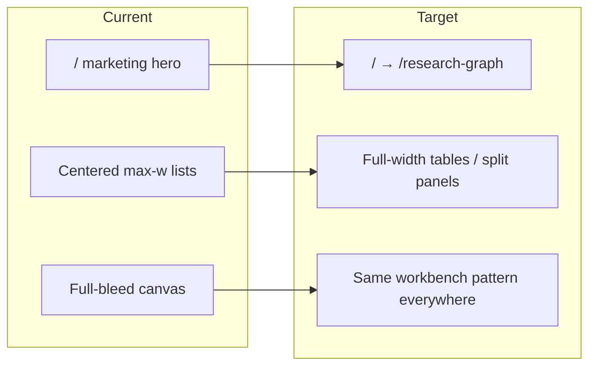
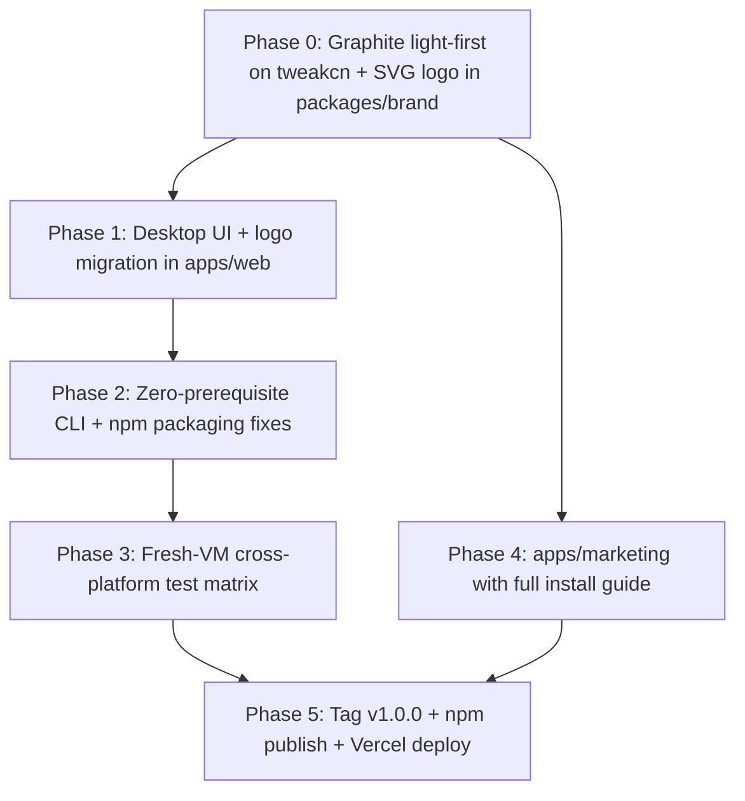

# Holocron v1: Desktop UI, npm Publish, Marketing Site

## Context

Holocron today is a **Docker-first npm CLI** (`packages/cli`) that opens a browser UI at `localhost:3000`. The product already has a sidebar shell ([`apps/web/src/components/layout/app-shell.tsx`](apps/web/src/components/layout/app-shell.tsx)) and two desktop-like workbenches (research canvas, paper generation detail), but list pages, editorial marketing landing, and centered `max-w-*` layouts still read as a SaaS website.

You chose **UI-only desktop feel** (no Electron/Tauri) and a **separate Vercel marketing app**.

**New constraints from iteration:**
- **Light theme is the default** for the product app (dark available via toggle)
- **New logo:** [`holocron.svg`](holocron.svg) replaces all PNG logo assets
- **Zero-dependency PCs:** assume users have **nothing** installed — setup must guide them through installing Node + Docker before first run

---

## Part 1 — Desktop UI + tweakcn Theme + Logo

### Recommended theme: **Graphite** from [tweakcn.com](https://tweakcn.com/)

| Why Graphite | Details |
|---|---|
| Product fit | tweakcn categorizes **graphite**, **darkmatter**, and **mono** as "Precision & Density" presets — ideal for dev/research tools |
| vs current | Current zinc-neutral + blue primary reads as generic SaaS; Graphite uses tighter radius (~0.25rem), neutral grays, subtle borders |
| Holocron accent | Keep a restrained blue-violet primary on Graphite's neutral base (tweak in [tweakcn editor](https://tweakcn.com/editor/theme) before export) |
| Light default | Tune **Graphite light palette first** in tweakcn; dark is the `.dark` override — matches your preference for a bright default workspace |

**Alternate if Graphite feels too cold:** **Notebook** (warmer, note-app feel) — pick one in Phase 0 preview, commit to one preset.

### Theme application

1. Export Graphite CSS from tweakcn — **light `:root` tokens first**, then `.dark` override
2. Replace `:root` / `.dark` blocks in [`apps/web/src/app/globals.css`](apps/web/src/app/globals.css)
3. Update [`apps/web/src/app/layout.tsx`](apps/web/src/app/layout.tsx): **`defaultTheme="light"`**, `enableSystem={false}` (predictable default)
4. Swap fonts: **Geist Sans** + **JetBrains Mono** for product; drop Newsreader from app routes (marketing site keeps editorial fonts)
5. Reduce `--radius` to `0.25rem–0.375rem` for sharper desktop chrome

### Logo migration — [`holocron.svg`](holocron.svg)

Current SVG uses hardcoded `fill="#1d1d1b"` (near-black) — works on light backgrounds but invisible on dark sidebar/backgrounds.

**Approach:**

1. Create theme-aware SVG at [`packages/brand/logos/holocron.svg`](packages/brand/logos/holocron.svg) with `fill="currentColor"` (replace `#1d1d1b`)
2. Add [`apps/web/src/components/brand/holocron-logo.tsx`](apps/web/src/components/brand/holocron-logo.tsx) — inline SVG or `` with `className="text-foreground"` so it adapts in light/dark automatically
3. Copy to [`apps/web/public/holocron.svg`](apps/web/public/holocron.svg) for favicon/static use; generate `favicon.ico` + `apple-touch-icon.png` from SVG at build time (or use SVG favicon directly in metadata)
4. Replace all PNG references:
   - [`app-shell.tsx`](apps/web/src/components/layout/app-shell.tsx) — sidebar header
   - [`layout.tsx`](apps/web/src/app/layout.tsx) — metadata icons
   - [`marketing-header.tsx`](apps/web/src/components/layout/marketing-header.tsx) (remove with marketing routes, but update if kept temporarily)
5. **Delete old assets:**
   - [`holocron.png`](holocron.png) (repo root)
   - [`apps/web/public/holocron.png`](apps/web/public/holocron.png)
   - [`apps/web/public/holocron-icon.png`](apps/web/public/holocron-icon.png)
6. Marketing site uses same `packages/brand` logo with light/dark variants for hero sections

**Dark-mode edge case:** on dark sidebar (`--sidebar-foreground`), logo inherits sidebar text color via `currentColor` — no separate dark SVG needed.

### Desktop shell changes (product app only)



| Change | Files |
|--------|-------|
| Remove in-app marketing | Delete or gut [`apps/web/src/app/(marketing)/`](apps/web/src/app/(marketing)/); add redirect `/` → `/research-graph` in [`apps/web/next.config.ts`](apps/web/next.config.ts) |
| Fixed viewport shell | [`app-shell.tsx`](apps/web/src/components/layout/app-shell.tsx): `h-svh overflow-hidden`, `Sidebar variant="inset"`, populate header with route title + actions |
| Remove web animations | Drop `.page-enter` from [`globals.css`](apps/web/src/app/globals.css) and `<main>` in AppShell |
| Dense list pages | List pages — replace `mx-auto max-w-* py-8` + hero [`PageHeader`](apps/web/src/components/layout/page-header.tsx) with compact toolbar + full-width `Table` or split-pane layout |
| Settings as panel | Keep route but use dense form rows, no marketing spacing |
| React Flow tokens | Align node/handle colors in [`globals.css`](apps/web/src/app/globals.css) React Flow overrides to Graphite palette |

**Layout reference:** Extend patterns from [`canvas.tsx`](apps/web/src/components/research-graph/canvas.tsx) and [`paper-generation/[genId]/page.tsx`](apps/web/src/app/(app)/paper-generation/[genId]/page.tsx) to list views.

### QA for UI

- Visual pass on all 7 product routes in **light (default)** and dark toggle
- Logo visible on: light sidebar, dark sidebar (toggle), app header, favicon
- Sidebar collapse + `Cmd/Ctrl+B` on Mac/Windows
- React Flow canvas, generation 3-pane grid, modals/wizards unchanged functionally

---

## Part 2 — Zero-Prerequisite Install + npm v1 Publish

### Reality check: what users must install

Holocron cannot run with **literally zero** host software — the npm CLI itself requires Node, and the stack requires Docker. What we **can** guarantee:

| Layer | User installs | Holocron provides automatically |
|-------|---------------|--------------------------------|
| Host | **Node.js 20+** (for `npx holocron`) + **Docker Desktop** | Nothing else — no Python, Postgres, npm clone, or manual env setup |
| First `holocron start` | — | Pulls GHCR images (web, agents, latex, supermemory), runs Postgres with bundled migrations, runs setup wizard if no config, opens browser |

Everything inside Docker (Postgres, Python agents, LaTeX, Supermemory, Next.js web) ships in images — users never install these separately.

### Enhanced CLI: prerequisite detection + guided install

Expand [`packages/cli/src/commands/doctor.ts`](packages/cli/src/commands/doctor.ts):

```
Holocron Doctor — checking your system...

✗ Node.js not found
  → Install Node.js 20 LTS: https://nodejs.org/ (Windows / macOS / Linux installers)

✗ Docker not found
  → Install Docker Desktop: https://docker.com/products/docker-desktop
  → Windows: enable WSL 2 during Docker Desktop setup
  → macOS: allow privileged helper when prompted
  → Linux: install Docker Engine + Compose plugin

✗ Docker installed but not running
  → Start Docker Desktop and wait for "Docker is running"

○ Docker Compose — verify `docker compose version` works

○ Disk space — warn if < 10 GB free (images ~2–4 GB)

○ RAM — warn if < 8 GB (Supermemory embedding)

○ Ports 3000, 8000, 5432, 6767 — must be free
```

**Platform-specific install URLs** stored in [`packages/cli/src/prerequisites.ts`](packages/cli/src/prerequisites.ts):

| OS | Node | Docker |
|----|------|--------|
| win32 | nodejs.org/en/download | docker.com/products/docker-desktop |
| darwin | nodejs.org/en/download | docker.com/products/docker-desktop |
| linux | nodesource or nvm script | docs.docker.com/engine/install |

**`holocron start` first-run flow** (update [`start.ts`](packages/cli/src/commands/start.ts)):

1. Run prerequisite checks **before** anything else
2. If Node missing → print install link, exit 1 (cannot proceed — `npx` wouldn't work anyway unless they used a global install)
3. If Docker missing/not running → print platform guide, optionally `openBrowser()` to Docker download page, exit 1
4. If config missing → auto-run `setup` (already partially done)
5. Set absolute `HOLOCRON_DATA` path (Windows fix)
6. `docker compose pull` then `up -d` (first run pulls all images — document ~5–10 min on slow connections)
7. Wait for health checks, open browser

**New optional command:** `holocron install-guide` — prints full platform-specific checklist (no side effects), linked from marketing site.

### npm packaging fixes (must fix before publish)

| Gap | Fix |
|-----|-----|
| Hardcoded `:0.1.0` image tags in [`docker-compose.release.yml`](packages/cli/assets/docker-compose.release.yml) | Template at build time: release workflow substitutes `$VERSION`; CLI reads package version |
| No DB migrations in release Postgres | Mount bundled `db/migrations` into postgres init (`packages/cli/assets/migrations/`) |
| No `prepublishOnly` | Add `"prepublishOnly": "npm run build"` to CLI package.json |
| Incomplete npm metadata | Add `license`, `repository`, `homepage`, `bugs`, `publishConfig`, `keywords` |
| Windows `~/.holocron` volume paths | Set absolute `HOLOCRON_DATA` in start.ts |
| Supermemory rebuilt every start | Publish `ghcr.io/.../holocron-supermemory:$VERSION`; reference in release compose |
| Minimal CLI tests | Add tests for prerequisite detection, compose version injection, paths |
| No publish-package E2E | CI job: install tarball globally → `holocron doctor` → compose config validates |

### Version coupling strategy

```
git tag v1.0.0
  → build GHCR images :1.0.0
  → inject 1.0.0 into docker-compose.release.yml
  → bump packages/cli version to 1.0.0
  → npm publish holocron@1.0.0
  → holocron start pulls matching images
```

### Cross-platform testing matrix (pre-release)

| Platform | Scenario |
|----------|----------|
| **Windows 11 (fresh VM)** | No Node → install Node → no Docker → install Docker Desktop → `npx holocron@1.0.0 doctor` all green → `start` → browser opens → create work |
| **macOS (fresh)** | Same flow + verify `host.docker.internal` for Supermemory |
| **Linux Ubuntu (fresh)** | Same + Docker Engine install path + port checks without `lsof` false positives |

### In-repo test expansion

- **CLI:** prerequisite detection per platform mock, compose path, version injection, Windows path normalization
- **Web:** Playwright smoke for desktop shell (sidebar, redirect from `/`, logo renders)
- **Agents:** existing pytest + citation verifier
- **Release dry-run:** `npm pack --workspace=holocron` → install tarball → verify assets

### User-facing install flow (marketing site + README)

```bash
# Step 1 — Install prerequisites (one-time, if not already installed)
#   Node.js 20+:  https://nodejs.org/
#   Docker Desktop: https://docker.com/products/docker-desktop

# Step 2 — Verify
npx holocron@latest doctor

# Step 3 — First run (setup wizard + pull images + open browser)
npx holocron@latest start
```

Add [`LICENSE`](LICENSE) (MIT) at repo root.

---

## Part 3 — Marketing Website (`apps/marketing` → Vercel)

### Architecture

```
apps/marketing/          # New Next.js 15 app (static-friendly)
packages/brand/          # holocron.svg, OG templates, screenshots
apps/web/                # Product only — no marketing routes
```

Deploy `apps/marketing` to Vercel; product remains local via npm CLI.

### Pages

| Route | Content |
|-------|---------|
| `/` | Hero with product screenshot, pipeline diagram, CTA `npx holocron start` |
| `/features` | Research graph, multi-agent pipeline, Supermemory, BYOK/local-first |
| `/install` | **Full zero-to-running guide** — platform tabs (Windows / macOS / Linux), Node install, Docker install, first `doctor` + `start`, expected download times, troubleshooting |
| `/docs` | User guide: create work → build graph → generate paper → references |
| `/agents` | Visual agent pipeline diagram |
| GitHub link | Footer CTA to repo |

### `/install` page structure (critical for fresh PCs)

```
┌─────────────────────────────────────────────────┐
│  Platform: [Windows] [macOS] [Linux]            │
├─────────────────────────────────────────────────┤
│  Step 1: Install Node.js 20 LTS                 │
│    → Download button + screenshot               │
│  Step 2: Install Docker Desktop                 │
│    → Platform notes (WSL2 on Windows, etc.)     │
│  Step 3: Open terminal, run:                    │
│    npx holocron@latest doctor                   │
│  Step 4: Start Holocron:                        │
│    npx holocron@latest start                    │
│    (first run downloads ~2–4 GB of images)      │
│  Step 5: Browser opens → create your first work │
├─────────────────────────────────────────────────┤
│  Troubleshooting table (ports, Docker not running)│
└─────────────────────────────────────────────────┘
```

### Visual design

- **Same Graphite tweakcn tokens** as product; marketing hero can use light gradient (matches product default)
- **Logo:** [`holocron.svg`](holocron.svg) from `packages/brand` — dark fill on light hero, `currentColor` on dark sections
- **Assets:** product screenshots, OG image (1200×630), pipeline SVG

### Monorepo wiring

- Add `apps/marketing` to root workspaces
- Turbo task for `marketing#build`
- Vercel project root: `apps/marketing`

---

## Execution order



---

## Success criteria

1. Opening `localhost:3000` feels like a **local desktop tool** — light default, dense panels, no marketing chrome, **holocron.svg logo** visible everywhere
2. A user on a **fresh Windows/Mac/Linux PC** can follow install docs → install Node + Docker → `npx holocron@1.0.0 start` → working app with DB schema
3. Marketing site on Vercel has a **graphic, step-by-step install guide** for users with zero prior dependencies
4. Old PNG logos removed; CI green; release workflow ready for `v1.0.0` tag
