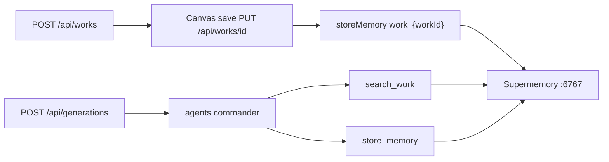

# Local App + Supermemory E2E Verification

## Current state

Recent startup fixes are in place ([`scripts/start-local.mjs`](scripts/start-local.mjs), [`scripts/supermemory-bootstrap.mjs`](scripts/supermemory-bootstrap.mjs), [`docker/docker-compose.yml`](docker/docker-compose.yml)). A **release stack** (`holocron start` / `assets_*` containers) may still be running from the last session — must be torn down first.

Supermemory integration touchpoints for this test:



| Step | Memory action | File |
|------|---------------|------|
| Save graph | `POST /v3/documents` with `containerTag: work_{workId}` | [`apps/web/src/app/api/works/[workId]/route.ts`](apps/web/src/app/api/works/[workId]/route.ts) |
| Paper generation | `search_work` + `store_memory` per section | [`apps/agents/src/orchestrator/commander.py`](apps/agents/src/orchestrator/commander.py) |
| UI panels | Memory panel + SupermemoryContext | [`MemoryPanel.tsx`](apps/web/src/components/research-graph/MemoryPanel.tsx), [`SupermemoryContext.tsx`](apps/web/src/components/paper-generation/detail/SupermemoryContext.tsx) |

---

## Phase 1 — Stop everything

```powershell
cd d:\holocron
npm run stop:all
```

Confirm ports **3000, 8000, 5432, 6767** are free. If Supermemory port is stuck, also run:

```powershell
docker ps -a --filter name=supermemory -q | ForEach-Object { docker rm -f $_ }
```

---

## Phase 2 — Pre-flight fixes

Before starting, verify [`.env`](.env) (create from [`.env.example`](.env.example) if missing):

| Variable | Requirement |
|----------|-------------|
| `K2THINK_API_KEY` | **Real key** (not `mock-key-for-dev`) — you chose full live generation |
| `K2THINK_BASE_URL` | `https://api.k2think.ai/v1/chat/completions` |
| `SUPERMEMORY_API_KEY` | Will be auto-captured on start if missing (`sm_*` from container logs) |

**Known auto-fixes already in code** (no manual volume wipe expected):
- Supermemory encrypted-volume key mismatch → [`ensureSupermemoryHealthy()`](scripts/supermemory-bootstrap.mjs) resets `supermemory_data` volume and retries
- Postgres slow init → `start_period: 60s` in compose

**If settings PATCH fails** (seen as non-fatal in logs): re-run bootstrap manually after stack is up:

```powershell
node scripts/supermemory-bootstrap.mjs
```

---

## Phase 3 — Start local dev stack

```powershell
npm run start:local
```

Expected completion message: `Holocron is ready at http://localhost:3000?onboarding=1`

**Health checks** (use PowerShell — `curl` hangs on Windows here):

```powershell
(Invoke-WebRequest http://localhost:8000/health -UseBasicParsing).Content
(Invoke-WebRequest http://localhost:3000/api/setup/status -UseBasicParsing).Content
node packages/cli/dist/index.js status
```

**Pass criteria before E2E:**
- Agents: `"supermemory": "ok"`, 9 agents online
- Setup status: `"supermemory": true`, `"agents": true`, `"database": true`
- `.env` contains `SUPERMEMORY_API_KEY=sm_...`

---

## Phase 4 — Create new research graph (Supermemory write #1)

### UI flow (primary verification)

1. Open http://localhost:3000/research-graph
2. Click **New Work** → title e.g. `Supermemory E2E Test` → create
3. On the canvas, add a minimal IMRaD graph via sidebar (**Add Node**):
   - `start` → `idea` → `question` → `method` → `result` → `end`
   - Fill node bodies with distinct text (e.g. hypothesis, method, result) so memories are searchable
4. Click **Save** (toolbar)
5. Open **Memory** sidebar tab → confirm badge shows `ok` and profile/hits appear for `work_{workId}`

### API confirmation (objective proof)

After save, call:

```powershell
# Replace {workId} from URL /research-graph/{workId}
(Invoke-WebRequest "http://localhost:3000/api/works/{workId}/memory/profile?q=hypothesis" -UseBasicParsing).Content
```

**Pass:** `"enabled": true` and `profile` or `hits` contain graph summary text.

Optional direct Supermemory smoke (from host):

```powershell
# Read key from .env, POST document
curl -X POST http://localhost:6767/v3/documents -H "Authorization: Bearer $env:SUPERMEMORY_API_KEY" -H "Content-Type: application/json" -d '{"content":"smoke test","containerTag":"work_{workId}"}'
```

---

## Phase 5 — New paper generation (Supermemory read + write #2)

### UI flow

1. On the same canvas, click **Generate Paper** (requires `end` node in graph)
2. Confirm config (planning + review enabled) → start
3. Redirects to `/paper-generation/{genId}`
4. Watch **Supermemory Context** panel — should show `live` polling and memory hits during planning/writing phases
5. Wait for generation to complete (real K2 key — may take several minutes)

### API polling during run

```powershell
(Invoke-WebRequest "http://localhost:3000/api/generations/{genId}/memory?q=plan" -UseBasicParsing).Content
```

**Pass:** `"enabled": true`, `"results"` / `"hits"` non-empty after planning phase starts.

### Completion checks

```powershell
# Generation status
(Invoke-WebRequest "http://localhost:3000/api/generations/{genId}" -UseBasicParsing).Content

# Agents still healthy
(Invoke-WebRequest http://localhost:8000/health -UseBasicParsing).Content
```

**Pass criteria:**
- Generation reaches `completed` (or `running` with visible section artifacts in storage)
- Agents `supermemory: ok` throughout
- Memory API returns hits tied to the work title / section names
- UI SupermemoryContext shows memories (not "disabled")

Optional artifact check:

```powershell
node scripts/verify-live-generation.mjs {genId}
```

(Expects PDF >50KB, 2500+ words — only passes with real K2 generation.)

---

## Phase 6 — Fix blockers if encountered

| Symptom | Likely fix |
|---------|------------|
| `supermemory: disabled` on agents | `node scripts/supermemory-bootstrap.mjs` then `docker compose -f docker/docker-compose.yml restart agents web` |
| Supermemory restart loop / unlock error | Re-run `npm run start:local` (auto volume reset) or `npm run stop:all` + remove `docker_supermemory_data` volume |
| Generation 502 / mock LLM | Confirm `K2THINK_API_KEY` in `.env` is real; restart agents: `docker compose -f docker/docker-compose.yml restart agents` |
| Empty graph generation | Ensure nodes have `body`/`notes` content and graph includes `end` node before Generate |
| Memory panel `enabled: false` | Web container missing key — restart web after bootstrap: `docker compose -f docker/docker-compose.yml restart web` |

---

## Success summary

All of the following must be true:

1. `npm run stop:all` → clean ports
2. `npm run start:local` → completes without manual intervention
3. New research graph created and saved → memory profile returns hits
4. New paper generation started with real K2 key → SupermemoryContext shows live memories; generation progresses
5. `GET :8000/health` → `"supermemory": "ok"` after full flow
