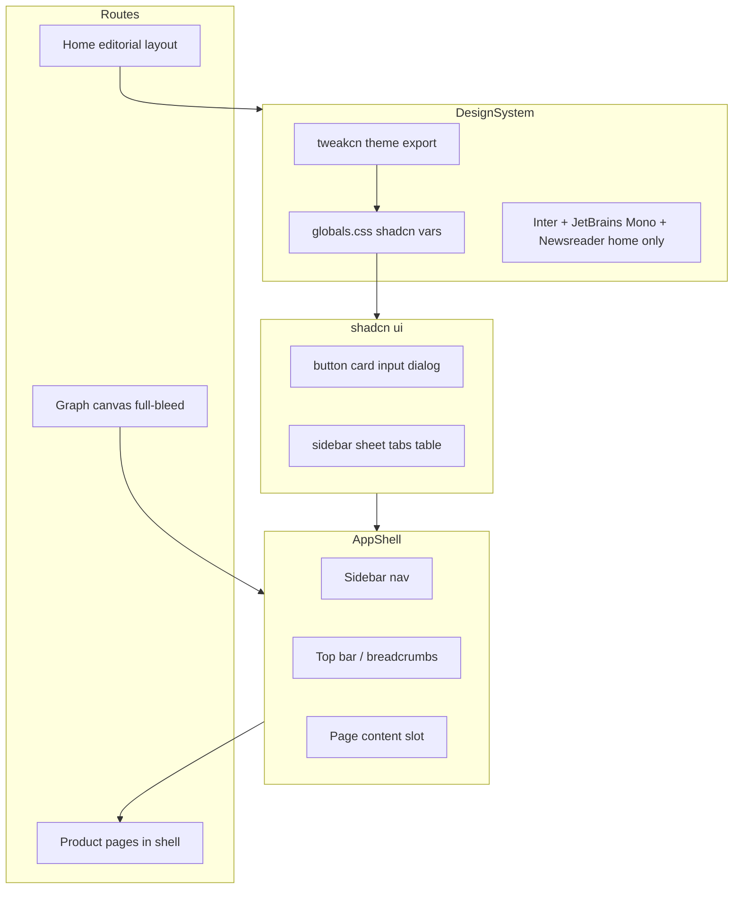

# Holocron Minimal UI Transition Plan

## Direction (locked)

| Surface | Source | Character |
|---------|--------|-----------|
| **Home / marketing** | [Minimalist UI Template](https://www.figma.com/design/GbEWs8sdaUdrbhZakBcit3/Minimalist-UI-Template--Community-?node-id=37-17) | Editorial: high whitespace, serif display accents, asymmetric grid |
| **All product routes** | [Free Minimal UI Kit](https://www.figma.com/design/7xcXd4sTiOcqw7xpzUIvcO/Free---Minimal-UI-Kit--Community-?node-id=10-5167) | Dashboard: sidebar shell, card lists, form fields, dialogs, tables |
| **Theme tokens** | [tweakcn](https://tweakcn.com/) | shadcn-compatible CSS variables; **light mode default**, dark via toggle |
| **Default theme** | Locked | **Light** — matches Minimal UI Kit white surfaces and new dark-on-light logo |

Product pages keep Research Workbench semantics (graph category colors, agent logs in mono) — only the **chrome** changes, not business logic.

---

## Current state

- **Stack:** Next.js 15, Tailwind v4, `next-themes`, custom monolithic [`apps/web/src/components/ui.tsx`](apps/web/src/components/ui.tsx) (~30 import sites)
- **Already present:** `class-variance-authority`, `clsx`, `tailwind-merge`, `cn()` in [`apps/web/src/lib/utils.ts`](apps/web/src/lib/utils.ts) — ready for shadcn
- **Missing:** `components.json`, Radix primitives, shadcn component files
- **Layout:** Top navbar only ([`navbar.tsx`](apps/web/src/components/navbar.tsx)); no sidebar
- **Logo:** New [`holocron.png`](holocron.png) is dark-on-black — **light default improves visibility**; still add subtle `bg-muted` container when logo sits on tinted surfaces (sidebar, dark mode toggle)

---

## Light theme default (locked)

Light is the primary experience; dark remains available via the theme toggle.

**Implementation touchpoints:**

| File | Change |
|------|--------|
| [`layout.tsx`](apps/web/src/app/layout.tsx) | Remove forced `className="dark"` on `<html>`; use `defaultTheme="light"` on `ThemeProvider` |
| [`theme-provider.tsx`](apps/web/src/components/theme-provider.tsx) | Confirm `defaultTheme="light"`, `enableSystem` optional (recommend `false` for predictable default) |
| [`globals.css`](apps/web/src/app/globals.css) | shadcn `:root` = light tokens; `.dark` = dark override (standard shadcn pattern) |
| [tweakcn](https://tweakcn.com/) export | Tune light palette first; verify contrast on white `#fafafa` / `#ffffff` backgrounds |
| [`theme-toggle.tsx`](apps/web/src/components/theme-toggle.tsx) | Reflect light-as-default in toggle initial state |

**QA priority:** validate every route in **light mode first**, then spot-check dark toggle.

## Recommended tweakcn theme

On [tweakcn.com](https://tweakcn.com/), start from a **neutral Zinc or Graphite** preset (matches both Figma kits: black/white, thin borders, generous padding). Tune:

- **Radius:** `0.5rem` (aligns with Minimal UI Kit card/button feel)
- **Primary:** keep Holocron blue (`#1d4ed8` light / `#2563eb` dark) OR shift to near-black primary if matching Figma kit literally — decide in Phase 0 side-by-side preview
- **Light default:** tune tweakcn **light palette first**; dark is secondary override via `.dark` class
- **Font in tweakcn:** Inter (app UI); editorial fonts are home-only

Export tweakcn output into [`apps/web/src/app/globals.css`](apps/web/src/app/globals.css) using shadcn v4 `@theme inline` pattern (literal font names, not circular `var(--font-sans)` refs — see shadcn skill).

```bash
# After theme selection in tweakcn UI:
npx shadcn@latest init -d --base radix -f
# Paste exported CSS variables; then add components incrementally
```

---

## Target architecture



---

## Phase 0 — Discovery and foundation (1–2 days)

1. **Figma audit** (UI Kit file): identify canonical frames for sidebar layout, list page, settings form, modal/wizard, empty state, and table/card row. The linked node `10:5167` did not return component code — during implementation, pick specific frame URLs per screen and run `get_design_context` per frame.
2. **tweakcn selection:** preview 2–3 presets on tweakcn with Button, Card, Input, Sidebar mocks; lock one theme JSON/CSS export.
3. **Initialize shadcn** in [`apps/web`](apps/web):
   - `npx shadcn@latest init -d --base radix -f` (monorepo: set `"ui": "@/components/ui"`, `"css": "src/app/globals.css"`)
   - Add core components first: `button`, `input`, `textarea`, `label`, `card`, `badge`, `dialog`, `select`, `switch`, `separator`, `scroll-area`, `sheet`, `sidebar`, `tabs`, `table`, `dropdown-menu`, `tooltip`, `skeleton`, `sonner` (optional toasts)

**Deliverable:** `components.json`, new `components/ui/*`, updated `globals.css`, no page changes yet.

**Commit:** `feat(web): init shadcn/ui and add core components`

---

## Phase 1 — Design tokens and typography (1 day)

**Files:** [`globals.css`](apps/web/src/app/globals.css), [`layout.tsx`](apps/web/src/app/layout.tsx), [`theme-provider.tsx`](apps/web/src/components/theme-provider.tsx)

- Replace custom `@theme` block with shadcn + tweakcn variables (`background`, `foreground`, `card`, `muted`, `border`, `ring`, `sidebar-*`, etc.)
- **Light-first token structure:** `:root` holds light values; `.dark` holds dark overrides
- Set `defaultTheme="light"` and remove hardcoded `dark` class from `<html>`
- Map semantic colors for graph nodes (`success`, `warning`, `info`) as shadcn-compatible extras
- **App fonts:** Inter (UI), JetBrains Mono (logs/code) — keep current `next/font` wiring
- **Home fonts only:** add Newsreader (+ optional display face inspired by Figma editorial headline) via `next/font` scoped to home route layout or CSS module
- **Logo:** sync [`holocron.png`](holocron.png) → [`apps/web/public/holocron.png`](apps/web/public/holocron.png); optional `bg-muted` wrapper for sidebar

**Commit:** `feat(web): apply tweakcn theme with light default and typography`

---

## Phase 2 — App shell (2–3 days)

**New files:**
- `apps/web/src/components/layout/app-sidebar.tsx` — nav items from current [`navbar.tsx`](apps/web/src/components/navbar.tsx)
- `apps/web/src/components/layout/app-shell.tsx` — sidebar + inset content area using shadcn `SidebarProvider`

**Layout split:**

| Route group | Shell |
|-------------|-------|
| `/` | No sidebar — full editorial home |
| `/research-graph`, `/paper-generation`, `/references`, `/agents`, `/settings` | Sidebar + page header |
| `/research-graph/[workId]` | Sidebar collapsed or icon-only + full-bleed canvas |
| `/paper-generation/[genId]` | Sidebar collapsed + three-panel detail |

**Replace** top [`navbar.tsx`](apps/web/src/components/navbar.tsx) with:
- Sidebar: logo, primary nav, settings link, theme toggle at footer
- Optional thin top bar inside content: page title + actions (matches Minimal UI Kit)

Update [`layout.tsx`](apps/web/src/app/layout.tsx) to conditionally wrap routes (route groups `(marketing)` vs `(app)` recommended).

**Commit:** `feat(web): add sidebar app shell and route groups`

---

## Phase 3 — Component migration (2 days)

Retire monolithic [`ui.tsx`](apps/web/src/components/ui.tsx):

1. Add shadcn equivalents for every export currently used: `Button`, `Input`, `Textarea`, `Card`, `Badge`, `Dialog`, `Switch`, `Select`
2. Create thin re-export shim `ui.tsx` → `@/components/ui/button` etc. **temporarily** to reduce diff size, then remove shim once imports updated
3. ~30 files import `@/components/ui` — migrate imports to `@/components/ui/<name>` in batches

**Variant mapping:**

| Old | shadcn |
|-----|--------|
| `Button variant="secondary"` | `Button variant="secondary"` |
| `Badge variant="success/warning/info/template"` | `Badge` + custom variants via CVA extension |
| Custom `Dialog` | shadcn `Dialog` (Radix) — update `MetadataWizard`, `AddReferenceModal`, BibTeX import |

**Commits (split for reviewability):**
- `refactor(web): add shadcn component shim replacing ui.tsx`
- `refactor(web): migrate imports to shadcn components and remove ui.tsx`

---

## Phase 4 — Page reimagining (4–6 days)

### Home (editorial — Figma Template)

**File:** [`apps/web/src/app/page.tsx`](apps/web/src/app/page.tsx)

Reference Figma frame `37:17`: asymmetric grid, large display type, serif italic subcopy, image/brand column, minimal CTA row. Adapt copy to Holocron (not Kern/Attitude placeholder text). CTAs use shadcn `Button`. Editorial home renders on **light white background** by default.

**Commit:** `feat(web): rebuild home with editorial Minimalist Template layout`

### List pages (UI Kit patterns)

| Page | File | UI Kit pattern |
|------|------|----------------|
| Research Graph | [`research-graph/page.tsx`](apps/web/src/app/research-graph/page.tsx) | Page header + search + card grid; `Dialog` for create work |
| Paper Generation | [`paper-generation/page.tsx`](apps/web/src/app/paper-generation/page.tsx) | List cards via [`GenerationCard.tsx`](apps/web/src/components/paper-generation/GenerationCard.tsx) → shadcn `Card` |
| References | [`references/page.tsx`](apps/web/src/app/references/page.tsx) | Search bar + [`ReferenceCard`](apps/web/src/components/references/ReferenceCard.tsx) grid |
| Agents | [`agents/page.tsx`](apps/web/src/app/agents/page.tsx) | Status badge + card grid; consider `Table` for dense view |
| Settings | [`settings/page.tsx`](apps/web/src/app/settings/page.tsx) | Form sections with `Label`, `Input`, `Select`, `Card` |

Shared pattern: `PageHeader` component (`title`, `description`, `actions` slot).

**Commit:** `feat(web): restyle list pages with Minimal UI Kit patterns`

### Complex surfaces (shell only — minimal layout change)

| Surface | Files | Notes |
|---------|-------|-------|
| Research canvas | [`canvas.tsx`](apps/web/src/components/research-graph/canvas.tsx), [`nodes.tsx`](apps/web/src/components/research-graph/nodes.tsx) | Restyle toolbar/sidebar/inspector with shadcn; keep React Flow + semantic node colors |
| Paper detail | [`[genId]/page.tsx`](apps/web/src/app/paper-generation/[genId]/page.tsx), detail panels | shadcn `ScrollArea`, `Tabs`, `ResizablePanelGroup` (optional) for three-panel layout |
| Wizards | [`MetadataWizard.tsx`](apps/web/src/components/paper-generation/MetadataWizard.tsx), [`AddReferenceModal.tsx`](apps/web/src/components/references/AddReferenceModal.tsx) | shadcn `Dialog` + `WizardStepper` using `Tabs` or custom step indicator |

**Commits:**
- `feat(web): restyle research graph and paper generation surfaces`
- `feat(web): migrate reference and paper wizards to shadcn dialogs`

---

## Phase 5 — Polish and verification (1–2 days)

1. **Light-first QA** on all routes (default load state); then dark toggle parity
2. **React Flow** theme: align background dots/grid to `muted` tokens in light mode
3. **Accessibility:** Radix focus rings, dialog traps, sidebar keyboard nav
4. **Typecheck:** `npx tsc --noEmit` in `apps/web`
5. **Visual QA checklist:** Home, each list page, graph canvas, generation running state, settings, reference wizard — **light first**
6. **Docs:** update [`apps/web/README.md`](apps/web/README.md) (shadcn + tweakcn, light default, new layout), [`docs/ARCHITECTURE.md`](docs/ARCHITECTURE.md) one paragraph

**Commit:** `docs: update UI docs for shadcn minimal theme and light default`

---

## Incremental commit strategy (required)

**Rule:** One focused commit per completed sub-phase. Do not accumulate uncommitted work across phases. Follow existing repo style (`feat(web):`, `refactor(web):`, `docs:`).

| # | Commit message (template) | Scope |
|---|---------------------------|-------|
| 0 | `chore(web): sync holocron logo assets` | Root + `apps/web/public/holocron.png` (if not already committed) |
| 1 | `feat(web): init shadcn/ui and add core components` | Phase 0 — `components.json`, Radix deps, core `components/ui/*` |
| 2 | `feat(web): apply tweakcn theme with light default` | Phase 1 — `globals.css`, `layout.tsx`, `theme-provider.tsx`, fonts |
| 3 | `feat(web): add sidebar app shell and route groups` | Phase 2 — `app-shell`, `app-sidebar`, `(marketing)` / `(app)` groups |
| 4a | `refactor(web): add shadcn component shim replacing ui.tsx` | Phase 3a — shim + first batch of shadcn components |
| 4b | `refactor(web): migrate imports to shadcn and remove ui.tsx` | Phase 3b — ~30 import sites updated |
| 5 | `feat(web): rebuild home with editorial layout` | Phase 4a — editorial home |
| 6 | `feat(web): restyle list pages with Minimal UI Kit patterns` | Phase 4b — list routes + `PageHeader` |
| 7a | `feat(web): restyle graph and generation surfaces` | Phase 4c — canvas chrome, generation detail |
| 7b | `feat(web): migrate wizards to shadcn dialogs` | Phase 4d — MetadataWizard, AddReferenceModal, etc. |
| 8 | `docs: update UI docs for shadcn and light default` | Phase 5 — README, ARCHITECTURE |

**Total:** ~10–11 commits. Each should pass `tsc --noEmit` before committing where feasible.

## Out of scope

- Agents, BYOK, CLI, API routes — no backend changes
- Docker web production build (`@holocron/shared` resolution)
- Replacing holocron logo artwork (only placement/contrast treatment)
- Full Figma pixel-perfect parity on graph node internals

---

## Risks and mitigations

| Risk | Mitigation |
|------|------------|
| UI Kit Figma node not extractable at plan time | Pick concrete frame URLs per screen in Phase 0 |
| Large import churn (~30 files) | Temporary re-export shim; migrate route-by-route |
| Dark logo invisible on dark sidebar | Light default mitigates; add `bg-muted` logo container for dark mode toggle |
| shadcn init overwrites Tailwind v4 setup | Manual merge of tweakcn export into existing `@import "tailwindcss"` block |
| Sidebar reduces canvas space | Collapsible/icon mode on graph and generation detail routes |
