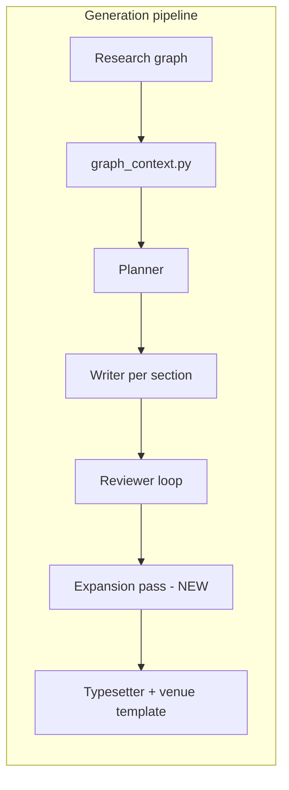

# Paper cleanup, academic pipeline, and graph spacing

## Current state

| Generation | Words | Verdict |
|------------|-------|---------|
| `b8f89876-…` (Multi-Agent) | 1,080 | Only real run (54 events, 94 KB PDF) but still too short |
| `83292d85-…` | 70 | Failed/stub |
| `09c45165-…`, `fac8450a-…` | 125 each | Duplicate RAG stubs |
| `f040ccba-…` | 23 | Failed stub |

Root causes for short papers:
- Reviewer accepts sections at **50% of target** (`min_words = target_words // 2` in [`commander.py`](apps/agents/src/orchestrator/commander.py))
- **Expansion gate is dead code** — logs "expanding thinnest" at line ~815 but never re-drafts
- `_build_main_tex` uses a minimal `article` class and ignores venue templates in [`templates/`](templates/) (ICML/Nature/IEEE)
- Graph tables/figures are copied but **not rendered into LaTeX** in Results
- No guaranteed **Related Work** section when literature nodes exist
- `sync-generations.ts` imports every disk folder with no quality filter, re-populating junk

Graph clutter root cause: seed coordinates stack multiple tall nodes in the same column (e.g. Multi-Agent work has `literature_1` and `literature_2` both at `x: 300` with only ~140px vertical gap while nodes are `min-w-[280px]` with full field previews). At 50% zoom everything overlaps.

---

## 1. Clean up dashboard generations

**Add** [`scripts/cleanup-generations.mjs`](scripts/cleanup-generations.mjs):
- Delete DB rows + `generation_events` + `storage/generations/{id}` for runs matching **any** of:
  - `word_count < 800`
  - `event_count <= 15`
  - duplicate title (keep highest word count + valid PDF)
- Explicit safelist: optionally keep one ID via `--keep=<uuid>`
- Add npm script: `gen:cleanup`

**Update** [`apps/web/src/lib/sync-generations.ts`](apps/web/src/lib/sync-generations.ts):
- Skip import when `word_count < 800` or PDF missing/<5KB
- Prevents re-importing stubs after cleanup

**Run after implementation:** `npm run gen:cleanup` → dashboard shows only the Multi-Agent success (until re-run replaces it).

---

## 2. Improve generation pipeline for academic-quality papers

Target: **~10 pages / ~5,000+ words**, all IMRaD sections, citations, figures/tables from graph, experiment flow from topological order.

### 2a. Planner — graph-driven outline

File: [`apps/agents/src/agents/planner.py`](apps/agents/src/agents/planner.py)

- Add `_ensure_academic_sections(sections, graph_ctx)` after LLM plan:
  - Always ensure: Abstract, Introduction, Methods, Results, Discussion, Conclusion
  - Insert **Related Work** when `literature` nodes exist
  - Boost `target_words` defaults (Abstract 250, Intro 800, Related Work 600, Methods 900, Results 900, Discussion 800, Conclusion 300)
- Pass `ordered_node_ids` + per-type summaries into planner prompt as "experiment flow narrative"
- Map `graph_node_ids` from matching node types when LLM omits them

### 2b. Graph context — richer section mapping

File: [`apps/agents/src/orchestrator/graph_context.py`](apps/agents/src/orchestrator/graph_context.py)

- Extend `snippets_for_section`:
  - **Related Work** → literature + concepts
  - **Conclusion** → findings + ideation
  - Include topological **flow summary** string (node labels in edge order) for Methods/Results prompts
- Add `latex_table_from_graph(table_node)` helper for Results section injection

### 2c. Writer — enforce length and academic structure

File: [`apps/agents/src/agents/writer.py`](apps/agents/src/agents/writer.py)

- Strengthen system prompt: IMRaD conventions, `\cite{}` required when refs provided, no unsupported claims outside graph snippets
- Pass `experiment_flow` and `bib_keys` in context
- For Results: inject pre-built `\begin{table}` / `\includegraphics` blocks from graph assets
- Retry once if output `< 70%` of `target_words` (same request with "expand" instruction)

### 2d. Reviewer — stricter gates

File: [`apps/agents/src/agents/reviewer.py`](apps/agents/src/agents/reviewer.py)

- Change default `min_words` to **85% of target** (not 50%)
- Reject sections that lack graph-derived content in Methods/Results (check for snippet keywords or explicit graph context mention)
- Never approve below `min_words` unless `revised_content` meets threshold

### 2e. Commander — implement expansion + venue templates

File: [`apps/agents/src/orchestrator/commander.py`](apps/agents/src/orchestrator/commander.py)

- **Implement expansion loop** (currently only emits event at ~815):
  - While `total_words < target_pages * 250` and passes `< 2`: re-draft thinnest 2 sections with `target_words * 1.3`
- Raise `min_total` to `target_pages * 250`
- Align review `min_words` with reviewer default
- **Use venue templates**: resolve style from `graph_ctx.target_venue` (ICML → `templates/icml/`, Nature → `templates/nature/`, IEEE → `templates/ieee/`), copy template `main.tex` structure into output and `\input{sections/...}` between `\begin{document}` and bibliography
- Ensure every planned section gets a `.tex` file before compile (fail loudly if missing)

### 2f. Verification thresholds

File: [`scripts/verify-live-generation.mjs`](scripts/verify-live-generation.mjs)

- Raise pass criteria: `words >= 4000`, PDF `> 50KB`, `>= 5` section files, bib without placeholder

### 2g. Re-run one clean generation

- Run `npm run gen:live` on work `f9993635-87b4-49f2-866b-d8930a7c29ab` with `targetPages: 10`, `styleGuide` matching ICML venue
- Cleanup old `b8f89876` after new run passes verify

---

## 3. Research graph spacing and readability

### 3a. Widen seed coordinates

Files: [`scripts/seed-works.mjs`](scripts/seed-works.mjs), [`scripts/seed-template.mjs`](scripts/seed-template.mjs) (if applicable)

- Increase layout constants: **horizontal step ~420px**, **vertical step ~260px** between nodes in same column
- Re-seed with `--force` updates positions for demo works

### 3b. One-time DB migration for existing works

**Add** [`scripts/respread-graph-nodes.mjs`](scripts/respread-graph-nodes.mjs):
- Topological layer layout: assign `x = layerIndex * 420`, distribute `y` within layer with 260px gaps
- Update `graph_nodes.position_x/y` for all works (or `--work-id=...` for Multi-Agent only)

### 3c. Canvas UX — less clutter on nodes

Files: [`apps/web/src/components/research-graph/nodes.tsx`](apps/web/src/components/research-graph/nodes.tsx), new small `NodeCanvasSummary.tsx`

- On canvas: show **label + status + 2-line preview** only (first non-empty text field)
- Keep full `NodeFieldRenderer` in [`inspector.tsx`](apps/web/src/components/research-graph/inspector.tsx) (already has full editing)
- Cap node body height (`max-h-32 overflow-hidden`) so cards stay compact

### 3d. Auto-layout toolbar action

Files: [`apps/web/src/lib/graph-layout.ts`](apps/web/src/lib/graph-layout.ts) (new), [`apps/web/src/components/research-graph/toolbar.tsx`](apps/web/src/components/research-graph/toolbar.tsx), [`canvas.tsx`](apps/web/src/components/research-graph/canvas.tsx)

- Pure-TS layered layout from edges (no new dependency): spread nodes left-to-right by topo order, stack vertically within columns
- **"Spread nodes"** button applies layout + `fitView({ padding: 0.3 })`
- Optional: run once on mount when nodes overlap (detect if >2 nodes share within 50px)

---

## Success criteria

- Paper Generation dashboard: **1 entry** (or 1 per work), no sub-800-word stubs
- New generation: **≥4,000 words**, **≥5 sections**, compiled PDF **>50KB**, real bib entries, figures/tables from graph in Results
- Research graph: nodes readable at 75–100% zoom without overlap on Multi-Agent work

## Files touched (summary)

| Area | Primary files |
|------|----------------|
| Cleanup | `scripts/cleanup-generations.mjs`, `sync-generations.ts`, `package.json` |
| Pipeline | `planner.py`, `writer.py`, `reviewer.py`, `commander.py`, `graph_context.py`, `verify-live-generation.mjs` |
| Graph layout | `seed-works.mjs`, `respread-graph-nodes.mjs`, `graph-layout.ts`, `nodes.tsx`, `toolbar.tsx`, `canvas.tsx` |
