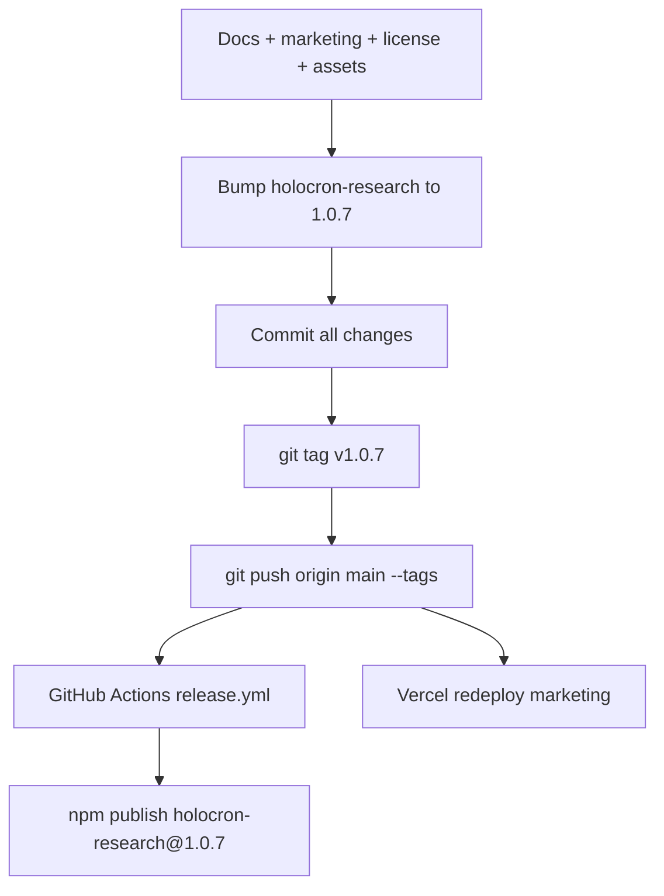

# Holocron Public Launch Plan

## Scope summary

This release covers documentation, branding, licensing, marketing site redesign, asset organization, and npm/GitHub publish — **not** application feature changes.

---

## 1. Asset organization

Move and rename assets to stable, descriptive paths used by both README and marketing site.

| Source | Destination | Use |
|--------|-------------|-----|
| [`Holocron_Light.png`](Holocron_Light.png) | [`docs/assets/holocron-light.png`](docs/assets/holocron-light.png) + [`apps/marketing/public/holocron-light.png`](apps/marketing/public/holocron-light.png) | README header, marketing header/hero |
| `screenshots/Screenshot (858).png` | `docs/assets/screenshots/research-graph-works.png` | Works dashboard |
| `screenshots/Screenshot (859).png` | `docs/assets/screenshots/research-graph-canvas.png` | Interactive graph canvas |
| `screenshots/Screenshot (860).png` | `docs/assets/screenshots/paper-generation-detail.png` | Paper generation detail |
| `screenshots/Screenshot (861).png` | `docs/assets/screenshots/agents-dashboard.png` | Agents page |
| `screenshots/Screenshot (862).png` | `docs/assets/screenshots/references-discover.png` | Reference discovery modal |

Copy the same screenshot set into [`apps/marketing/public/screenshots/`](apps/marketing/public/screenshots/) for the deployed site. Delete the temporary [`screenshots/`](screenshots/) folder and root [`Holocron_Light.png`](Holocron_Light.png) after copy.

---

## 2. Remove Cite Smart and stale references

**Delete:**
- [`docs/CITE_SMART_BORROW.md`](docs/CITE_SMART_BORROW.md)

**Edit (remove links/mentions):**
- [`README.md`](README.md) — line 209 link
- [`docs/SUPERMEMORY.md`](docs/SUPERMEMORY.md) — line 102 link; keep Discover/Ask API docs inline if useful
- [`packages/cli/README.md`](packages/cli/README.md) — line 62 link; trim version-changelog bullets that mention WhatsApp theme (line 51)
- [`apps/web/src/lib/discover-score.ts`](apps/web/src/lib/discover-score.ts) — reword comment to generic “title/keyword overlap scoring”

**Optional comment-only cleanup (no behavior change):**
- [`apps/web/src/app/globals.css`](apps/web/src/app/globals.css) — remove “WhatsApp tweakcn” comment
- [`packages/brand/theme.css`](packages/brand/theme.css) — same
- [`docs/DEMO.md`](docs/DEMO.md) — replace “WhatsApp green theme” with neutral “Holocron green UI”

**Leave untouched:** [`.cursor/plans/`](.cursor/plans/) — internal dev history, not user-facing.

**Academic Hub:** No matches outside `.cursor/plans/` — nothing to change in shipped code/docs.

---

## 3. License → PolyForm Noncommercial 1.0.0

Replace [`LICENSE`](LICENSE) with the full [PolyForm Noncommercial 1.0.0](https://polyformproject.org/licenses/noncommercial/1.0.0/) text, copyright “Holocron Contributors”.

Update license metadata everywhere it appears:

| File | Change |
|------|--------|
| [`packages/cli/package.json`](packages/cli/package.json) | `"license": "PolyForm-Noncommercial-1.0.0"` |
| [`README.md`](README.md) | License section: NC terms + link to PolyForm |
| [`apps/marketing/src/components/site-footer.tsx`](apps/marketing/src/components/site-footer.tsx) | “PolyForm Noncommercial License” |
| Marketing copy | Replace “Open source” with **“Source available (non-commercial)”** — NC is not OSI-open-source |

**Note:** `holocron-research@1.0.6` on npm remains MIT; **v1.0.7** will ship under NC.

---

## 4. Add CONTRIBUTING.md

Create [`CONTRIBUTING.md`](CONTRIBUTING.md) covering:

- **License reminder** — contributions are under PolyForm NC; commercial use requires separate permission
- **Prerequisites** — Node 20+, Docker, optional Python 3.12
- **Dev setup** — clone, `npm install`, `cp .env.example .env`, `npm run start:local`
- **Workflow** — fork → branch → focused PR; run `npm run lint` / relevant tests
- **Scope guidance** — match existing conventions; minimal diffs
- **Issues** — bug reports with repro steps; feature requests welcome
- **Links** — [`docs/ARCHITECTURE.md`](docs/ARCHITECTURE.md), [`docs/TESTING.md`](docs/TESTING.md)

Link from README footer and marketing footer.

---

## 5. README rewrite

Restructure [`README.md`](README.md) to be application-focused:

```markdown
<!-- Top: logo + one-line tagline -->
<p align="center"></p>

**Local-first AI research platform** — visual research graphs → multi-agent LaTeX/PDF papers.

[Demo video](https://youtu.be/5Vnh6s4N_Z4) · [Install](https://holocron-tawny.vercel.app/install) · [Docs](https://github.com/hatif03/holocron/tree/main/docs)
```

**Remove:**
- WhatsApp/tweakcn theme paragraph (line 3)
- Version changelog blocks (`v1.0.5 highlights`, `v1.0.6 highlights`) — move a one-line “Latest: v1.0.7” in install section only
- Cite Smart doc link

**Add:**
- Screenshot gallery (3–5 images with captions) after “What you can do”
- Demo video link in hero badges and a dedicated “Watch the demo” section
- Screenshots table mapping features to images

**Fix URLs:** Standardize marketing site to [`holocron-tawny.vercel.app`](https://holocron-tawny.vercel.app/) (currently README points to `holocron.vercel.app`).

**Keep:** Quick start, architecture diagram, agents table, troubleshooting — these are core and already good.

Also trim [`packages/cli/README.md`](packages/cli/README.md): drop long version-history sections; point to main README for features.

---

## 6. Marketing site — SigNoz-inspired maximalist redesign

Reference: [Agents of SigNoz](https://www.wemakedevs.org/hackathons/signoz) — dense sections, bold display typography, gradient heroes, numbered blocks, feature grids, FAQ, repeated CTAs.

Holocron adaptation (green palette + Instrument Serif, not MIB dark):

### Marketing asset strategy

**User guidance:** Assets (PNG, video, animations, etc.) may be downloaded during implementation or requested from the user when a bespoke file is better than a generated one.

#### Already in repo (use first — no download needed)

| Asset | Path | Marketing use |
|-------|------|---------------|
| Logo (light) | `Holocron_Light.png` → `public/holocron-light.png` | Header, hero, OG fallback |
| App screenshots (5) | `screenshots/` → `public/screenshots/` | Showcase tabs, feature sections |
| Pipeline diagram | [`apps/marketing/public/pipeline.svg`](apps/marketing/public/pipeline.svg) | Hero + pipeline section |
| Icon mark | [`apps/marketing/public/holocron.svg`](apps/marketing/public/holocron.svg) | Favicon fallback, small nav |
| Demo video | [YouTube 5Vnh6s4N_Z4](https://youtu.be/5Vnh6s4N_Z4) | Embedded demo section (no file download) |

#### Create in code (no external files)

- CSS radial gradients, grid/dot backgrounds, glow orbs (SigNoz-style depth without stock photos)
- Hand-authored SVG ornaments (corner brackets, node-link motifs, stat badges)
- Lucide icons already used in marketing — extend for feature cards
- Subtle CSS `@keyframes` for hero glow / floating pipeline labels (lightweight, no Lottie unless user provides)

#### May download during implementation (open-license only)

- **Google Fonts** — Instrument Serif + Plus Jakarta Sans (already used in main app via CDN/import)
- **Subtle noise/grid textures** — only from permissive sources (e.g. SVG patterns generated locally; avoid copyrighted textures)
- **YouTube thumbnail** — fetch via `img.youtube.com/vi/5Vnh6s4N_Z4/maxresdefault.jpg` for demo section poster (no repo commit required; can hotlink)

#### Will ask user only if it materially improves the site

| Asset | Why ask |
|-------|---------|
| **Holocron dark logo** | Hero on dark gradient sections — light PNG may not contrast well |
| **Short loop / GIF** | Hero background animation (e.g. graph nodes animating) — CSS alone may not match SigNoz polish |
| **Branded favicon set** | PNG logo cropped to 32×32 may look soft; user may have a dedicated icon |
| **Custom OG image** | 1200×630 social card with tagline — can generate from screenshot composite, but user may prefer a designed card |

**Default approach:** Ship v1.0.7 with existing assets + CSS maximalism. Only block on user input if contrast or OG quality is clearly insufficient after first pass.

All downloaded assets land in [`apps/marketing/public/`](apps/marketing/public/) with descriptive names and a brief note in [`apps/marketing/README.md`](apps/marketing/README.md) (source + license) if any third-party file is added.

### Design system ([`apps/marketing/src/app/globals.css`](apps/marketing/src/app/globals.css))

- Display font: **Instrument Serif** (matches app)
- UI font: **Plus Jakarta Sans**
- Deep green primary (`oklch` aligned with app tokens from [`packages/brand/theme.css`](packages/brand/theme.css))
- Maximalist utilities: radial gradient heroes, grid backgrounds, glow orbs, section dividers, pill badges, large stat numbers

### Component architecture

| Component | Purpose |
|-----------|---------|
| [`site-header.tsx`](apps/marketing/src/components/site-header.tsx) | Logo PNG, sticky nav with anchor links on home, “Get started” CTA |
| **New** `hero-section.tsx` | Headline, subcopy, install + demo CTAs, embedded YouTube thumbnail/link |
| **New** `demo-video-section.tsx` | Responsive 16:9 embed for `https://youtu.be/5Vnh6s4N_Z4` |
| **New** `screenshot-showcase.tsx` | Tabbed or scroll gallery using `/screenshots/*` |
| **New** `pipeline-section.tsx` | Agent pipeline with SVG + step cards |
| **New** `features-grid.tsx` | 6–8 dense feature cards (graph, discover, ask, memory, paper gen, references, BYOK, local stack) |
| **New** `install-cta-section.tsx` | `npx holocron-research@latest start` + platform pills |
| **New** `faq-section.tsx` | 6–8 FAQs (prerequisites, mock mode, LLM keys, license, data locality) |
| [`site-footer.tsx`](apps/marketing/src/components/site-footer.tsx) | GitHub, demo video, CONTRIBUTING, PolyForm license |

### Homepage ([`apps/marketing/src/app/page.tsx`](apps/marketing/src/app/page.tsx))

Single long-scroll landing (SigNoz pattern):

1. Hero — logo, tagline, CTAs, pipeline preview
2. Demo video
3. Screenshot showcase (5 images)
4. “What Holocron does” — 4-column feature grid
5. Agent pipeline — visual + cards
6. BYOK providers table
7. Install in 4 steps (condensed from install page)
8. FAQ
9. Final CTA band

### Subpages (visual upgrade, keep routes)

- [`features/page.tsx`](apps/marketing/src/app/features/page.tsx) — add screenshots per feature
- [`install/page.tsx`](apps/marketing/src/app/install/page.tsx) — match new design tokens
- [`agents/page.tsx`](apps/marketing/src/app/agents/page.tsx) — use agents screenshot + full agent list
- [`docs/page.tsx`](apps/marketing/src/app/docs/page.tsx) — add demo video link

### Metadata ([`layout.tsx`](apps/marketing/src/app/layout.tsx))

- OG image: holocron-light.png or hero screenshot
- `metadata.openGraph` with demo video URL where supported

---

## 7. Demo video integration

Embed/link `https://youtu.be/5Vnh6s4N_Z4` in:

- README (hero + optional thumbnail)
- Marketing homepage demo section
- Marketing footer
- [`docs/DEMO.md`](docs/DEMO.md) — add “Published demo: [YouTube](…)” at top

Use YouTube embed pattern: `https://www.youtube.com/embed/5Vnh6s4N_Z4` in marketing; markdown link in README.

---

## 8. Publish checklist (v1.0.7)



**Steps:**

1. Bump [`packages/cli/package.json`](packages/cli/package.json) version `1.0.6` → `1.0.7`; update README/CLI install commands
2. Verify `npm run build --workspace=holocron-research` locally
3. Commit with message focused on public launch polish
4. `git tag v1.0.7 && git push origin main && git push origin v1.0.7`
5. Confirm [`.github/workflows/release.yml`](.github/workflows/release.yml) publishes to npm (requires `NPM_TOKEN` secret — already documented in prior plan)
6. Verify: `npx holocron-research@1.0.7 doctor`
7. Confirm marketing deploy at [holocron-tawny.vercel.app](https://holocron-tawny.vercel.app/)

**Optional follow-up (not blocking):** Configure custom domain `holocron.vercel.app` on Vercel if desired.

---

## Files changed (estimated)

| Area | Files |
|------|-------|
| Assets | 11 new paths, 2 temp dirs removed |
| License | `LICENSE`, `packages/cli/package.json`, footer |
| Docs cleanup | 6 files edited, 1 deleted, 1 new (`CONTRIBUTING.md`) |
| README | `README.md`, `packages/cli/README.md`, `docs/README.md` |
| Marketing | ~12 files in `apps/marketing/` (pages, components, CSS, public assets) |
| Code comments | 2–3 minor comment edits |

No application logic changes beyond comment strings.
