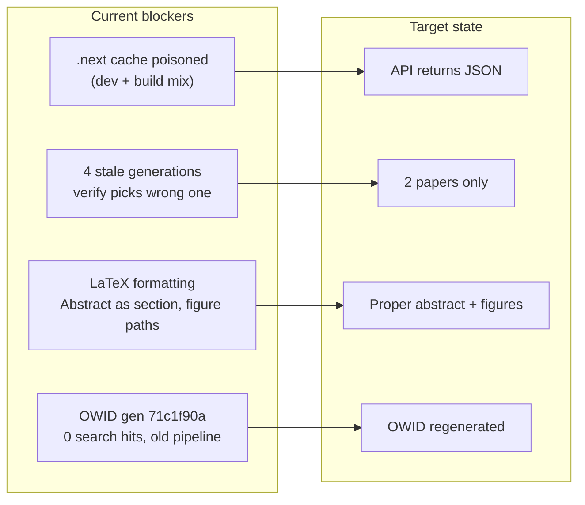

# Public Release Readiness (v1.0.5 + demo fixes)

## Security first (do this immediately)

You pasted an npm granular access token in chat. **Do not commit it or add it to the repo.**

1. Revoke that token at [npmjs.com](https://www.npmjs.com/) → Access Tokens
2. Create a new automation token (Publish scope for `holocron-research`)
3. Update the GitHub repo secret **`NPM_TOKEN`** (Settings → Secrets → Actions) with the new token

**npm publish is already done for 1.0.5** — the [Release workflow](https://github.com/hatif03/holocron/actions) (`release.yml`) publishes on tag push using `NPM_TOKEN`. Local `npm login` / `npm publish` is **not required** for the current release. Verify install with:

```powershell
npx holocron-research@1.0.5 doctor
```

---

## Problem map



| Issue | Root cause | Fix |
|-------|-----------|-----|
| `/api/generations` → 500 | Stale `apps/web/.next` on host bind-mounted into Docker dev container (Turbopack `ENOENT` manifests) | Clear cache + isolate `.next` in compose |
| `verify-showcase-papers.mjs` fails | Same 500 + script picks **newest** gen by `created_at` (may be a 0-hit duplicate) | Fix API + update verify to pick **best** gen per title |
| 4 generations, 3 stale | Old runs before Supermemory search fix | Cleanup script with explicit `--keep` |
| Paper formatting “off” | Writer emits `\section{Abstract}`; `\graphicspath{{figures/}}` doubles paths; only 2× pdflatex+bibtex | Targeted agent + compile fixes |
| npm 401 locally | Not logged in locally; irrelevant if CI published | Confirm registry + `NPM_TOKEN` secret for future tags |

---

## Phase 1 — Fix dev stack (API 500)

### 1a. Immediate recovery

In [`scripts/start-local.mjs`](scripts/start-local.mjs), before `docker compose up`, delete `apps/web/.next` if it exists (prevents recurrence after local `npm run build --workspace=web`).

### 1b. Docker isolation (durable fix)

In [`docker/docker-compose.yml`](docker/docker-compose.yml), add an anonymous volume for the web container cache so host builds cannot poison dev:

```yaml
web:
  volumes:
    - ../apps/web:/app/apps/web
    - ../packages:/app/packages
    - ../storage:/data/storage
    - web_next_cache:/app/apps/web/.next   # new

volumes:
  web_next_cache:   # new
```

### 1c. Harden generations API

In [`apps/web/src/app/api/generations/route.ts`](apps/web/src/app/api/generations/route.ts), wrap `syncGenerationsFromStorage()` in its own try/catch so a sync failure does not 500 the list endpoint.

**Verify:** `curl http://localhost:3000/api/generations` returns a JSON array.

---

## Phase 2 — LaTeX formatting fixes

Showcase works use Nature-style venues ([`seed-showcase-owid.mjs`](scripts/seed-showcase-owid.mjs), [`seed-showcase-renewables.mjs`](scripts/seed-showcase-renewables.mjs)). Focus on visible fixes:

### 2a. Abstract block (not numbered section)

In [`apps/agents/src/agents/writer.py`](apps/agents/src/agents/writer.py):
- If `section_name.lower() == "abstract"`, instruct `\begin{abstract}...\end{abstract}` instead of `\section{Abstract}`
- Mirror existing correct pattern in [`scripts/seed-generations.mjs`](scripts/seed-generations.mjs) lines 55–57

### 2b. Figure path fix

In [`apps/agents/src/orchestrator/commander.py`](apps/agents/src/orchestrator/commander.py) `_build_main_tex()`:
- **Remove** `\graphicspath{{figures/}}` (figure blocks in [`graph_context.py`](apps/agents/src/orchestrator/graph_context.py) already use `figures/foo.png`)

### 2c. Extra compile pass

In [`docker/latex/compile_server.py`](docker/latex/compile_server.py):
- Change loop from 2× `(pdflatex + bibtex)` to **3× pdflatex** with bibtex after first pass (resolves `??` references)

### 2d. Table escaping (small)

In [`graph_context.py`](apps/agents/src/orchestrator/graph_context.py) `latex_table_from_graph()`, apply existing `_latex_escape()` to captions and cell text.

**Rebuild agents container** after Python changes: `docker compose -f docker/docker-compose.yml up -d --build agents`

---

## Phase 3 — Curate two showcase papers

**Target pair (per your choice):**

| Paper | Work | Generation | Role |
|-------|------|------------|------|
| Renewables | `186bd7a1-…` | **Keep** `4d9df851-1f58-4f46-820b-ab6da3d5e28b` | Supermemory demo (70 search hits) |
| OWID | `c0d23fd0-…` | **Regenerate** (new UUID) | Full capability: figures, CSV, Methods, PDF |

### 3a. Cleanup stale generations

```powershell
npm run stop:all && npm run start:local
node scripts/cleanup-generations.mjs --keep=4d9df851-1f58-4f46-820b-ab6da3d5e28b
```

This removes the two duplicate renewables runs (`f237ef6b`, `b1141b94`) and old OWID (`71c1f90a`).

### 3b. Re-seed Supermemory recalls (before OWID regen)

```powershell
npm run diagnose:supermemory
npm run seed:recall:demo
```

### 3c. Regenerate OWID only

```powershell
node scripts/generate-showcase-paper.mjs "Global CO₂ Emissions"
# Poll until completed; ~15–30 min with real LLM
node scripts/verify-live-generation.mjs <new-owid-gen-id>
```

Requires real LLM key in Settings / `.env` (not mock).

### 3d. Fix verify script selection logic

In [`scripts/verify-showcase-papers.mjs`](scripts/verify-showcase-papers.mjs), replace “newest by `created_at`” with scoring:

```
score = (searchHitsWithRecalls * 1_000_000) + word_count + eventCount
```

Pick highest score per title fragment. This prevents a future duplicate from breaking verify.

**Pass criteria:** both papers `completed*`, ≥5 memory events, ≥1 search recall with hits, valid PDF.

---

## Phase 4 — GitHub Actions verification

Per [Actions history](https://github.com/hatif03/holocron/actions), v1.0.5 already triggered:
- **CI #17** (main push) — build, lint, tests
- **E2E #9** (main push) — Playwright
- **Release #6** (tag `v1.0.5`) — GHCR images + npm

After code changes land on `main`:
1. Confirm CI + E2E are green on the new commits
2. If formatting + stack fixes ship as **1.0.6**: bump [`packages/cli/package.json`](packages/cli/package.json), commit, tag `v1.0.6`, push (Release workflow republishes automatically)

**Note:** Release does not gate on CI/E2E — only push to `main` triggers those. Fix any CI lint failure (e.g. unused `NODE_TYPES` in [`sidebar.tsx`](apps/web/src/components/research-graph/sidebar.tsx)) before merging.

---

## Phase 5 — Documentation + public install path

Update demo URLs after OWID regen in:
- [`docs/DEMO.md`](docs/DEMO.md)
- [`docs/DEMO_NARRATION.md`](docs/DEMO_NARRATION.md)
- [`README.md`](README.md) — quick start block

**Public install smoke test** (fresh machine simulation):

```powershell
npx holocron-research@1.0.5 install-guide
npx holocron-research@1.0.5 doctor
npx holocron-research@1.0.5 start
# Open demo URLs from verify:showcase output
npm run diagnose:supermemory
node scripts/verify-showcase-papers.mjs
```

Document in README that showcase papers are pre-seeded on first `start:local` when DB is empty, or via `npm run seed:showcase && npm run seed:showcase:renewables`.

---

## Phase 6 — Git commits (after implementation)

Logical commits (exclude `.cursor/plans/`):

1. `fix(web): isolate Next.js dev cache and harden generations sync`
2. `fix(agents): LaTeX abstract block, figure paths, compile passes`
3. `chore(demo): cleanup showcase generations and fix verify selection`
4. `docs: update demo URLs and public install verification`
5. (Optional) `chore(release): bump holocron-research to 1.0.6` + tag

---

## Success criteria

- `http://localhost:3000/api/generations` returns JSON (no 500)
- Exactly **2** paper generations in DB (renewables + OWID)
- Renewables: `4d9df851-…` — memory trace with search hits intact
- OWID: new generation — completed PDF, figures render, proper abstract block, search hits > 0
- `node scripts/verify-showcase-papers.mjs` exits 0
- `npm run diagnose:supermemory` PASS
- `npx holocron-research@1.0.5 doctor` works for new users
- GitHub CI + E2E green on `main`
- npm token rotated; `NPM_TOKEN` GitHub secret updated for future releases
