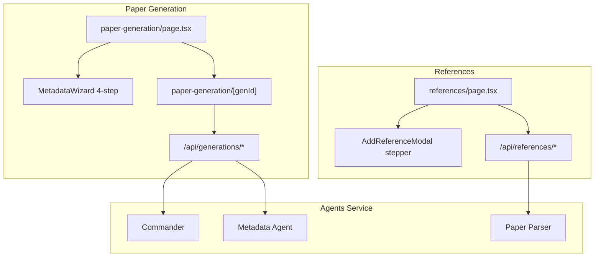

# References & Paper Generation UI Fidelity Plan

## Gap Summary

The backend pipeline (Commander, Planner, Writer, Reviewer, Typesetter, Paper Parser) is largely in place. The UI is still MVP-level: monolithic pages, no edit/delete, no stepper modals, non-functional View PDF, flat file lists, and minimal event logs.

| Area | Screenshots show | Current state |
|------|------------------|---------------|
| **References list** | Search bar, cards with URL, "Linked to N nodes", Edit/Delete | Basic cards; click triggers analysis; no actions |
| **Add Reference** | 2-step stepper: Find Paper → Review & Analyze | Single-step manual dialog; search on page |
| **Reference search** | S2 + arXiv toggles, Title/All Fields, Import BibTeX, result cards with source badges | S2 only, no filters, no BibTeX import |
| **AI analysis** | In-modal "Analyze with AI", persisted Analysis Complete view | Title-only analysis in side panel; not saved |
| **Paper list** | Search, + New Paper, Running/Completed cards, reviews, PDF button, delete | Read-only list; no search/new/delete/PDF |
| **New paper** | 4-step Metadata wizard + Import JSON | Only canvas single-step dialog |
| **Generation detail** | 3-panel: grouped log w/ badges+durations, file tree, viewer | Flat log, flat files, static search stub |
| **Viewers** | LaTeX editor, Abstract text, embedded PDF | View PDF button has no href |

---

## Architecture



Shared UI primitives will live under [`apps/web/src/components/`](apps/web/src/components/) (new `references/` and `paper-generation/` folders), reusing patterns from [`apps/web/src/components/ui.tsx`](apps/web/src/components/ui.tsx) and [`apps/web/src/components/research-graph/fields/FileDropzone.tsx`](apps/web/src/components/research-graph/fields/FileDropzone.tsx).

---

## Phase 1 — Schema & Shared Types

**Migration:** [`db/migrations/002_references_paper_gen.sql`](db/migrations/002_references_paper_gen.sql)

Extend `references_lib`:
- `url TEXT`, `doi TEXT`, `notes TEXT`, `source TEXT` (semantic_scholar | arxiv | manual)
- `linked_count` not stored — computed at query time

Extend `paper_generations`:
- `source TEXT DEFAULT 'graph'` (`graph` | `metadata`)
- `review_count INT DEFAULT 0`
- `current_step TEXT` (e.g. "Planning: Creating paper plan")
- `work_id` → **nullable** for metadata-only generations (create placeholder work row on confirm if needed)

Add index on `graph_nodes` JSONB: `data->>'reference_id'` for linked-node counts.

**Shared types:** [`packages/shared/src/reference-types.ts`](packages/shared/src/reference-types.ts), [`packages/shared/src/metadata-generation.ts`](packages/shared/src/metadata-generation.ts)
- `ReferenceAnalysis`, `ReferenceDraft`, `PaperSearchSource`, `MetadataPaperDraft`, wizard step enums

**Commit:** `feat: add schema and types for references and paper generation UI`

---

## Phase 2 — References API Layer

**New/updated routes:**

| Route | Purpose |
|-------|---------|
| [`apps/web/src/app/api/references/[refId]/route.ts`](apps/web/src/app/api/references/[refId]/route.ts) | `GET` / `PATCH` / `DELETE` |
| [`apps/web/src/app/api/references/search/route.ts`](apps/web/src/app/api/references/search/route.ts) | Add `source`, `field` query params; arXiv search |
| [`apps/web/src/app/api/references/analyze/route.ts`](apps/web/src/app/api/references/analyze/route.ts) | POST analyze + optional persist |
| [`apps/web/src/app/api/references/import-bibtex/route.ts`](apps/web/src/app/api/references/import-bibtex/route.ts) | Parse BibTeX → draft fields |
| [`apps/web/src/app/api/references/upload/route.ts`](apps/web/src/app/api/references/upload/route.ts) | PDF upload → agents paper-parser |

**[`apps/web/src/lib/agents-client.ts`](apps/web/src/lib/agents-client.ts):**
- `searchArxiv(query, field)` via arXiv API (`export.arxiv.org/api/query`)
- Normalize S2 + arXiv results to common `PaperSearchResult` shape (title, authors, year, abstract, url, source badge, external id)

**List query enhancement** in [`apps/web/src/app/api/references/route.ts`](apps/web/src/app/api/references/route.ts):
- Include `linked_node_count` via subquery on `graph_nodes WHERE data->>'reference_id' = ref.id`
- Support `?search=` for library filter (wire to page search bar)

**Assumption:** Literature nodes can store optional `reference_id` in node `data`; sidebar References tab will show linked refs. Auto-link when adding from graph is deferred — count works once nodes reference library IDs.

**Commit:** `feat: add references CRUD, arXiv search, and analysis API`

---

## Phase 3 — References UI Overhaul

**Refactor** [`apps/web/src/app/references/page.tsx`](apps/web/src/app/references/page.tsx) into components:

```
apps/web/src/components/references/
  ReferenceCard.tsx       — title, authors · year, URL link, green "Linked to N nodes", Edit/Delete
  ReferenceList.tsx       — filtered list + empty state
  AddReferenceModal.tsx   — 2-step stepper shell
  FindPaperStep.tsx       — search input, filters (S2/arXiv, Title/All Fields), Import BibTeX link
  SearchResultRow.tsx     — blue title, source badge (Arxiv/S2), authors/year, abstract snippet, hover select
  ReviewAnalyzeStep.tsx   — form fields + AI analysis panel
  AnalysisPanel.tsx       — "Analysis Complete" badge, Summary / Research Question / Methods / Key Findings
  BibTeXImportDialog.tsx  — paste BibTeX → auto-fill step 2
  Stepper.tsx             — reusable 1 Find Paper / 2 Review & Analyze
```

**Add Reference flow (matches screenshots):**
1. **Find Paper:** search with filters; click result → prefill step 2; or "Import BibTeX" / manual entry via "Back to Search"
2. **Review & Analyze:** Title*, Authors, Year, DOI, URL, Notes; AI Paper Analysis box with "Analyze with AI" (uses abstract/URL/PDF); shows structured analysis; **Add Reference** persists `analysis` JSONB

**List page:**
- Header search bar ("Search references...") filters local library
- Remove inline S2 results from main page (search moves into modal)
- Edit opens same modal prefilled; Delete confirms then `DELETE /api/references/[id]`

**Commit:** `feat: add rich references page with 2-step add modal`

---

## Phase 4 — Paper Generation List & Metadata Wizard

**Refactor** [`apps/web/src/app/paper-generation/page.tsx`](apps/web/src/app/paper-generation/page.tsx):

```
apps/web/src/components/paper-generation/
  GenerationCard.tsx      — Running (blue) / Completed (green) badges, step subtitle, words + reviews, PDF btn, delete
  MetadataWizard.tsx      — 4-step modal: Metadata → References & Files → Options → Confirm
  WizardStepper.tsx       — numbered steps with connector line
  MetadataStep.tsx        — Title, Idea*, Method*, Data*, Experiments* textareas
  ReferencesFilesStep.tsx — BibTeX textarea + file upload zone (reuse FileDropzone pattern)
  OptionsStep.tsx         — style guide, target pages, planning/review/compile toggles (reuse canvas config)
  ConfirmStep.tsx         — summary of all fields before launch
```

**List page features:**
- Search bar ("Search tasks...")
- **+ New Paper** opens MetadataWizard
- **Import JSON** button (top-right of wizard) loads `MetadataPaperDraft` from file
- Card actions: click → detail; PDF button → `/api/works/files?path=...`; delete → `DELETE /api/generations/[id]`
- Running cards show `current_step` from DB

**API updates** [`apps/web/src/app/api/generations/route.ts`](apps/web/src/app/api/generations/route.ts):
- `POST` accepts `{ mode: "metadata", metadata, config, bibtex, files }` — creates generation + invokes metadata or commander path
- `GET` returns `review_count`, `current_step`, `pdf_path`

**New route:** [`apps/web/src/app/api/generations/[genId]/route.ts`](apps/web/src/app/api/generations/[genId]/route.ts) add `DELETE`

**Assumption for metadata mode:** Wizard creates a lightweight `research_works` row titled from metadata, then starts Commander with a synthetic graph built from the 5 fields (or calls `/agents/metadata/generate` for simple mode and writes output to `storage/generations/{id}/`).

**Commit:** `feat: add paper generation dashboard and metadata wizard`

---

## Phase 5 — Generation Detail Three-Panel Workspace

**Rewrite** [`apps/web/src/app/paper-generation/[genId]/page.tsx`](apps/web/src/app/paper-generation/[genId]/page.tsx) as thin shell + components:

```
apps/web/src/components/paper-generation/detail/
  GenerationHeader.tsx    — back arrow, title, status dot, words, reviews, View PDF, download
  ProcessLogPanel.tsx     — grouped accordions: Planning, Reference Discovery, Introduction, Body Sections...
  LogEntry.tsx            — badge (LLM/Search/Found/Writing/Agent/Completed) + message + duration
  ExplorerPanel.tsx       — collapsible tree: sections/, analysis/, Main LaTeX, Paper PDF, References BibTeX + sizes
  DetailPanel.tsx         — right panel router: SearchDetails | FileContent | PdfViewer
  SearchDetailsView.tsx   — query card, source, discovered count
  FileContentView.tsx     — LaTeX/text viewer with word count header
  PdfViewer.tsx           — iframe/embed via /api/works/files
```

**Interaction model:**
- Click log entry with `metadata.search_query` → right panel shows Search Details
- Click file in Explorer → right panel shows LaTeX (`.tex`) or PDF (`.pdf`) or BibTeX text
- **Review** toggle in Explorer header (visual filter/highlight; full review mode deferred)
- Running state: auto-expand active accordion section; pulsing "Generating..." header; Cancel button calls new cancel endpoint (sets status `cancelled`)

**API enhancement** [`apps/web/src/app/api/generations/[genId]/route.ts`](apps/web/src/app/api/generations/[genId]/route.ts):
- Return structured file tree `{ name, path, size, type, children? }` instead of flat paths
- Return `review_count` computed from Reviewer completed events
- Include file contents endpoint or inline read for selected file: `GET ?file=sections/Introduction.tex`

**Commit:** `feat: add three-panel paper generation detail workspace`

---

## Phase 6 — Agent Event Enrichment

Update [`apps/agents/src/orchestrator/commander.py`](apps/agents/src/orchestrator/commander.py) and [`apps/agents/src/agents/planner.py`](apps/agents/src/agents/planner.py) to emit screenshot-accurate events:

| Event type | When | Example metadata |
|------------|------|------------------|
| `llm` | After each LLM call | `{ duration_ms, model }` |
| `search` | Before S2 query | `{ source, search_query }` |
| `found` | After S2 returns | `{ count }` |
| `writing` | Section drafting start | `{ section }` |
| `agent` | Agent handoff | `{ agent }` |
| `completed` | Step done | `{ word_count, duration_ms }` |

Wrap LLM calls with timing; emit nested-friendly `phase` field (`planning`, `reference_discovery`, `introduction`, `body_sections`) for accordion grouping.

Update [`apps/web/src/app/api/generations/[genId]/route.ts`](apps/web/src/app/api/generations/[genId]/route.ts) poll handler to persist `current_step` and `review_count` on generation row.

**Commit:** `feat: enrich generation events with search, LLM, and duration metadata`

---

## Phase 7 — Polish, Seed & Verification

- Badge color palette aligned with screenshots (Search/Found orange, LLM blue, Agent purple, Completed green)
- Wire **View PDF** everywhere to existing [`apps/web/src/app/api/works/files/route.ts`](apps/web/src/app/api/works/files/route.ts)
- Seed script [`scripts/seed-generations.mjs`](scripts/seed-generations.mjs): 2–3 demo generations (1 running, 2 completed) with sample events/files for offline UI testing
- Seed sample references with analysis JSON in [`scripts/seed-references.mjs`](scripts/seed-references.mjs)
- Manual verification checklist: add reference via search → analyze → save; edit/delete; start metadata wizard; view completed generation PDF + LaTeX + log drill-down

**Commit:** `chore: seed demo references and generations for UI polish`

---

## Git Commit Strategy

Commit **immediately after each phase** reaches a stable, buildable state. Do not batch the entire References + Paper Generation work into one commit.

### Rules during implementation

1. **Commit right away** when a phase is done (builds cleanly, no broken imports).
2. **One concern per commit** — schema separate from API, references UI separate from paper wizard, detail view separate from agent events.
3. **Conventional commit prefixes:** `feat:`, `fix:`, `chore:`.
4. **Never commit secrets** — `.env` stays gitignored.
5. **Do not push** unless explicitly asked.
6. **Bug fixes within a phase** may be included in that phase's commit; cross-phase fixes get a small follow-up commit (e.g. `fix: wire View PDF href on generation cards`).

### Planned commit checkpoints (~7 commits)

| After completing | Commit message |
|------------------|----------------|
| Phase 1 — Schema & types | `feat: add schema and types for references and paper generation UI` |
| Phase 2 — References API | `feat: add references CRUD, arXiv search, and analysis API` |
| Phase 3 — References UI | `feat: add rich references page with 2-step add modal` |
| Phase 4 — Paper list + wizard | `feat: add paper generation dashboard and metadata wizard` |
| Phase 5 — Detail 3-panel | `feat: add three-panel paper generation detail workspace` |
| Phase 6 — Agent events | `feat: enrich generation events with search, LLM, and duration metadata` |
| Phase 7 — Seed + polish | `chore: seed demo references and generations for UI polish` |

Additional commits are fine for incremental progress or bug fixes within a phase (e.g. `fix: persist reference analysis on save`).

### Commit workflow (each checkpoint)

1. Run `git status` and `git diff` to review staged/unstaged changes.
2. Stage only files belonging to the completed phase.
3. Commit with a 1–2 sentence message focused on **why**, not just what.
4. Run `git status` to confirm a clean working tree for that phase.

---

## Out of Scope (Deferred)

- Real-time WebSocket streaming (polling every 2–3s is sufficient for v1)
- Full PDF.js toolbar (page nav, zoom) — basic embed is enough
- Bi-directional graph ↔ reference linking UI (count badge only for v1)
- arXiv PDF download + storage pipeline (URL + abstract analysis is sufficient)
- Agent cancel mid-flight (UI cancel sets status; hard kill deferred)

---

## Key Files Changed

| Action | Path |
|--------|------|
| New migration | `db/migrations/002_references_paper_gen.sql` |
| New shared types | `packages/shared/src/reference-types.ts`, `metadata-generation.ts` |
| Refactor | `apps/web/src/app/references/page.tsx` |
| Refactor | `apps/web/src/app/paper-generation/page.tsx`, `[genId]/page.tsx` |
| New components | `apps/web/src/components/references/*`, `paper-generation/*` |
| Extend APIs | `apps/web/src/app/api/references/*`, `generations/*` |
| Extend agents | `apps/agents/src/orchestrator/commander.py`, `planner.py` |
| New seeds | `scripts/seed-references.mjs`, `scripts/seed-generations.mjs` |
