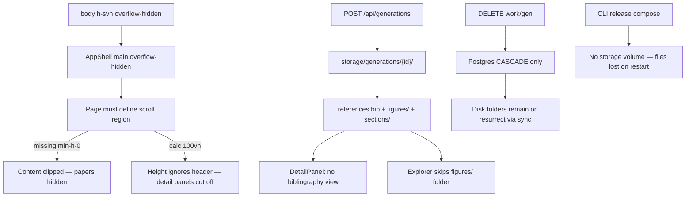

# Scroll, Citations, Paper Content, and Storage Reliability

## Root causes (from codebase audit)



| Symptom | Cause |
|---------|-------|
| Can't scroll to all papers | List pages use `ScrollArea className="flex-1"` without `min-h-0`; settings/detail have no scroll wrapper ([`app-shell.tsx`](apps/web/src/components/layout/app-shell.tsx), [`paper-generation/page.tsx`](apps/web/src/app/(app)/paper-generation/page.tsx)) |
| Citations feel broken | No bibliography UI; only "Reference Discovery" log event in [`DetailPanel.tsx`](apps/web/src/components/paper-generation/detail/DetailPanel.tsx); `discovered_refs` truncated to 5 in [`commander.py`](apps/agents/src/orchestrator/commander.py); `references_lib` not merged into [`build_bibtex_entries`](apps/agents/src/orchestrator/graph_context.py) |
| Missing images/graphs/equations | `figures/` hidden in Explorer ([`generations/[genId]/route.ts`](apps/web/src/app/api/generations/[genId]/route.ts) line 198); bib key index gaps; metadata wizard `bibtex` not converted to literature nodes |
| Data feels unreliable | Release compose has **no** `STORAGE_PATH` bind mount ([`docker-compose.release.yml`](packages/cli/assets/docker-compose.release.yml)); API deletes are DB-only; [`syncGenerationsFromStorage`](apps/web/src/lib/sync-generations.ts) re-imports deleted gens from disk |

---

## Phase 1 — Fix scroll on every page

**Pattern:** Keep the locked viewport shell, but every page gets `flex h-full min-h-0 flex-col` and exactly one scroll child with `flex-1 min-h-0 overflow-auto` (or `ScrollArea` with `min-h-0`).

**Add shared wrapper** [`apps/web/src/components/layout/page-scroll.tsx`](apps/web/src/components/layout/page-scroll.tsx):

```tsx
// flex h-full min-h-0 flex-col + optional toolbar + scroll body
<ScrollArea className="flex-1 min-h-0"> … </ScrollArea>
```

**Apply to:**

| Page | File | Change |
|------|------|--------|
| Paper list | [`paper-generation/page.tsx`](apps/web/src/app/(app)/paper-generation/page.tsx) | `ScrollArea` → `flex-1 min-h-0` |
| Research graph list | [`research-graph/page.tsx`](apps/web/src/app/(app)/research-graph/page.tsx) | same |
| References list | [`references/page.tsx`](apps/web/src/app/(app)/references/page.tsx) | same |
| Settings | [`settings/page.tsx`](apps/web/src/app/(app)/settings/page.tsx) | wrap content in `PageScroll` (currently fully clipped) |
| Paper detail | [`paper-generation/[genId]/page.tsx`](apps/web/src/app/(app)/paper-generation/[genId]/page.tsx) | replace `min-h-[calc(100vh-3rem)]` with `h-full min-h-0 flex-col`; single outer scroll or flex-fill 3-column grid |
| Detail panels | [`ProcessLogPanel.tsx`](apps/web/src/components/paper-generation/detail/ProcessLogPanel.tsx), [`ExplorerPanel.tsx`](apps/web/src/components/paper-generation/detail/ExplorerPanel.tsx), [`DetailPanel.tsx`](apps/web/src/components/paper-generation/detail/DetailPanel.tsx) | replace `max-h-[calc(100vh-12rem)]` with `flex-1 min-h-0 overflow-y-auto` inside flex parent |
| Research canvas | [`canvas.tsx`](apps/web/src/components/research-graph/canvas.tsx) | `h-full min-h-0` instead of `h-[calc(100vh-3rem)]` |

**Verify:** Long paper list, settings page bottom cards, paper detail on mobile (stacked panels), research graph sidebar tabs all scroll independently without clipping.

---

## Phase 2 — Citations section on generated papers

**UI — new Citations panel on paper detail**

Extend [`DetailPanel.tsx`](apps/web/src/components/paper-generation/detail/DetailPanel.tsx) with mode `"citations"`:

- **Bibliography tab** — parse `references.bib` from disk (via existing `GET /api/generations/[genId]?file=references.bib`) into structured entries (title, key, authors, year)
- **In-text cites** — scan `sections/*.tex` for `\cite{key}` / `\citep{}` and show which keys are used vs missing from `.bib`
- **Verifier results** — when user selects CitationVerifier log event, show `uncovered_bib_keys` / `uncovered_literature` with fix hints
- **Discovery** — keep existing Reference Discovery view; store full ref list in event metadata (not `[:5]`)

**Explorer shortcut:** Add top-level "Bibliography" file entry + "Figures" folder (Phase 3) in [`generations/[genId]/route.ts`](apps/web/src/app/api/generations/[genId]/route.ts).

**Pipeline fixes** in [`graph_context.py`](apps/agents/src/orchestrator/graph_context.py) + [`commander.py`](apps/agents/src/orchestrator/commander.py):

1. **Stable bib keys** — assign `lit{node_key}` or sequential keys only for nodes with bibtex (no index gaps vs `GraphContract.literature_keys`)
2. **Merge work references** — fetch `work_references` → `references_lib.bibtex` and append to `references.bib`
3. **Metadata wizard** — in [`packages/shared/src/metadata-generation.ts`](packages/shared/src/metadata-generation.ts), create `literature` nodes from pasted BibTeX so graph-mode and metadata-mode both produce citations
4. **Full discovery metadata** — remove `discovered_refs[:5]` cap in commander `_emit` calls; keep UI pagination instead

---

## Phase 3 — Images, graphs, equations, and data in generated papers

**Explorer / preview**

- Stop skipping `figures/` in `groupFileTree` — show PNG/SVG with thumbnail preview in [`DetailPanel`](apps/web/src/components/paper-generation/detail/DetailPanel.tsx) (image mode) using existing [`/api/works/files`](apps/web/src/app/api/works/files/route.ts)
- Add "Figures & Data" section in Citations panel listing copied vs generated chart paths

**Pipeline hardening** ([`graph_context.py`](apps/agents/src/orchestrator/graph_context.py), [`chart_generator.py`](apps/agents/src/orchestrator/chart_generator.py), [`commander.py`](apps/agents/src/orchestrator/commander.py), [`typesetter.py`](apps/agents/src/agents/typesetter.py)):

| Asset | Fix |
|-------|-----|
| Uploaded figures | Log + surface warning when `figure_path` missing on disk (currently silently skipped in `copy_figure_assets`) |
| Auto charts | Ensure CSV paths resolve via `storage_path`; emit generation event with chart filenames |
| Tables | `enrich_tables_from_files` — verify CSV load errors are logged to process log |
| Equations | Wrap raw `formula` in `\begin{equation}` only if valid; escape unsafe chars via `_latex_escape` |
| Compile retry | Extend typesetter LLM fix to patch failing **section** `.tex` and `references.bib`, not only `main.tex` |
| Empty sections | Fail reviewer when Results/Related Work snippets are empty if graph has data/literature nodes (per existing pipeline v2 plan) |

**Seed reliability:** Add default `keywords` + sample data paths to OWID showcase nodes in [`seed-showcase-owid.mjs`](scripts/seed-showcase-owid.mjs) so re-seeds always have chart inputs.

---

## Phase 4 — Reliable local storage (dev + CLI)

**Critical: mount storage in release compose**

Update [`packages/cli/assets/docker-compose.release.yml`](packages/cli/assets/docker-compose.release.yml) (and dev [`docker/docker-compose.yml`](docker/docker-compose.yml) latex service if missing):

```yaml
# agents, web, latex
volumes:
  - ${HOLOCRON_DATA}/storage:/data/storage
environment:
  STORAGE_PATH: /data/storage
```

Ensure [`scripts/storage-init.mjs`](scripts/storage-init.mjs) creates `~/.holocron/data/storage/{works,generations,references,uploads}` on `holocron start`.

**Delete = DB + disk (coordinated, not accidental loss)**

Add [`apps/web/src/lib/storage-cleanup.ts`](apps/web/src/lib/storage-cleanup.ts):

- `deleteGenerationArtifacts(genId)` — remove `storage/generations/{genId}/`
- `deleteWorkArtifacts(workId)` — remove `storage/works/{workId}/` + all linked generation folders

Wire into:

- [`DELETE /api/generations/[genId]`](apps/web/src/app/api/generations/[genId]/route.ts) — delete disk **after** DB row removed
- [`DELETE /api/works/[workId]`](apps/web/src/app/api/works/[workId]/route.ts) — delete work + generation disk trees (Supermemory delete already exists)

**Prevent ghost resurrection**

- Track tombstones: write `.deleted` marker or move to `storage/.trash/{id}/` instead of hard delete from UI (optional soft-delete); at minimum, [`syncGenerationsFromStorage`](apps/web/src/lib/sync-generations.ts) must skip folders listed in a small `storage/.deleted-generations.json` registry updated on DELETE

**Storage visibility**

- Extend [`GET /api/setup/storage`](apps/web/src/app/api/setup/storage/route.ts) (implement if stub) — breakdown includes `references/`, config JSON, generation count
- Settings "Storage" card shows path (`STORAGE_PATH`), sizes, and "Data is persisted at …" message

**Backfill safety net**

- Document `npm run gen:backfill-events` in README for recovering events from disk artifacts
- Run backfill once after storage mount fix if any gens show empty process logs

---

## Phase 5 — Verification

| Check | Command / action |
|-------|------------------|
| Scroll | Manual: paper list with 10+ gens, settings bottom, paper detail mobile |
| Citations | Generate from OWID showcase; Citations tab shows bib keys + cite map |
| Figures | Explorer lists `figures/`; PDF includes charts from CSV nodes |
| Storage dev | Restart `docker compose`; generations + PDFs still in `d:\holocron\storage` |
| Storage CLI | `holocron stop && holocron start`; verify `~/.holocron/data/storage/generations/` persists |
| No accidental loss | Delete one test gen → folder gone; not re-imported on refresh |

---

## Suggested commit grouping

1. `fix(web): app-wide scroll containers for list, detail, and settings pages`
2. `feat(paper-gen): citations panel, figures explorer, and bib pipeline fixes`
3. `fix(agents): figures, charts, equations, and compile retry hardening`
4. `fix(storage): release volume mounts, coordinated delete, and sync tombstones`

No version bump required unless you want a patch release for CLI compose fix (`1.0.4`).
