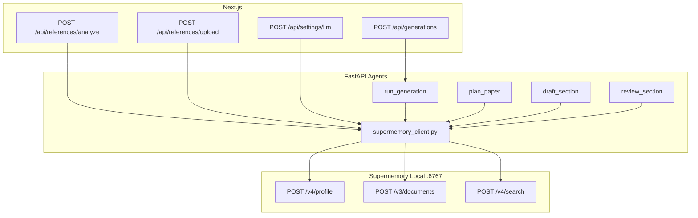

# Supermemory Local Integration Plan

## Prerequisite: K2 Think key

Update your local `.env` (and `~/.holocron/.env` for release) with your K2 Think key — **do not commit this file**:

```dotenv
K2THINK_API_KEY=<your-key>
```

Restart Supermemory so memory extraction uses a real LLM:

```powershell
docker compose -f docker/docker-compose.yml up supermemory -d --force-recreate
```

Supermemory Docker maps `K2THINK_*` → `OPENAI_*` for extraction ([configuration](https://supermemory.ai/docs/self-hosting/configuration)).

---

## What Supermemory adds to Holocron

Holocron today stores **structured** data (Postgres + files). Supermemory adds **semantic memory**:

| Supermemory feature | Holocron use | Docs |
|---------------------|--------------|------|
| `profile({ containerTag, q })` | Inject user + work context before planner/writer LLM calls | [Quickstart](https://supermemory.ai/docs/quickstart) |
| `add({ content, containerTag, customId, metadata })` | Store agent outputs, conversations, analysis results | [Add memories](https://supermemory.ai/docs/add-memories) |
| `search.memories({ q, searchMode: "hybrid" })` | Retrieve relevant refs, past drafts, review feedback | [Search](https://supermemory.ai/docs/search) |
| File upload `/v3/documents/file` | Ingest reference PDFs for semantic search | [Add memories](https://supermemory.ai/docs/add-memories) |
| `PATCH /v3/settings` | Holocron-specific memory filter prompt (one-time) | Vibe-coding / skill |

Postgres remains source of truth for CRUD. Supermemory is the **agent context layer**.



---

## containerTag strategy

| Scope | containerTag | When |
|-------|-------------|------|
| Research work | `work_{workId}` | Default — plans, drafts, refs tied to a work |
| User | `user_{userId}` | Style prefs, cross-work habits (`LOCAL_USER` UUID) |
| Generation | `customId: gen_{generationId}` + metadata | Update same generation doc over time |

Metadata on every write:

```json
{ "type": "planner|writer|reviewer|reference|preference", "generationId": "...", "workId": "...", "section": "Introduction" }
```

---

## Phase 1: Shared infrastructure

### 1a. Python client module (agents — primary)

New file: [`apps/agents/src/supermemory_client.py`](apps/agents/src/supermemory_client.py)

- `get_client()` — returns `Supermemory` SDK client or `None` if disabled
- `is_enabled()` — checks `SUPERMEMORY_API_KEY` is set
- `configure_settings_once()` — `PATCH /v3/settings` with Holocron filterPrompt (idempotent)
- `context_for_work(work_id, query)` — wraps `profile(container_tag=..., q=...)` → formatted string
- `store_memory(content, work_id, *, custom_id, metadata)` — wraps `add()`
- `search_work(work_id, query, limit=5)` — `search.memories(search_mode="hybrid", threshold=0.6)`

Add to [`apps/agents/src/config.py`](apps/agents/src/config.py):

```python
supermemory_api_url: str = "http://localhost:6767"
supermemory_api_key: str = ""
```

Docker agents use `http://host.docker.internal:6767` (see Phase 5).

Add `supermemory` to [`apps/agents/requirements.txt`](apps/agents/requirements.txt) or `pyproject.toml`.

### 1b. TypeScript client (web — references + settings)

New file: [`apps/web/src/lib/supermemory-client.ts`](apps/web/src/lib/supermemory-client.ts)

- Same env vars, graceful no-op if key missing
- `ingestReferencePdf(file, workId, referenceId)` — `POST /v3/documents/file`
- `storeUserPreference(userId, content)` — `add()` to `user_{userId}`

Add `supermemory` npm dep to [`apps/web/package.json`](apps/web/package.json).

### 1c. One-time settings bootstrap

Call `configure_settings_once()` on agents startup in [`apps/agents/src/main.py`](apps/agents/src/main.py) `@app.on_event("startup")` — non-blocking, logs warning on failure.

---

## Phase 2: Paper generation pipeline (core hackathon feature)

Primary hook: [`apps/agents/src/orchestrator/commander.py`](apps/agents/src/orchestrator/commander.py) — `run_generation()`.

### At pipeline start

```python
memory_ctx = await context_for_work(req.work_id, query=req.title)
# Pass memory_ctx into planner/writer via extended request models or config dict
```

### After Planner (`plan_paper` completes)

Store plan + discovered refs ([`apps/agents/src/agents/planner.py`](apps/agents/src/agents/planner.py)):

```python
await store_memory(
    content=json.dumps({"plan": plan, "refs": discovered_refs}),
    work_id=req.work_id,
    custom_id=f"gen_{gen_id}_plan",
    metadata={"type": "planner", "generationId": gen_id},
)
```

### Before each Writer section

Hybrid search for section-specific context ([Search docs](https://supermemory.ai/docs/search)):

```python
prior = await search_work(req.work_id, f"{name} section {req.title}", limit=3)
# Inject into DraftRequest.context["memory"]
```

Extend [`DraftRequest`](apps/agents/src/agents/writer.py) context dict to accept `memory: str`.

### After each Writer / Reviewer turn

```python
await store_memory(
    content=f"section: {name}\n{content}",
    work_id=req.work_id,
    custom_id=f"gen_{gen_id}_{safe_name}",
    metadata={"type": "writer", "generationId": gen_id, "section": name},
)
```

Use `customId` per [add-memories docs](https://supermemory.ai/docs/add-memories) so re-runs update rather than duplicate.

### On pipeline complete

Store generation summary to `work_{workId}` with metadata `{ type: "generation_complete", generationId }`.

**Demo value:** Second generation on the same work recalls prior plan, section style, and review feedback.

---

## Phase 3: Reference library integration

### Analyze flow

[`apps/web/src/app/api/references/analyze/route.ts`](apps/web/src/app/api/references/analyze/route.ts):

After `analyzePaper()` succeeds, if `body.workId` provided:

```typescript
await storeMemory({
  content: JSON.stringify(analysis),
  containerTag: `work_${workId}`,
  customId: `ref_${referenceId}`,
  metadata: { type: "reference", referenceId },
});
```

Thread optional `workId` through [`ReviewAnalyzeStep.tsx`](apps/web/src/components/references/ReviewAnalyzeStep.tsx) when analyzing from a work context.

### PDF upload flow

[`apps/web/src/app/api/references/upload/route.ts`](apps/web/src/app/api/references/upload/route.ts) and [`apps/web/src/app/api/works/[workId]/upload/route.ts`](apps/web/src/app/api/works/[workId]/upload/route.ts):

After file saved to `STORAGE_PATH`, call `ingestReferencePdf()` → Supermemory file API. Processing is async — document returns `status: "queued"` ([add-memories](https://supermemory.ai/docs/add-memories)).

### Search in planner

In `plan_paper()`, before Semantic Scholar search:

```python
local_refs = await search_work(work_id, query, limit=5)  # if work_id available
# Merge with S2 results in planner prompt
```

Extend `PlanRequest` with optional `work_id: str`.

---

## Phase 4: User preferences

### Settings save

[`apps/web/src/app/api/settings/llm/route.ts`](apps/web/src/app/api/settings/llm/route.ts) — on LLM config save, store preference:

```typescript
await storeUserPreference(LOCAL_USER, `LLM provider: ${provider}, model: ${model}, style: ${styleGuide}`)
```

Container: `user_00000000-0000-0000-0000-000000000001`.

### Profile in generation

`context_for_work()` can combine:

- `profile(containerTag=user_{id})` — static prefs (Nature style, etc.)
- `profile(containerTag=work_{id}, q=title)` — work-specific memories

Matches [quickstart profile pattern](https://supermemory.ai/docs/quickstart).

---

## Phase 5: npm deployment (`npx holocron`)

Today: [`packages/cli/assets/docker-compose.release.yml`](packages/cli/assets/docker-compose.release.yml) has **no** Supermemory service. Dev compose does.

### 5a. Bundle Supermemory in CLI assets

Copy to npm package:

- `docker/supermemory/Dockerfile` → [`packages/cli/assets/supermemory/Dockerfile`](packages/cli/assets/supermemory/Dockerfile)
- Update `files` in [`packages/cli/package.json`](packages/cli/package.json) already ships `assets/`

### 5b. Add supermemory to release compose

Extend [`packages/cli/assets/docker-compose.release.yml`](packages/cli/assets/docker-compose.release.yml):

```yaml
supermemory:
  build: ./supermemory
  ports:
    - "6767:6767"
  env_file:
    - ${HOLOCRON_ENV_FILE:-~/.holocron/.env}
  environment:
    SUPERMEMORY_DATA_DIR: /data
    OPENAI_API_KEY: ${K2THINK_API_KEY:-mock-key-for-dev}
    OPENAI_BASE_URL: ${K2THINK_BASE_URL:-https://www.k2think.ai/api/chat/completions}
    OPENAI_MODEL: ${K2THINK_MODEL:-MBZUAI-IFM/K2-Think-v2}
  volumes:
    - ${HOLOCRON_DATA:-~/.holocron/data}/supermemory:/data
  restart: unless-stopped
```

Wire agents + web to reach Supermemory:

```yaml
agents:
  extra_hosts:
    - "host.docker.internal:host-gateway"
  environment:
    SUPERMEMORY_API_URL: http://host.docker.internal:6767
```

Same for `web` service.

### 5c. Extend `holocron setup`

[`packages/cli/src/commands/setup.ts`](packages/cli/src/commands/setup.ts):

- After LLM key, scrape or prompt for Supermemory API key
- On first `holocron start`, if `SUPERMEMORY_API_KEY` empty, tail supermemory logs for `sm_*` and append to `~/.holocron/.env` (reuse logic from [`docker/supermemory/bootstrap.ps1`](docker/supermemory/bootstrap.ps1))

Add to generated env:

```dotenv
SUPERMEMORY_API_URL=http://localhost:6767
SUPERMEMORY_API_KEY=
```

### 5d. Extend `holocron doctor` and `holocron status`

[`packages/cli/src/commands/doctor.ts`](packages/cli/src/commands/doctor.ts) — check port `6767`.

[`packages/cli/src/commands/status.ts`](packages/cli/src/commands/status.ts) — `GET http://localhost:6767` health + whether `SUPERMEMORY_API_KEY` is set in env.

---

## Incremental commit strategy

Create **focused commits after each phase completes** (not one giant commit). Follow existing repo commit style (concise, why-focused). Never commit `.env`, API keys, or `.next` artifacts.

| After phase | Suggested commit message | Files in commit |
|-------------|-------------------------|-----------------|
| Phase 1 (infra) | `feat(agents): add Supermemory client and config` | `supermemory_client.py`, `config.py`, `requirements.txt`, `main.py`, `.env.example` |
| Phase 2 (pipeline) | `feat(agents): memory-aware paper generation pipeline` | `commander.py`, `planner.py`, `writer.py` |
| Phase 3 (references) | `feat(web): ingest references into Supermemory` | `supermemory-client.ts`, reference/upload routes, UI threading |
| Phase 4 (preferences) | `feat(web): persist user LLM preferences to Supermemory` | `settings/llm/route.ts` |
| Phase 5 (npm) | `feat(cli): bundle Supermemory Local in holocron start` | release compose, CLI commands, `assets/supermemory/` |
| Phase 5 (docker) | `chore(docker): wire agents and web to Supermemory` | both `docker-compose.yml` files |
| Phase 7 (docs) | `docs: document Supermemory integration and rationale` | all doc files listed below |
| Final verify | `test: verify Supermemory integration smoke paths` | only if test helpers added |

**Rules during implementation:**
- Commit when a phase is working and tests pass for that slice
- If a phase spans multiple sessions, commit sub-slices (e.g. commander hooks before planner search)
- Do not amend unless pre-commit hook auto-modifies files
- User asked for commits "time-to-time" — aim for **5–7 commits** across the full integration

---

## Phase 7: Documentation (rationale-first)

Every doc update must answer **what**, **where**, **which Supermemory feature**, and **why** (rationale). Postgres/file storage alone cannot do semantic recall across agent sessions — that is the core justification.

### Documents to create or update

| Document | Action |
|----------|--------|
| [`docs/SUPERMEMORY.md`](docs/SUPERMEMORY.md) | **Expand** into primary integration guide — setup + full rationale matrix (see below) |
| [`docs/ARCHITECTURE.md`](docs/ARCHITECTURE.md) | Add Supermemory layer to system diagram; new "Memory layer" section |
| [`docs/CONFIGURATION.md`](docs/CONFIGURATION.md) | `SUPERMEMORY_API_URL`, `SUPERMEMORY_API_KEY`; Docker networking notes |
| [`docs/README.md`](docs/README.md) | Link to `SUPERMEMORY.md` in doc index |
| [`README.md`](README.md) (repo root) | One paragraph on persistent research memory; link to docs |
| [`packages/cli/README.md`](packages/cli/README.md) | `holocron start` now includes Supermemory; env vars |
| [`.cursor/skills/supermemory-local/references/holocron-integration.md`](.cursor/skills/supermemory-local/references/holocron-integration.md) | Sync with final implementation paths |

### Rationale matrix (include in `docs/SUPERMEMORY.md`)

This table is the canonical "why we use Supermemory here" reference:

| Integration point | File / route | Supermemory feature | Why we use it (rationale) | Why not Postgres alone? |
|-------------------|--------------|---------------------|---------------------------|-------------------------|
| Pipeline start | `commander.py` → `run_generation()` | **User Profiles** (`profile`) | Load accumulated work context + user prefs before any agent runs; avoids cold-start generations | Postgres stores generation records, not extracted semantic facts or cross-run narrative context |
| After planning | `planner.py` / commander | **Add documents** (`add` + `customId`) | Persist plan structure and discovered literature so future runs build on prior research direction | Plan JSON in events is buried in logs; not semantically searchable |
| Before writing each section | `writer.py` / commander | **Hybrid search** (`search.memories`, `searchMode: hybrid`) | Retrieve section-relevant prior drafts, review notes, and reference chunks for coherent multi-section papers | No vector search in Holocron; keyword match on graph nodes misses paraphrased context |
| After writer/reviewer | `commander.py` | **Add documents** (`add` + `customId` + `metadata`) | Capture iterative draft + review loop outcomes; enables learning from rejected sections | Review feedback in `generation_events` is not injected into future LLM prompts automatically |
| Pipeline complete | `commander.py` | **Add documents** | Store generation summary as a durable milestone memory | Status field alone does not convey what was learned |
| Reference analyze | `POST /api/references/analyze` | **Add documents** | Make structured paper analysis semantically retrievable during planning/writing | `references_lib.analysis` JSONB requires exact fetch by ID; agents cannot query "papers about X" |
| Reference PDF upload | `POST /api/references/upload`, `works/[workId]/upload` | **File ingestion** (`/v3/documents/file`) | OCR + chunk PDFs for hybrid search alongside extracted memories | PDFs on disk are opaque to agents without a separate RAG pipeline |
| Planner local recall | `planner.py` | **Hybrid search** | Complement Semantic Scholar with user's already-ingested library (private PDFs, prior analyses) | S2 only knows public literature; cannot see user's uploaded corpus |
| Settings save | `POST /api/settings/llm` | **Add documents** to `user_{userId}` | Persist style/provider preferences as profile static facts across all works | `llm_config.json` is operational config, not semantic user context for agents |
| Generation context | `context_for_work()` | **Profile + search in one call** (`profile({ containerTag, q })`) | Single low-latency call per [quickstart](https://supermemory.ai/docs/quickstart); combines static + dynamic + relevant memories | Would require multiple DB joins + manual prompt assembly |
| Org-level tuning | agents startup | **Settings** (`PATCH /v3/settings`, `filterPrompt`) | Tell Supermemory's extractor what Holocron stores so memories stay on-topic | No equivalent in Postgres |
| npm deployment | `holocron start` | **Self-hosted Local** (`localhost:6767`) | Hackathon requirement: memory runs on user's machine; privacy-first research | Cloud memory would contradict local-first positioning |

### `docs/SUPERMEMORY.md` proposed structure

```markdown
# Supermemory in Holocron

## Why Holocron uses Supermemory
(2–3 paragraphs: agent amnesia problem, local-first hackathon, Postgres vs semantic memory)

## Architecture
(diagram: Postgres = CRUD, Supermemory = agent context)

## Feature map
(full rationale matrix table)

## containerTag conventions
(work_{id}, user_{id}, customId patterns)

## Setup
(Docker, bootstrap, env vars — existing content)

## Per-component behavior
### Paper generation pipeline
### Reference library
### User preferences
### Graceful degradation

## npm deployment
(holocron start flow)

## API reference
(links to canonical endpoints; pointer to .cursor/skills)
```

### `docs/ARCHITECTURE.md` additions

- Update ASCII diagram to include **Supermemory :6767** box connected to agents + web
- New section **"Memory layer (Supermemory Local)"** explaining:
  - Postgres = authoritative structured state
  - Supermemory = derived, searchable, evolving agent context
  - Data never replaces Postgres rows — it augments LLM prompts

### Inline code comments (lightweight)

At each integration hook in code, add a **one-line comment** referencing the rationale:

```python
# Supermemory: hybrid search — recall prior section drafts (see docs/SUPERMEMORY.md#writer)
```

Keeps docs and code aligned without duplicating the full matrix.

---

## Phase 5e. Update docs (summary)

Subsumed by **Phase 7** above. Phase 5e checklist:

- [`docs/CONFIGURATION.md`](docs/CONFIGURATION.md) — Supermemory env vars
- [`docs/SUPERMEMORY.md`](docs/SUPERMEMORY.md) — full integration + rationale guide
- [`packages/cli/README.md`](packages/cli/README.md) — hackathon memory feature
- [`docs/ARCHITECTURE.md`](docs/ARCHITECTURE.md) — memory layer section
- [`docs/README.md`](docs/README.md) + root [`README.md`](README.md) — links

**Commit:** `docs: document Supermemory integration and rationale` (Phase 7 commit)

---

```
npx holocron setup    # K2 key + optional S2 key
npx holocron start    # postgres + agents + web + latex + supermemory
                      # auto-captures sm_* key on first boot
→ http://localhost:3000
→ Generations use memory automatically (if key set)
```

---

## Phase 6: Graceful degradation

All Supermemory calls wrapped in try/except (Python) / try/catch (TS):

- Missing `SUPERMEMORY_API_KEY` → skip silently, log at debug
- Supermemory container down → pipeline continues without memory (log warning once)
- Never block paper generation on memory failures

Add `GET /health` field in agents: `supermemory: "ok" | "disabled" | "unreachable"`.

---

## File change summary

| Area | Files to create/modify |
|------|------------------------|
| Agents core | `supermemory_client.py`, `config.py`, `requirements.txt`, `main.py` |
| Pipeline | `commander.py`, `planner.py`, `writer.py` (context injection) |
| Web | `supermemory-client.ts`, `references/analyze`, `references/upload`, `works/[workId]/upload`, `settings/llm` |
| CLI / release | `docker-compose.release.yml`, `setup.ts`, `start.ts`, `doctor.ts`, `status.ts`, `assets/supermemory/` |
| Config | `.env.example`, `docker/docker-compose.yml` (agents extra_hosts) |
| **Documentation** | `docs/SUPERMEMORY.md`, `docs/ARCHITECTURE.md`, `docs/CONFIGURATION.md`, `docs/README.md`, root `README.md`, `packages/cli/README.md`, skill reference sync |

---

## Testing plan

1. **Infrastructure:** `holocron start` brings up Supermemory; `sm_*` key in `~/.holocron/.env`
2. **Add:** Generate paper on work A → verify documents in Supermemory with `containerTag: work_{id}`
3. **Profile:** Second generation on same work → planner/writer prompts include prior context
4. **Search:** `POST /v4/search` returns planner/writer memories with `searchMode: hybrid`
5. **References:** Upload PDF → queued document; analyze → text memory stored
6. **Preferences:** Save settings → `user_{id}` container has style preference
7. **Degradation:** Stop supermemory container → generation still completes

---

## Hackathon narrative (for submission)

> Holocron is an AI research paper platform. We integrated Supermemory Local so every research work builds a persistent semantic memory — literature, agent plans, drafts, and review feedback accumulate per `work_{workId}`. The planner recalls prior discoveries; the writer adapts to user style from `user_{userId}` profiles. All memory runs on `localhost:6767` via Docker — no cloud dependency. `npx holocron start` ships the full stack including Supermemory for end users.
