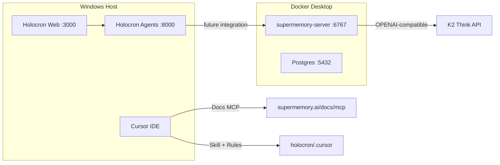

# Supermemory Local Workspace Setup

## Context

**Hackathon:** [Localhost:6767](https://instinctive-chance-ed9.notion.site/Localhost-6767-392222a60c568030ab86e7729d765bbe) — build anything that meaningfully uses Supermemory Local (`http://localhost:6767`).

**Holocron today:** npm monorepo with Next.js + Python FastAPI agents, Docker Compose for Postgres/agents/web ([`docker/docker-compose.yml`](docker/docker-compose.yml)). No Supermemory, no `.cursor/` config, no vector memory.

**Windows constraint:** Supermemory ships **Linux/macOS binaries only** — no native Windows `.exe` yet ([GitHub issue #1102](https://github.com/supermemoryai/supermemory/issues/1102)). Official docs say "No Docker," but they also document **Docker/non-interactive** env-var boot ([self-hosting quickstart](https://supermemory.ai/docs/self-hosting/quickstart)). The practical Windows path is **Docker Desktop running the `linux-x64` release binary**.



---

## Phase 1: Run Supermemory Local via Docker (Windows)

### 1a. Add a minimal Docker wrapper

Create [`docker/supermemory/Dockerfile`](docker/supermemory/Dockerfile):

- Base: `debian:bookworm-slim`
- Install `ca-certificates`, `curl`
- Download pinned binary from latest release: `supermemory-server-linux-x64` (server-v0.0.5)
- `chmod +x`, expose `6767`, entrypoint runs the binary
- No interactive wizard — all config via env vars (required for Docker)

### 1b. Extend Docker Compose

Add a `supermemory` service to [`docker/docker-compose.yml`](docker/docker-compose.yml):

```yaml
supermemory:
  build: ./supermemory
  ports:
    - "6767:6767"
  environment:
    SUPERMEMORY_DATA_DIR: /data
    OPENAI_API_KEY: ${K2THINK_API_KEY}
    OPENAI_BASE_URL: ${K2THINK_BASE_URL:-https://www.k2think.ai/api/chat/completions}
    OPENAI_MODEL: ${K2THINK_MODEL:-MBZUAI-IFM/K2-Think-v2}
    SUPERMEMORY_EMBEDDING_RAM_LIMIT: 2gb
  volumes:
    - supermemory_data:/data
  restart: unless-stopped
```

**Why K2 Think maps to `OPENAI_*`:** Supermemory self-hosted treats any OpenAI-compatible endpoint via `OPENAI_BASE_URL` + `OPENAI_API_KEY` ([configuration docs](https://supermemory.ai/docs/self-hosting/configuration)). Holocron already uses K2 this way in [`apps/agents/src/llm.py`](apps/agents/src/llm.py).

**Ollama on host (optional):** If you later want local embeddings/LLM from Windows host, add `extra_hosts: ["host.docker.internal:host-gateway"]` and point `OPENAI_BASE_URL=http://host.docker.internal:11434/v1`.

### 1c. First-boot API key capture

On first container start, Supermemory prints `sm_...` to logs (no TTY wizard). Add a small helper script:

- [`docker/supermemory/bootstrap.ps1`](docker/supermemory/bootstrap.ps1) — starts service, tails logs until API key appears, writes to `.env`
- [`docker/supermemory/bootstrap.sh`](docker/supermemory/bootstrap.sh) — same for WSL/Git Bash users

Document in [`docs/SUPERMEMORY.md`](docs/SUPERMEMORY.md):

1. `docker compose -f docker/docker-compose.yml up supermemory -d`
2. `docker logs holocron-supermemory-1` → copy `sm_...` key
3. Add to `.env`: `SUPERMEMORY_API_KEY=sm_...`, `SUPERMEMORY_API_URL=http://localhost:6767`

Persisted volume means key survives restarts.

### 1d. Smoke test

```bash
curl http://localhost:6767/v3/documents \
  -H "Authorization: Bearer $SUPERMEMORY_API_KEY" \
  -H "Content-Type: application/json" \
  -d '{"content":"Holocron hackathon test","containerTag":"holocron_dev"}'
```

---

## Phase 2: Cursor MCP (Vibe-Coding Docs Server)

Per [vibe-coding setup](https://supermemory.ai/docs/vibe-coding), install the **docs search MCP** (not the platform memory MCP — self-hosted explicitly excludes managed MCP per [configuration](https://supermemory.ai/docs/self-hosting/configuration)):

```bash
npx -y install-mcp@latest https://supermemory.ai/docs/mcp --client cursor --oauth=no -y
```

Create project-level [`.cursor/mcp.json`](.cursor/mcp.json) with the `supermemory-docs` server entry (stdio or HTTP as returned by installer). This gives Cursor tools like `search_supermemory_memory_api_for` and the bundled `supermemory` skill resource.

**Note:** Your global [`~/.cursor/mcp.json`](C:/Users/mdhat/.cursor/mcp.json) has Supabase. Project MCP merges with global — both can coexist. Reload Cursor MCP after install.

---

## Phase 3: Project Skill (Holocron + Local)

Copy and adapt the official skill from [supermemoryai/supermemory/skills/supermemory](https://github.com/supermemoryai/supermemory/tree/main/skills/supermemory) into [`.cursor/skills/supermemory-local/`](.cursor/skills/supermemory-local/):

| File | Purpose |
|------|---------|
| `SKILL.md` | Main skill — trigger on Supermemory/memory/hackathon work |
| `references/canonical-api.md` | Vibe-coding **canonical API surface** (avoid AI-hallucinated endpoints) |
| `references/holocron-integration.md` | Holocron-specific hooks and containerTag strategy |

### Critical content in `canonical-api.md` (from vibe-coding)

**Use:**
- Auth: `Authorization: Bearer $SUPERMEMORY_API_KEY`
- Write: `POST /v3/documents`
- Search: `POST /v4/search`
- Profile: `POST /v4/profile`
- Scoping: `containerTag` (singular string) in JSON body
- SDK: `client.add()`, `client.search.memories()`, `client.profile()`
- Local base URL: `http://localhost:6767`

**Do NOT use:** `/v1/*`, `/v3/memories`, `/v3/search`, `x-supermemory-api-key`, `containerTags` (plural), deprecated SDK methods.

### Holocron integration guidance in skill

Natural `containerTag` strategy for this app:

| Scope | containerTag | Use case |
|-------|-------------|----------|
| Per research work | `work_{workId}` | Paper context, references, generation history |
| Per user (local auth) | `user_{LOCAL_USER_ID}` | Cross-project preferences |
| Per generation run | metadata `{ generationId, workId }` | Filter within a work |

**Integration hook points** (for later hackathon build, documented in skill now):

- **Python agents** ([`apps/agents/src/orchestrator/commander.py`](apps/agents/src/orchestrator/commander.py)): `profile()` before planner/writer, `add()` after each agent turn
- **Next.js API** ([`apps/web/src/lib/`](apps/web/src/lib/)): thin `supermemory-client.ts` wrapper using `supermemory` npm package
- **References ingestion**: upload PDFs via `POST /v3/documents/file` with `containerTag: work_{id}`

Install SDK deps when integrating (not in this setup phase):
- `apps/web`: `npm install supermemory`
- `apps/agents`: `pip install supermemory`

---

## Phase 4: Cursor Rule

Create [`.cursor/rules/supermemory-local.mdc`](.cursor/rules/supermemory-local.mdc) with `alwaysApply: true`:

- Every write/search MUST include `containerTag`
- Point SDK at `baseURL: process.env.SUPERMEMORY_API_URL ?? "http://localhost:6767"`
- Configure settings once via `PATCH /v3/settings` with Holocron-specific `filterPrompt`
- Prefer Python SDK in agents service, TS SDK in web
- Hackathon requirement: integration must call local server, not `api.supermemory.ai`

---

## Phase 5: Environment Variables

Extend [`.env.example`](.env.example):

```dotenv
# Supermemory Local (hackathon)
SUPERMEMORY_API_URL=http://localhost:6767
SUPERMEMORY_API_KEY=          # from docker logs on first boot

# Used by supermemory Docker service (reuses K2 Think)
# K2THINK_API_KEY, K2THINK_BASE_URL, K2THINK_MODEL already defined above
```

Add matching vars to agents `Settings` in [`apps/agents/src/config.py`](apps/agents/src/config.py) only when integration code is written — not required for workspace setup itself.

---

## Phase 6: Verification Checklist

After implementation, confirm:

1. `docker compose up supermemory` → healthy on `http://localhost:6767`
2. API key captured and in `.env`
3. Test document add + search returns results
4. Cursor MCP shows supermemory docs tools (Settings → MCP)
5. Agent recognizes `@supermemory-local` skill or auto-invokes on memory tasks
6. `containerTag` present in all test API calls

---

## What this plan does NOT include (next hackathon step)

- Actual Holocron feature integration (memory-aware paper generation)
- Replacing Postgres persistence with Supermemory
- WSL alternative (Docker is primary; WSL documented as fallback in `docs/SUPERMEMORY.md`)

## Fallback: WSL (if Docker fails)

```bash
# In WSL2 Ubuntu
curl -fsSL https://supermemory.ai/install | bash
export OPENAI_API_KEY=$K2THINK_API_KEY
export OPENAI_BASE_URL=https://www.k2think.ai/api/chat/completions
export OPENAI_MODEL=MBZUAI-IFM/K2-Think-v2
supermemory-server
```

Access from Windows at `http://localhost:6767` (WSL port forwarding).
