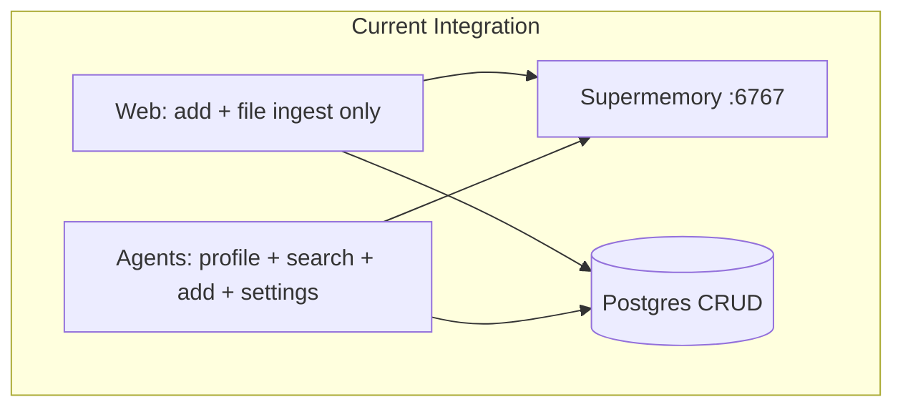
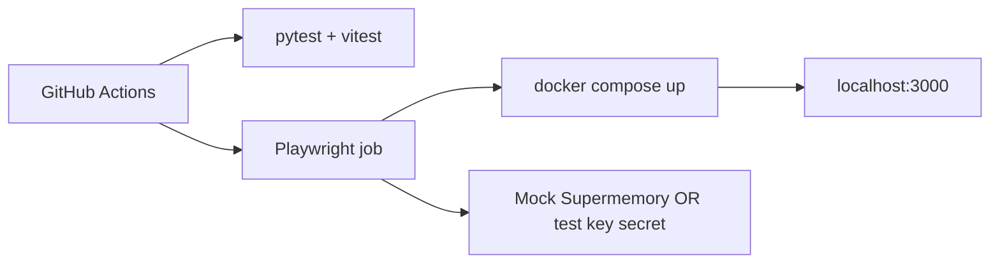

# Supermemory Integration Review, Documentation, and Full Test Suite

## Current state (baseline)

Holocron already has a **dual-layer memory model**: Postgres for CRUD, Supermemory Local (`:6767`) for semantic agent context. Agents implement the full read/write loop; web is **write-only** (add + file ingest). There are **zero automated tests** today ([`.github/workflows/ci.yml`](.github/workflows/ci.yml) only builds/lints + one Python import smoke check).

**Security first:** Your API key was shared in chat. During execution we will write it only to gitignored [`.env`](.env) and [`apps/web/.env`](apps/web/.env) — never commit it. Consider rotating the key after this session.



---

## Part 1 — Supermemory integration improvements

### 1.1 Consolidate shared primitives (remove redundancy)

| Change | Files | Why |
|--------|-------|-----|
| Export `LOCAL_USER_ID` from [`packages/shared`](packages/shared/src/index.ts) | New `packages/shared/src/constants.ts`; update web routes + agents to import | Same UUID duplicated in 10+ files (`LOCAL_USER`, `LOCAL_USER_ID`) |
| Add shared Supermemory tag helpers | `workTag(id)`, `userTag(id)` in shared | Prevents string drift (`work_` vs `work-`) |
| Single `FILTER_PROMPT` constant in shared (or agents-only doc) | Referenced by Python + future web settings bootstrap | One source for LLM filter text |

### 1.2 Harden both clients (reliability, not silent failures in dev)

**Python** [`apps/agents/src/supermemory_client.py`](apps/agents/src/supermemory_client.py):
- Check HTTP status in `health_status` / `configure_settings_once`; log warnings at `warning` level (keep graceful no-op for callers)
- Optional: unify on httpx for all calls OR SDK for all — **recommend keeping hybrid** (SDK for profile/search/add; httpx for settings/health) but document why in docs

**TypeScript** [`apps/web/src/lib/supermemory-client.ts`](apps/web/src/lib/supermemory-client.ts):
- Add `searchMemories()`, `profileForWork()`, `configureSettingsOnce()` mirroring Python (raw fetch — no npm SDK; `supermemory@^1` doesn’t exist and bundle size is fine for server routes)
- Check `response.ok`; log non-2xx in development (`process.env.NODE_ENV === 'development'`)
- Pass `referenceId` from upload routes into `ingestReferencePdf` with `customId: ref_{id}` metadata (param exists but unused)

**Intentionally keep fetch in web** — documented justification: server-side only, no published TS SDK version aligned with Local v0.0.5 OpenAPI.

### 1.3 Close pipeline gaps (capability, not redundancy)

| Gap | Change | File(s) | Justification |
|-----|--------|---------|---------------|
| VLM layout issues not recalled | After `review_pdf()`, `store_memory()` VLM summary/issues | [`commander.py`](apps/agents/src/orchestrator/commander.py) | Future generations can avoid repeated layout mistakes |
| Reviewer has no memory context | `search_work()` before review loop; store feedback even when not revised | [`commander.py`](apps/agents/src/orchestrator/commander.py) | Reviewer agent never imports Supermemory today |
| Reference analyze dual-write | Store **compact summary** to Supermemory (title, claims, methods); keep full JSON in Postgres | [`analyze/route.ts`](apps/web/src/app/api/references/analyze/route.ts) | Reduces embedding noise; PG remains authoritative |
| No web-side search | New `GET /api/works/[workId]/memory/search?q=` | New route + optional References UI hook | Enables “search my library” without agents round-trip |
| Graph not in memory | On work graph save (`PATCH /api/works/[workId]`), `storeMemory` node/edge summary | [`works/[workId]/route.ts`](apps/web/src/app/api/works/[workId]/route.ts) | Planner/writer can recall hypothesis structure |
| Settings bootstrap if agents down | Web calls `PATCH /v3/settings` once on first Supermemory write | `supermemory-client.ts` | Agents startup isn’t guaranteed in hybrid dev |
| Supermemory disabled in running stack | Ensure `.env` + `apps/web/.env` have `SUPERMEMORY_API_KEY`; restart agents container | Env + docker | Health currently reports `"supermemory":"disabled"` |

### 1.4 Dev tooling alignment

| Change | File | Why |
|--------|------|-----|
| Add **local** MCP server alongside docs MCP | [`.cursor/mcp.json`](.cursor/mcp.json) | You provided `http://localhost:6767/mcp` — separate from cloud docs MCP |
| Fix Docker web build (`@holocron/shared` resolution) | [`apps/web/Dockerfile`](apps/web/Dockerfile) | Full `docker compose up` failed; blocks CI-like prod path |
| CLI status probes `/health` not root | [`packages/cli/src/commands/status.ts`](packages/cli/src/commands/status.ts) | Accurate Supermemory health |
| Restart agents after key capture | [`packages/cli/src/commands/start.ts`](packages/cli/src/commands/start.ts) | Pick up new `SUPERMEMORY_API_KEY` |

### 1.5 What we will NOT change (documented rationale)

- **Postgres dual-write for references/generations** — keep both; roles differ (CRUD vs semantic recall)
- **Graceful degradation** — memory never blocks generation; tests will assert this contract
- **containerTag scoping** — stay `work_{id}` / `user_{id}`; no cross-work bleed without explicit user profile

---

## Part 2 — Documentation deliverables

### 2.1 Extend [`docs/SUPERMEMORY.md`](docs/SUPERMEMORY.md)

Add sections:
- **Changelog: pre-Supermemory → current** — table of every integration point added, file, API used, and why Postgres alone was insufficient
- **OpenAPI alignment** — map Holocron calls to `http://localhost:6767/v4/openapi` endpoints (`/v3/documents`, `/v3/documents/file`, `/v4/profile`, `/v4/search`, `/v3/settings`, `/mcp`)
- **Redundancy matrix** — what is intentionally duplicated vs what was removed (e.g., analyze summary vs full JSON)
- **Client strategy** — Python SDK 3.50.x vs web fetch; why not npm SDK
- **Local MCP** — Cursor config, difference from app integration
- **Testing** — how to run Supermemory contract tests against `:6767`

### 2.2 New [`docs/TESTING.md`](docs/TESTING.md)

- Test pyramid diagram
- How to run locally (mock LLM, docker compose, Playwright)
- CI job descriptions
- Env vars for test runs (never real keys in CI — use mocked Supermemory)

### 2.3 Update cross-links

- [`docs/ARCHITECTURE.md`](docs/ARCHITECTURE.md) — memory layer after improvements
- [`docs/CONFIGURATION.md`](docs/CONFIGURATION.md) — `SUPERMEMORY_*` + web env parity
- [`.env.example`](.env.example) — ensure both root and note `apps/web/.env` needs same keys for local dev

---

## Part 3 — Comprehensive test suite

### 3.1 Stack (aligned with repo conventions)

| Layer | Tool | Location |
|-------|------|----------|
| Agents unit/integration | **pytest** + **httpx** `ASGITransport` | `apps/agents/tests/` |
| Shared + CLI + web libs | **Vitest** | `packages/shared/`, `packages/cli/`, `apps/web/src/lib/` |
| Web API routes | Vitest + test DB or mocked `getDb` | `apps/web/src/app/api/**/*.test.ts` |
| Supermemory contracts | pytest + Vitest with **httpx mock**; optional live job | `*/tests/test_supermemory*` |
| Frontend E2E | **Playwright** | `apps/web/e2e/` |
| CI | Extend [`.github/workflows/ci.yml`](.github/workflows/ci.yml) | Parallel jobs |

Add root `"test"` script + [`turbo.json`](turbo.json) `test` task.

### 3.2 Test coverage map (priority order)

**P0 — Agents ([`apps/agents/src/main.py`](apps/agents/src/main.py))**
- `GET /health` includes supermemory status
- `POST /agents/commander/generate` + status polling with `mock_llm`
- Path traversal guard on uploads
- Commander event order: Planner → Writer → Reviewer → Typesetter → VLM

**P0 — Supermemory clients**
- `is_enabled()` / `isSupermemoryEnabled()` gates
- Correct `containerTag`, `customId`, metadata on add/file/search/profile
- Graceful empty return when key missing or 503
- `configure_settings_once` sends `shouldLLMFilter` + `filterPrompt`

**P1 — Web API (13 routes)**
- Generations create + poll + file path sanitization
- References analyze/upload + memory side-effect (mocked fetch)
- Settings LLM + preference store
- Works CRUD + graph memory hook

**P1 — Pure logic quick wins**
- [`packages/shared/src/metadata-generation.ts`](packages/shared/src/metadata-generation.ts) — `buildGraphFromMetadata`
- [`apps/web/src/lib/bibtex.ts`](apps/web/src/lib/bibtex.ts) — `parseBibTeX`
- [`packages/cli/src/supermemory.ts`](packages/cli/src/supermemory.ts) — env key capture

**P2 — Playwright E2E (real user flows)**

```
Landing → Research Graph (add node) → Paper Generation metadata wizard →
start generation (mock LLM) → detail page shows agent events →
References (search/upload) → Settings (save provider)
```

Fixtures: docker compose services (postgres, agents, supermemory, latex) + seeded data via existing [`scripts/seed-*.mjs`](scripts/).

### 3.3 CI architecture (your choice: local + CI)



- **Unit/integration jobs**: no Docker; mock external HTTP
- **E2E job**: `docker compose -f docker/docker-compose.yml up -d --wait`; build shared; `npm run dev --workspace=web` or use web container; Playwright against `http://localhost:3000`
- Use `MOCK_LLM=1` / `K2THINK_API_KEY=mock-key-for-dev` for deterministic generation
- Supermemory in E2E: mock server on `:6767` OR GitHub secret `SUPERMEMORY_TEST_KEY` (optional live integration nightly)

New workflow file: `.github/workflows/e2e.yml` (or extend `ci.yml` with `e2e` job + service containers).

---

## Part 4 — Frontend verification (run like a real user)

After Playwright suite is written, **execute locally**:

1. `docker compose up -d` (full stack including fixed web image OR hybrid dev)
2. Configure `.env` with your Supermemory key
3. Run `npx playwright test` — all happy paths green
4. Manual spot-check: second generation on same work recalls prior plan (Supermemory profile/search visible in agent logs or new memory search API)

Deliverable: Playwright HTML report + short verification note in `docs/TESTING.md`.

---

## Execution order

1. **Env + enable Supermemory** in running stack (immediate user-visible win) — *local only, no commit*
2. **Client improvements + pipeline gaps** (Part 1)
3. **Documentation** with changelog (Part 2) — written alongside code changes
4. **Test infrastructure** (scripts, turbo, pytest/vitest/playwright config)
5. **Tests by priority** P0 → P1 → P2
6. **CI wiring** + fix Docker web build
7. **Run Playwright locally**, then validate CI green

Each step 2–6 ends with a **commit + push** (see Part 5).

---

## Part 5 — Incremental GitHub commits

Follow the repo’s existing convention (`feat:`, `fix:`, `docs:`, `test:`, `chore:`) and keep each commit **small, reviewable, and green** (lint/build/tests pass for that slice).

### Rules

- **Commit after every logical chunk** — not one giant commit at the end
- **Push to GitHub** after each commit (`git push`) so remote stays in sync
- **Never commit** `.env`, `apps/web/.env`, API keys, or `.next/` / build artifacts
- Include the pending **`supermemory>=3.50.0`** fix in the first agents-related commit if still unstaged
- If a commit fails a pre-commit hook, fix and create a **new** commit (no amend unless hook auto-modified files)

### Planned commit sequence

| # | When | Suggested message | Scope |
|---|------|-------------------|-------|
| 1 | Shared constants + tag helpers | `refactor(shared): centralize LOCAL_USER_ID and Supermemory tag helpers` | `packages/shared`, route imports |
| 2 | TS/Python client hardening | `feat(supermemory): add search/profile/settings and HTTP status checks` | `supermemory-client.ts`, `supermemory_client.py` |
| 3 | Pipeline memory gaps | `feat(agents): store VLM/reviewer context and graph summaries in Supermemory` | `commander.py`, works/analyze routes, memory search API |
| 4 | Dev tooling | `chore(supermemory): local MCP config, Docker web build, CLI health fixes` | `.cursor/mcp.json`, Dockerfile, CLI |
| 5 | Documentation | `docs: Supermemory changelog, OpenAPI map, and testing guide` | `docs/SUPERMEMORY.md`, `docs/TESTING.md`, cross-links |
| 6 | Test infrastructure | `test: add pytest, vitest, and playwright scaffolding` | configs, root scripts, `turbo.json` |
| 7 | Agents + Supermemory unit tests | `test(agents): health, commander, and supermemory client coverage` | `apps/agents/tests/` |
| 8 | Web + shared unit tests | `test(web): API routes, bibtex, and supermemory client mocks` | vitest suites |
| 9 | Playwright E2E | `test(e2e): Playwright user-journey flows for core platform` | `apps/web/e2e/` |
| 10 | CI | `ci: run unit tests and Playwright E2E on push/PR` | `.github/workflows/` |

Adjust numbering if two small commits merge naturally (e.g. docs bundled with the feature they describe), but **avoid** combining unrelated areas (tests + pipeline + docs in one commit).

### Verification before each push

```bash
git status          # no secrets staged
npm run lint        # or workspace-specific lint for touched packages
npm run test        # once test scripts exist
git push origin HEAD
```

---

## Risk notes

- **Docker web build**: `@holocron/shared` must be built and resolvable before `next build` in Dockerfile — likely needs explicit `COPY packages/shared` + workspace install fix
- **E2E flakiness**: use `mock_llm`, generous Playwright timeouts for first compile, health wait scripts
- **Supermemory live tests in CI**: default to HTTP mocks; optional nightly live job against real Local server
