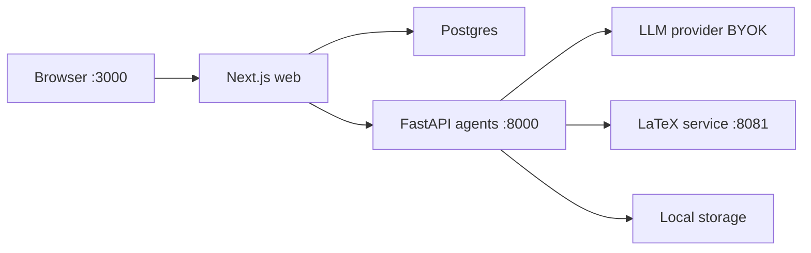

# Holocron

**Holocron** is a local-first AI research platform. Map hypotheses, literature, and experiments on a visual research graph, then generate publication-ready LaTeX and PDF output through a multi-agent writing pipeline. The UI follows a **Research Workbench** aesthetic — calm, data-dense surfaces for long research sessions; inference is bring-your-own-key (BYOK).

Everything runs on your machine. Docker Desktop is the only prerequisite for end users.

---

## Quick start

```bash
npx holocron start
```

First run:

1. Runs the setup wizard if `~/.holocron/.env` does not exist
2. Prompts for an LLM provider (default: **K2 Think**) — press Enter for mock mode
3. Starts Postgres, agents, LaTeX, **Supermemory Local**, and the web UI
4. Waits for health checks and opens [http://localhost:3000](http://localhost:3000)

### Persistent research memory

Holocron uses [Supermemory Local](https://supermemory.ai/docs/self-hosting/overview) so agents remember prior plans, drafts, references, and preferences across paper generations — all on your machine at `localhost:6767`. See [docs/SUPERMEMORY.md](docs/SUPERMEMORY.md).

### CLI commands

| Command | Description |
|---------|-------------|
| `holocron start` | Start the full stack |
| `holocron setup` | Configure LLM provider and API keys |
| `holocron doctor` | Check Docker, Node, and port availability |
| `holocron status` | Show service health |
| `holocron stop` | Tear down containers |

Install globally:

```bash
npm install -g holocron
holocron start
```

---

## What you can do

| Area | Route | Description |
|------|-------|-------------|
| **Research Graph** | `/research-graph` | Visual canvas with 16 node types — ideation, knowledge, execution, evidence |
| **Paper Generation** | `/paper-generation` | Multi-agent pipeline from graph or metadata wizard |
| **References** | `/references` | Semantic Scholar, arXiv, PDF upload, BibTeX import, AI analysis |
| **Agents** | `/agents` | Live status for the multi-agent pipeline |
| **Settings** | `/settings` | Switch LLM provider and API keys (BYOK) |

### Paper generation pipeline

```
Planner → Writer ⇄ Reviewer → Citation Verifier → Typesetter → VLM Review
         ↑ GraphContract (per-node obligations) ↑
         Supermemory profile / search / store at each phase
```

- **Graph mode** — build a research graph, then generate from the `end` node
- **Metadata mode** — four-step wizard: fields → BibTeX → options → confirm
- **Process log** — events persist to Postgres (`generation_events`); backfill from disk with `npm run gen:backfill-events`
- **Graph-faithful** — `GraphContract` tracks which nodes must appear in which sections; targeted re-draft on unsatisfied nodes

Venue templates: Nature, IEEE, ICML.

---

## LLM providers (BYOK)

Configure via **Settings** in the UI or `holocron setup`. Keys stay local — Holocron does not require a cloud account.

| Provider | Default model | Notes |
|----------|---------------|-------|
| **K2 Think** | `MBZUAI-IFM/K2-Think-v2` | Recommended for demos — [build.k2think.ai](https://build.k2think.ai/) |
| Groq | `llama-3.3-70b-versatile` | Fast OpenAI-compatible inference |
| OpenAI | `gpt-4o` | Official API |
| Anthropic | `claude-sonnet-4-20250514` | Messages API |
| Google | `gemini-2.0-flash` | OpenAI-compatible endpoint |
| OpenRouter | `openai/gpt-4o` | Many models behind one key |
| Custom | — | Any OpenAI-compatible base URL |

Leave the API key empty (or use `mock-key-for-dev`) to run in **mock mode** — placeholder content for local tours without a key.

Optional: [Semantic Scholar API key](https://www.semanticscholar.org/product/api) for richer literature discovery.

See [docs/CONFIGURATION.md](docs/CONFIGURATION.md) for all environment variables.

---

## Architecture



| Service | Port | Role |
|---------|------|------|
| Web | 3000 | Next.js App Router UI and API routes |
| Agents | 8000 | Python FastAPI multi-agent service |
| Postgres | 5432 | Research works, references, generations |
| LaTeX | 8081 | Self-healing PDF compilation |

End-user config lives at `~/.holocron/.env`. See [docs/ARCHITECTURE.md](docs/ARCHITECTURE.md) for monorepo layout and data flow.

---

## Development

### Prerequisites

- Node.js 20+
- Docker Desktop
- Python 3.12+ (optional — for running agents outside Docker)

### From source

```bash
git clone https://github.com/hatif03/holocron.git
cd holocron
npm install
cp .env.example .env
docker compose -f docker/docker-compose.yml up --build
```

Seed a demo research graph (10 nodes, 13 edges):

```bash
node scripts/seed-template.mjs
```

Open [http://localhost:3000](http://localhost:3000).

### Monorepo layout

```
holocron/
├── apps/web/           Next.js 15 frontend
├── apps/agents/        Python FastAPI agent service
├── packages/cli/       holocron npm CLI (npx holocron)
├── packages/shared/    Shared Zod schemas and types
├── templates/          LaTeX venue templates
├── docker/             Docker Compose stacks
├── db/migrations/      Postgres schema
└── docs/               Architecture and configuration guides
```

### Scripts

```bash
npm run dev          # Turbo dev (all workspaces)
npm run build        # Build all packages
npm run lint         # Lint
npm run seed         # Seed demo template graph
npm run seed:all     # Full demo pipeline (refs + works + template)
npm run graph:respread   # Re-space graph node layout
npm run gen:live     # Live paper generation via agents API
npm run gen:verify   # Verify latest generation artifacts
npm run gen:cleanup  # Remove failed/stub generations
npm run gen:backfill-events  # Reconstruct process log from disk
```

App-specific guides: [apps/web/README.md](apps/web/README.md), [packages/cli/README.md](packages/cli/README.md).

---

## Agents

| Agent | Role |
|-------|------|
| **Paper Parser** | PDF understanding and structured extraction |
| **Template Parser** | LaTeX venue template rules |
| **Commander** | Pipeline orchestrator |
| **Planner** | Outline + Semantic Scholar / arXiv discovery |
| **Writer** | IMRaD LaTeX section generation (graph-grounded) |
| **Reviewer** | Logic, style, length, citation coverage review loop |
| **Citation Verifier** | Ensures all bib keys and literature nodes are cited |
| **Typesetter** | Self-healing LaTeX compilation |
| **Metadata** | Simple-mode paper from metadata fields |
| **VLM Review** | Visual PDF layout detection |

---

## Troubleshooting

| Issue | Fix |
|-------|-----|
| Docker not running | Start Docker Desktop, then `holocron doctor` |
| Port in use | Stop conflicting services on 3000, 8000, or 5432 |
| Agents offline in Settings | Ensure stack is up: `holocron start` |
| Mock content only | Add a real API key in Settings or `holocron setup` |
| Process log empty on old runs | `npm run gen:backfill-events -- <genId>` |
| Agents offline during generation | Check `/agents` health; ensure Docker agents on `:8000` |

---

## License

MIT
